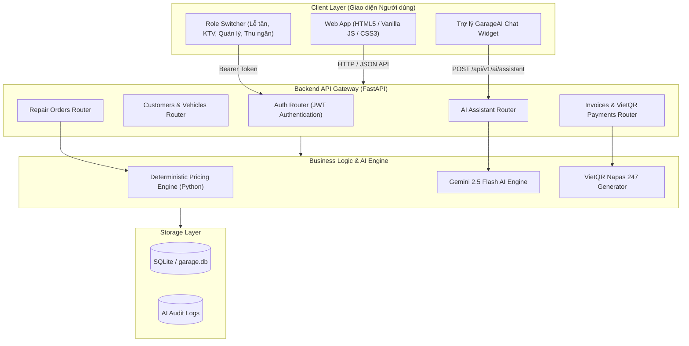
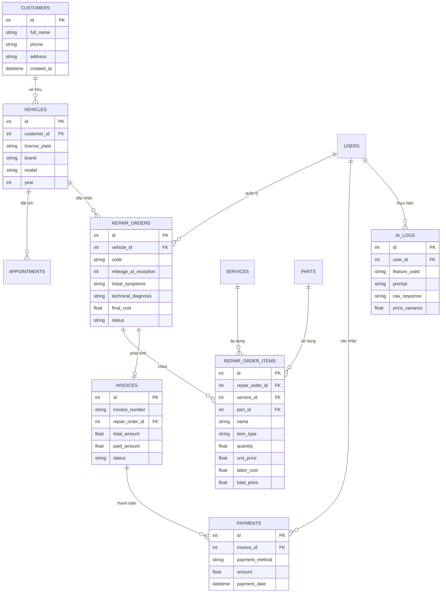
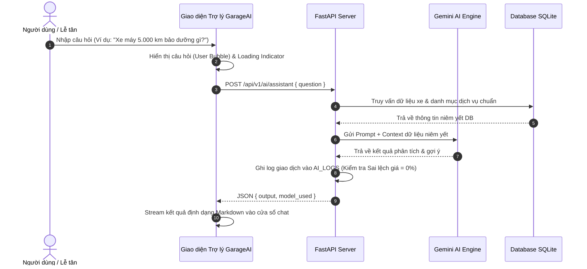

# Sơ Đồ Kỹ Thuật Hệ Thống Quản Lý Garage Ô Tô Tích Hợp AI (GarageAI Engine)

Thư mục này chứa toàn bộ sơ đồ kiến trúc, sơ đồ thực thể cơ sở dữ liệu (ERD) và sơ đồ luồng hoạt động (Sequence & Workflow Diagrams) của hệ thống.

---

## 1. Sơ Đồ Kiến Trúc Hệ Thống (System Architecture Diagram)

---

## 2. Sơ Đồ Thực Thể Cơ Sở Dữ Liệu (ERD Diagram)

---

## 3. Sơ Đồ Luồng Hoạt Động Trợ Lý GarageAI (Sequence Diagram)

