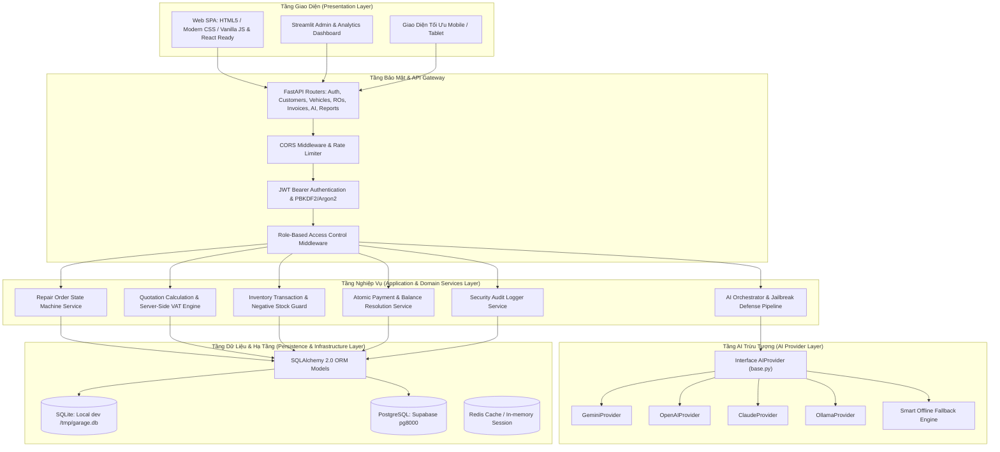

# KIẾN TRÚC HỆ THỐNG (SYSTEM ARCHITECTURE)
## HỆ THỐNG QUẢN LÝ GARAGE VTV TÍCH HỢP AI (GARAGE VTV AI MANAGEMENT SYSTEM)

---

## 1. NGUYÊN TẮC THIẾT KẾ KIẾN TRÚC
Dự án được xây dựng theo mô hình **Clean Architecture** kết hợp **API-First** và **Domain-Driven Design (DDD)** tinh gọn:
- **Tính độc lập với khung giao diện (UI Independence)**: Toàn bộ nghiệp vụ tính toán tiền nong, kiểm tra tồn kho, chuyển đổi trạng thái (State Machine) được quản lý tại tầng Backend Python FastAPI. Cả giao diện Web SPA, Streamlit Dashboard hay các kênh tích hợp thứ ba đều giao tiếp qua REST API tiêu chuẩn.
- **Tính độc lập với Cơ sở Dữ liệu (Database Independence)**: Sử dụng ORM SQLAlchemy 2.0 cho phép chạy mượt mà trên SQLite môi trường phát triển cục bộ và chuyển đổi sang PostgreSQL (Supabase / AWS RDS) trên môi trường Production mà không cần thay đổi logic nghiệp vụ.
- **Tính độc lập với nhà cung cấp AI (AI Provider Agnostic)**: Lớp AI Service trừu tượng thông qua Interface `AIProvider`, cho phép hoán đổi giữa OpenAI, Google Gemini, Anthropic Claude, hoặc Local LLM Ollama bằng biến môi trường `AI_PROVIDER`.

---

## 2. SƠ ĐỒ PHÂN TẦNG KIẾN TRÚC (LAYERED ARCHITECTURE)

---

## 3. CÁC TẦNG CHÍNH TRONG DỰ ÁN

### 3.1. Tầng API Routers (`backend/app/routers/`)
- Đảm nhiệm việc nhận request, giải mã token JWT, kiểm tra quyền theo vai trò (RBAC), xác thực dữ liệu đầu vào qua Pydantic Schemas v2 và trả về mã lỗi chuẩn hóa JSON.
- Độc lập hoàn toàn với cách thức lưu trữ dữ liệu.

### 3.2. Tầng Business Services (`backend/app/services/`)
- Nơi tập trung toàn bộ quy tắc nghiệp vụ (Business Rules) của garage:
  - **Kiểm soát giao dịch tồn kho**: Đảm bảo không bao giờ xuất kho quá số lượng hiện có. Sử dụng cơ chế khóa hàng (row locking) và database transaction để ngăn chặn Race Condition khi nhiều thợ cùng xuất linh kiện.
  - **Máy trạng thái sửa chữa**: Ép buộc quy trình chuyển trạng thái từng bước một (Received -> Inspecting -> Quotation Pending -> Waiting Approval -> Approved -> In Repair -> Quality Check -> Completed).
  - **Tính toán tài chính bất biến**: Báo giá và Hóa đơn luôn do Server tính toán (`Subtotal = Labor + Parts`, `VAT = Subtotal * VAT_Rate`, `Total = Subtotal + VAT - Discount`). Không cho phép Client gửi số tiền tự tính lên Server.

### 3.3. Tầng AI Provider Abstraction (`backend/app/ai/`)
- Mọi tương tác AI đều đi qua quy trình 6 bước an toàn:
  1. Chuẩn bị dữ liệu và khử định danh PII (loại bỏ SĐT, email, địa chỉ khách hàng).
  2. Bọc dữ liệu đầu vào trong thẻ phân cách tường minh `<UNTRUSTED_DATA>...</UNTRUSTED_DATA>`.
  3. Gửi tới Adapter được chọn cấu hình qua `AI_PROVIDER`.
  4. Nhận phản hồi và chuyển đổi thành JSON có cấu trúc.
  5. Kiểm tra tính hợp lệ qua Pydantic Schema.
  6. Lưu nhật ký truy vết vào bảng `ai_logs` kèm thời gian thực thi (latency) và trạng thái.

### 3.4. Tầng Cơ Sở Dữ Liệu & ORM (`backend/app/models.py`, `database.py`)
- Cấu hình Connection Pooling linh hoạt:
  - `pool_pre_ping=True`: Tự động kiểm tra tính sẵn sàng của kết nối trước khi thực thi truy vấn.
  - Tự động hạ cấp sang SQLite cục bộ nếu mạng đám mây gián đoạn (Zero Downtime).
  - Hỗ trợ Soft-delete (xóa mềm qua cột `deleted_at`) để bảo toàn lịch sử dịch vụ.
