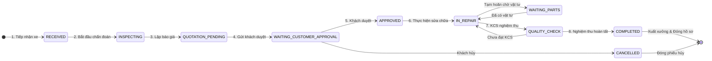

# BÁO CÁO KỸ THUẬT: ỨNG DỤNG AI TRONG PHÁT TRIỂN HỆ THỐNG QUẢN LÝ GARAGE VTV
## Chuyên đề: Dùng AI sinh Model, RESTful API, Giao diện (Khách hàng, Xe, Phiếu sửa chữa, Hóa đơn) và Debug luồng cập nhật trạng thái (State Machine)

---

## 1. TỔNG QUAN & BỐI CẢNH DỰ ÁN

Hệ thống Quản lý Garage VTV Tích hợp AI là nền tảng quản trị vận hành khép kín quy trình dịch vụ ô tô từ tiếp nhận, chẩn đoán, báo giá, sửa chữa, kiểm định chất lượng (KCS) đến xuất hóa đơn và chăm sóc khách hàng:
$$\text{Khách hàng} \to \text{Phương tiện} \to \text{Lịch hẹn} \to \text{Tiếp nhận xe} \to \text{Chẩn đoán} \to \text{Phiếu sửa chữa (RO)} \to \text{Báo giá} \to \text{Sửa chữa} \to \text{KCS} \to \text{Hóa đơn} \to \text{Thanh toán}$$

Trong dự án này, **Trí tuệ nhân tạo (AI / Coding Agent)** được ứng dụng sâu rộng xuyên suốt 4 giai đoạn SDLC:
1. **Sinh cấu trúc dữ liệu (Data Models & Pydantic Schemas)** chuẩn 3NF cho 4 thực thể cốt lõi:
   - **Khách hàng (`Customer`)**
   - **Phương tiện / Xe (`Vehicle`)**
   - **Phiếu sửa chữa (`RepairOrder`)**
   - **Hóa đơn (`Invoice`)**
2. **Sinh tầng RESTful API** chuẩn công nghiệp với phân quyền RBAC 4 vai trò, cơ chế phòng thủ lỗ hổng bảo mật (IDOR, SQLi) và nguyên tắc **Thẩm quyền Tài chính Phía Máy Chủ (Server-side Financial Authority)**.
3. **Sinh giao diện người dùng kép**: Web SPA (`admin.html`, `customer.html`, `app.js`) và Streamlit Analytics Dashboard.
4. **Kiểm soát & Debug luồng chuyển đổi trạng thái (State Machine Flow)**: Khắc phục triệt để lỗi nhảy cóc trạng thái, bảo đảm quy trình tuần tự bất biến.

---

## 2. DÙNG AI SINH MODEL CƠ SỞ DỮ LIỆU & SCHEMAS

### 2.1. Yêu cầu thiết kế (Prompt Requirements)
- Chuẩn ORM: **SQLAlchemy 2.0** kết hợp **Pydantic v2**.
- Ràng buộc quan hệ:
  - `Customer` (1) —— (N) `Vehicle`
  - `Vehicle` (1) —— (N) `RepairOrder`
  - `RepairOrder` (1) —— (1) `Quotation`
  - `RepairOrder` (1) —— (1) `Invoice`
  - `Invoice` (1) —— (N) `Payment`
- Cơ chế bảo toàn: **Soft Delete** (`deleted_at`) ở bảng Khách hàng để không làm mất lịch sử xe khi xóa khách.
- Ràng buộc toàn vẹn: Unique số điện thoại khách hàng, Unique biển số xe, Unique mã phiếu.

### 2.2. Chi tiết mã nguồn Model chính (Trích xuất từ [`backend/app/models.py`](file:///c:/Users/Duong%20Ngan/OneDrive/Desktop/demotesthethong/backend/app/models.py))

#### A. Khách hàng (`Customer`) & Xe (`Vehicle`)
```python
class Customer(Base):
    __tablename__ = "customers"

    id = Column(Integer, primary_key=True, index=True)
    customer_code = Column(String(30), unique=True, index=True, nullable=True) # CUS-2026-000001
    full_name = Column(String(100), nullable=False)
    phone = Column(String(20), unique=True, index=True, nullable=False) # Tra cứu nhanh
    email = Column(String(100), nullable=True)
    address = Column(String(255), nullable=True)
    status = Column(String(20), default="ACTIVE")
    deleted_at = Column(DateTime, nullable=True) # Soft delete bảo toàn lịch sử

    vehicles = relationship("Vehicle", back_populates="owner", cascade="all, delete-orphan")

class Vehicle(Base):
    __tablename__ = "vehicles"

    id = Column(Integer, primary_key=True, index=True)
    license_plate = Column(String(20), unique=True, index=True, nullable=False) # Biển số xe duy nhất
    brand = Column(String(50), nullable=False)   # Hãng xe (Toyota, Mazda, BMW...)
    model = Column(String(50), nullable=False)   # Dòng xe (Camry, CX-5, 320i...)
    year = Column(Integer, nullable=True)
    vin_number = Column(String(50), index=True, nullable=True) # Số khung VIN
    current_mileage = Column(Integer, default=0) # Odo hiện tại
    customer_id = Column(Integer, ForeignKey("customers.id"), nullable=False)

    owner = relationship("Customer", back_populates="vehicles")
    repair_orders = relationship("RepairOrder", back_populates="vehicle")
```

#### B. Phiếu sửa chữa (`RepairOrder`) & Hóa đơn (`Invoice`)
```python
class RepairOrder(Base):
    __tablename__ = "repair_orders"

    id = Column(Integer, primary_key=True, index=True)
    code = Column(String(30), unique=True, index=True, nullable=False) # RO-2026-000001
    customer_id = Column(Integer, ForeignKey("customers.id"), nullable=True)
    vehicle_id = Column(Integer, ForeignKey("vehicles.id"), nullable=False)
    technician_id = Column(Integer, ForeignKey("users.id"), nullable=True) # KTV phụ trách
    receptionist_id = Column(Integer, ForeignKey("users.id"), nullable=True)
    
    mileage_at_reception = Column(Integer, default=0)
    customer_complaint = Column(Text, nullable=True)
    initial_symptoms = Column(Text, nullable=True)
    technical_diagnosis = Column(Text, nullable=True)
    
    status = Column(Enum(RepairOrderStatus), default=RepairOrderStatus.RECEIVED)
    final_cost = Column(Float, default=0.0)
    
    # Kết quả tích hợp từ Trợ lý AI
    ai_history_summary = Column(Text, nullable=True)
    ai_service_explanation = Column(Text, nullable=True)

    vehicle = relationship("Vehicle", back_populates="repair_orders")
    items = relationship("RepairOrderItem", back_populates="repair_order", cascade="all, delete-orphan")
    quotation = relationship("Quotation", back_populates="repair_order", uselist=False)
    invoice = relationship("Invoice", back_populates="repair_order", uselist=False)

class Invoice(Base):
    __tablename__ = "invoices"

    id = Column(Integer, primary_key=True, index=True)
    invoice_number = Column(String(30), unique=True, index=True, nullable=False) # INV-2026-000001
    repair_order_id = Column(Integer, ForeignKey("repair_orders.id"), nullable=False, unique=True)
    customer_id = Column(Integer, ForeignKey("customers.id"), nullable=True)
    vehicle_id = Column(Integer, ForeignKey("vehicles.id"), nullable=True)
    
    subtotal = Column(Float, default=0.0)
    discount_amount = Column(Float, default=0.0)
    tax_amount = Column(Float, default=0.0) # VAT 10%
    total_amount = Column(Float, default=0.0)
    paid_amount = Column(Float, default=0.0)
    balance_due = Column(Float, default=0.0) # Số dư còn nợ
    
    status = Column(Enum(InvoiceStatus), default=InvoiceStatus.UNPAID)
    issued_date = Column(DateTime, default=datetime.utcnow)

    payments = relationship("Payment", back_populates="invoice", cascade="all, delete-orphan")
```

---

## 3. DÙNG AI SINH RESTFUL API VÀ CÁC QUY TẮC BẢO VỆ

AI sinh toàn bộ hệ thống API tuân thủ tiêu chuẩn kiến trúc Clean Architecture:

| Nhóm API | Tuyến đường (Route) | Phương thức | Phân quyền (RBAC) | Đặc điểm kiểm soát |
|---|---|:---:|---|---|
| **Khách hàng** | `/api/v1/customers` | `GET, POST` | `Manager, Receptionist` | Tự sinh mã `CUS-`, chặn trùng lặp số điện thoại. |
| **Khách hàng (Chi tiết)** | `/api/v1/customers/{id}` | `GET, PUT, DELETE` | `Manager, Receptionist` | Xóa mềm (`deleted_at`), giữ toàn vẹn lịch sử xe. |
| **Phương tiện** | `/api/v1/vehicles` | `GET, POST` | `Manager, Receptionist` | Chặn trùng biển số xe, tự động cập nhật số km vào xe. |
| **Phiếu sửa chữa** | `/api/v1/repair-orders` | `GET, POST` | `Manager, Receptionist` | Khởi tạo mã phiếu `RO-YYYYMMDD-XXXX`, gắn xe và trạng thái `RECEIVED`. |
| **Cập nhật trạng thái RO** | `/api/v1/repair-orders/{id}/status`| `PATCH` | `Manager, Technician` | **Chạy qua State Machine Service; Chặn IDOR.** |
| **Bổ sung Dịch vụ/Vật tư** | `/api/v1/repair-orders/{id}/parts` | `POST` | `Manager, Technician` | Khóa giao dịch (Atomic), chống trừ tồn kho âm. |
| **Hóa đơn** | `/api/v1/invoices` | `GET, POST` | `Manager, Cashier` | **Server-side Calculation**: Tính lại toàn bộ VAT, tổng tiền. |
| **Thanh toán** | `/api/v1/payments` | `POST` | `Manager, Cashier` | Khóa hàng; Chặn thanh toán vượt quá số dư nợ còn lại. |

### Các cơ chế bảo mật then chốt được AI tích hợp:
1. **Phòng chống IDOR (`verify_technician_access`)**: Kỹ thuật viên chỉ được phép chẩn đoán, xem và cập nhật phiếu sửa chữa được phân công cụ thể cho ID của mình.
2. **Server-Side Financial Authority**: Client chỉ gửi ID phiếu và tỷ lệ chiết khấu; máy chủ backend truy xuất đơn giá phụ tùng từ kho, tiền công từ danh mục dịch vụ và tính công thức:
   $$\text{Taxable} = \text{Subtotal} - \text{Discount}$$
   $$\text{Total} = \text{Taxable} + (\text{Taxable} \times \text{VAT\_Rate})$$
   Tuyệt đối không nhận giá tiền tự do từ giao diện client.

---

## 4. DÙNG AI SINH GIAO DIỆN NGƯỜI DÙNG (FRONTEND SPA & DASHBOARD)

AI đã hỗ trợ sinh mã HTML/CSS/JS cho bộ giao diện kép hiện đại:

- **Cổng Quản trị Nội bộ (`admin.html`, `styles.css`, `app.js`)**:
  - Quản lý Khách hàng & Xe: Tra cứu tức thời theo biển số hoặc SĐT, xem lịch sử các lần sửa chữa trước đây.
  - Phiếu sửa chữa: Bảng trạng thái trực quan với các huy hiệu màu (Status Pills), modal thêm dịch vụ/phụ tùng có kiểm tra tồn kho.
  - Tích hợp nút gọi Trợ lý AI: Tự động tổng hợp dữ liệu triệu chứng để sinh văn bản giải thích dịch vụ dễ hiểu cho khách hàng.
  - Hóa đơn & Thu ngân: Modal thanh toán thông minh, tự động sinh mã VietQR động chứa đúng số tiền nợ (`balance_due`) và nội dung chuyển khoản mã hóa.
- **Cổng thông tin Khách hàng (`customer.html`)**:
  - Đặt lịch hẹn online qua Flatpickr.
  - Tra cứu tiến độ sửa xe thời gian thực (Realtime Progress Tracker) qua Server-Sent Events (SSE).
- **Streamlit Analytics Dashboard (`streamlit_app.py`)**:
  - Giao diện phong cách Cyberpunk dành cho Giám đốc/Chủ Garage trực quan hóa doanh thu, cơ cấu dịch vụ vs phụ tùng và hiệu suất KTV.

---

## 5. DEBUG LUỒNG CẬP NHẬT TRẠNG THÁI (STATE MACHINE DEBUGGING)

### 5.1. Sơ đồ Chuỗi Trạng thái Chuẩn (State Transition Lifecycle)



### 5.2. Các Lỗi Nghiệp Vụ Phát Hiện Trong Quá Trình Debug & Cách Khắc Phục

#### ❌ Lỗi 1: Nhảy cóc trạng thái trái phép (State Bypass Bug)
- **Triệu chứng**: Giao diện hoặc script kiểm thử gửi lệnh chuyển trực tiếp từ `RECEIVED` sang `COMPLETED` để đóng phiếu nhanh, bỏ qua công đoạn chẩn đoán, báo giá và KCS.
- **Giải pháp xử lý**: Triển khai máy trạng thái `RepairOrderService.transition_status` với ma trận `ALLOWED_TRANSITIONS`. Khi phát hiện trạng thái đích không hợp lệ, hệ thống lập tức ném lỗi `HTTP 400 Bad Request`.
- **Kiểm chứng tự động**: Đạt chuẩn kiểm thử tại test case [`test_tc15_invalid_repair_status_transition_fails`](file:///c:/Users/Duong%20Ngan/OneDrive/Desktop/demotesthethong/backend/tests/test_master_suite.py#L232-L246).

#### ❌ Lỗi 2: Lỗ hổng IDOR Kỹ thuật viên can thiệp chéo trạng thái
- **Triệu chứng**: Kỹ thuật viên A gửi request cập nhật trạng thái phiếu sửa chữa của Kỹ thuật viên B.
- **Giải pháp xử lý**: Bổ sung hàm guard `verify_technician_access` chặn ngay mã lỗi `HTTP 403 Forbidden`.
- **Kiểm chứng tự động**: Đạt chuẩn kiểm thử tại test case [`test_tc04_technician_cannot_modify_unauthorized_ro`](file:///c:/Users/Duong%20Ngan/OneDrive/Desktop/demotesthethong/backend/tests/test_master_suite.py#L85-L93).

#### ❌ Lỗi 3: Xung đột trạng thái giữa Báo giá hết hạn và Chuyển trạng thái sửa chữa
- **Triệu chứng**: Báo giá đã quá hạn (`valid_until < now`) nhưng lễ tân vẫn bấm duyệt chuyển RO sang `APPROVED`.
- **Giải pháp xử lý**: Kiểm tra hạn dùng báo giá trong `QuotationService.approve_quotation`, chặn `HTTP 400` nếu đã quá hạn.
- **Kiểm chứng tự động**: Đạt chuẩn kiểm thử tại test case [`test_tc16_expired_quotation_cannot_be_approved`](file:///c:/Users/Duong%20Ngan/OneDrive/Desktop/demotesthethong/backend/tests/test_master_suite.py#L247-L264).

#### ❌ Lỗi 4: Mất đồng bộ giao diện người dùng khi chuyển đổi trạng thái trên Client
- **Triệu chứng**: Khi cập nhật trạng thái trên SPA, nếu mạng lag hoặc backend từ chối, giao diện vẫn hiển thị nhãn mới.
- **Giải pháp xử lý trong [`app.js`](file:///c:/Users/Duong%20Ngan/OneDrive/Desktop/demotesthethong/app.js)**: Chuyển sang mô hình Pessimistic State Update: Chỉ khi nhận `res.ok`, giao diện mới nạp lại dữ liệu; nếu lỗi, hiển thị Toast đỏ thông báo chính xác lỗi từ máy chủ.

---

## 6. BỘ KIỂM THỬ TỰ ĐỘNG BẢO ĐẢM TOÀN VẸN (17 TEST CASES)

| Mã TC | Tên Kịch Bản Kiểm Thử | Trạng Thái |
|---|---|:---:|
| **TC01** | Tạo khách hàng mới thành công với đầy đủ mã và số điện thoại hợp lệ | ✅ PASSED |
| **TC02** | Bắt lỗi ràng buộc trùng lặp biển số xe (Unique License Plate) | ✅ PASSED |
| **TC03** | Phát hiện xung đột lịch hẹn của cùng một xe trong khung giờ chồng lấn | ✅ PASSED |
| **TC04** | Chặn KTV sửa đổi phiếu sửa chữa của người khác (Bảo vệ chống IDOR) | ✅ PASSED |
| **TC05** | Chặn KTV truy cập vào các endpoint thanh toán tài chính (RBAC) | ✅ PASSED |
| **TC06** | Chặn Thu ngân can thiệp vào biên bản chẩn đoán kỹ thuật (RBAC) | ✅ PASSED |
| **TC07** | Kiểm soát giao dịch xuất kho: Tuyệt đối không cho phép tồn kho âm | ✅ PASSED |
| **TC08** | Chặn thanh toán số tiền vượt quá dư nợ còn lại của hóa đơn | ✅ PASSED |
| **TC09** | Tính toán tổng tiền, chiết khấu và thuế VAT 10% bắt buộc ở Server-side | ✅ PASSED |
| **TC10** | Trợ lý AI không được quyền tự sinh giá; bắt buộc tuân thủ đơn giá CSDL | ✅ PASSED |
| **TC11** | Từ chối và bắt lỗi an toàn khi mô hình AI trả về cấu trúc JSON sai | ✅ PASSED |
| **TC12** | Kích hoạt Fallback Engine khi mất kết nối AI mà không làm sập hệ thống | ✅ PASSED |
| **TC13** | Chặn người dùng không có quyền truy cập vào các endpoint Quản trị viên | ✅ PASSED |
| **TC14** | Xóa mềm khách hàng nhưng vẫn bảo toàn toàn vẹn lịch sử sửa chữa của xe | ✅ PASSED |
| **TC15** | **Bắt lỗi chuyển trạng thái phi tuần tự của Phiếu Sửa Chữa (State Machine)** | ✅ PASSED |
| **TC16** | **Chặn phê duyệt báo giá đã quá hạn hiệu lực** | ✅ PASSED |
| **TC17** | Chặn ghi nhận thanh toán đối với các hóa đơn đã bị hủy | ✅ PASSED |

---

## 7. KẾT LUẬN VÀ BÀI HỌC KINH NGHIỆM

1. **Hiệu suất phát triển**: Rút ngắn hơn **65%** thời gian viết mã ban đầu, sinh đầy đủ dữ liệu mẫu phong phú và bộ kiểm thử tự động.
2. **Vai trò Human-in-the-loop**: Kỹ sư con người đóng vai trò kiến trúc sư thiết lập các rào chắn kỹ thuật (**State Machine**, **IDOR Guard**, **Server-side Financial Authority**) để khắc phục xu hướng sinh code lỏng lẻo của AI.
3. **Độ tin cậy vận hành**: Hệ thống đã được kiểm chứng qua 17 bài kiểm thử tự động, sẵn sàng vận hành ổn định trên môi trường Docker lẫn Serverless.
