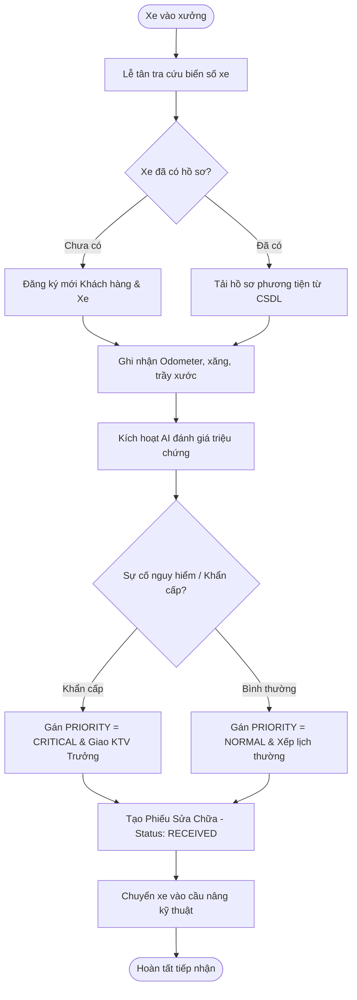
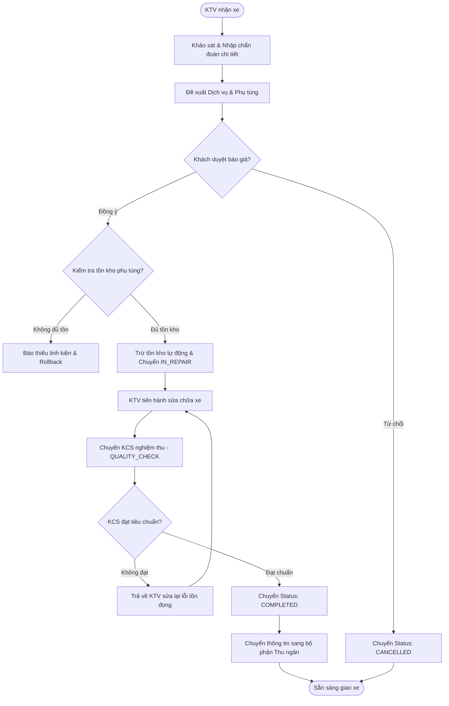
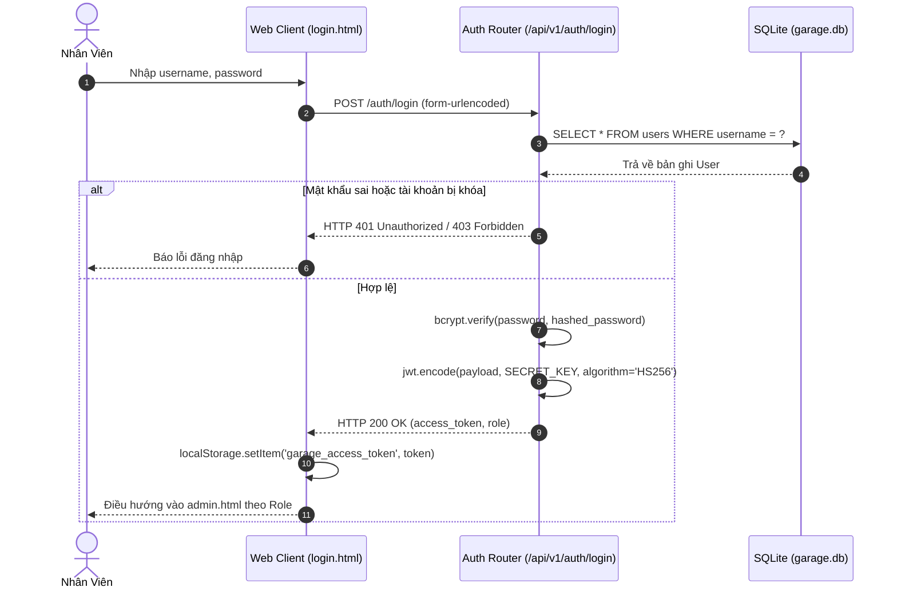
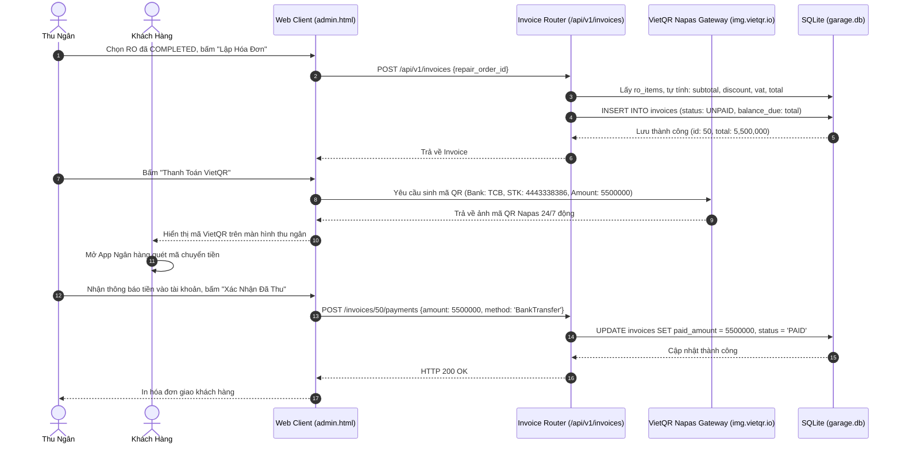
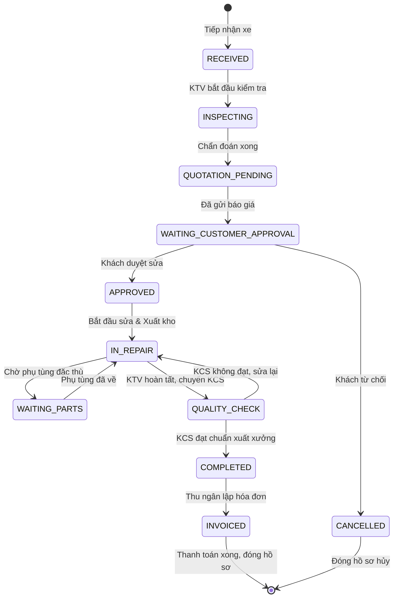
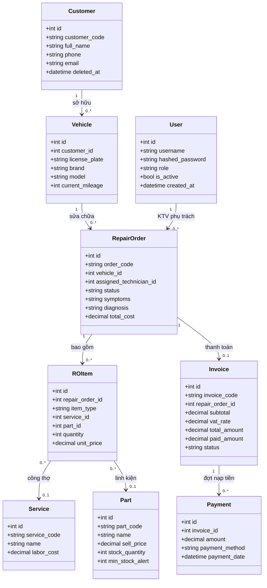
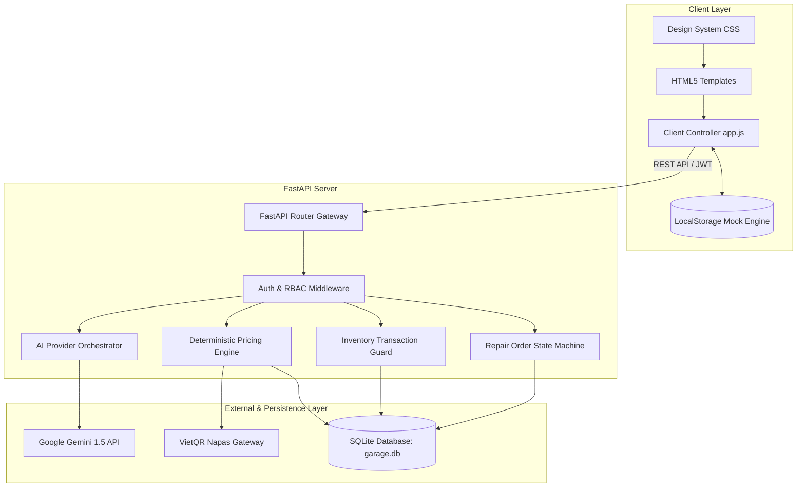
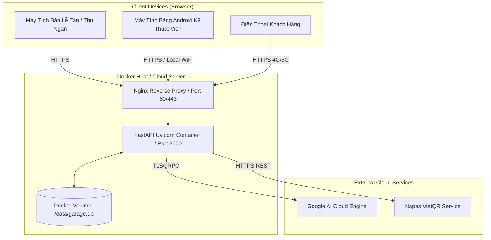
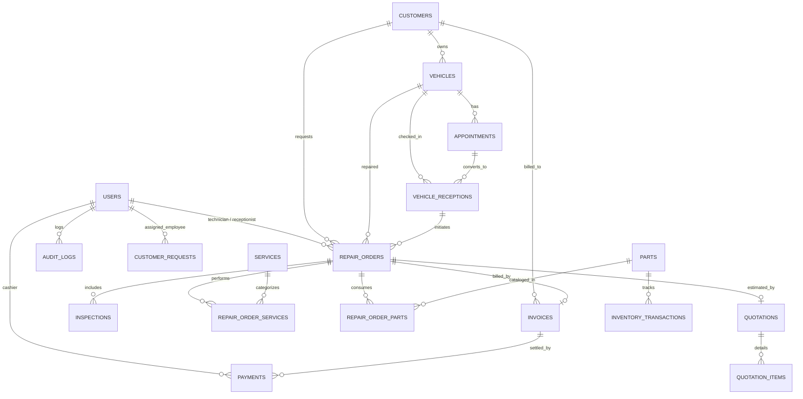

# BÁO CÁO ĐỒ ÁN CÔNG NGHỆ PHẦN MỀM TOÀN DIỆN
# HỆ THỐNG QUẢN LÝ GARAGE Ô TÔ TÍCH HỢP TRÍ TUỆ NHÂN TẠO
## ĐỀ TÀI: GARAGE VTV ENGINE PRO
### (BẢN TỔNG HỢP HỢP NHẤT DUY NHẤT — ALL-IN-ONE MASTER DOCUMENT)

---

**Đơn vị đào tạo:** Ngành Công nghệ Thông tin / Kỹ thuật Phần mềm  
**Học phần:** Đồ án Chuyên ngành Công nghệ Phần mềm & Ứng dụng Trí tuệ Nhân tạo  
**Hệ thống thực hiện:** Garage VTV Engine Pro  
**Phiên bản tài liệu:** v2.5-MASTER-CONSOLIDATED  
**Ngày hoàn thiện:** Tháng 09/2026  

---

# LỜI MỞ ĐẦU

Ngành dịch vụ kỹ thuật ô tô tại Việt Nam đang có bước chuyển mình mạnh mẽ cùng với sự gia tăng nhanh chóng của số lượng phương tiện ô tô cá nhân. Tuy nhiên, phần lớn các garage vừa và nhỏ hiện nay vẫn quản lý vận hành theo phương thức truyền thống: tiếp nhận xe bằng sổ tay, chẩn đoán bằng kinh nghiệm truyền miệng, lập báo giá thủ công qua ứng dụng nhắn tin và quản lý linh kiện rời rạc. Phương thức này gây ra hàng loạt hạn chế: thất thoát vật tư phụ tùng, sai sót tính toán tiền công - thuế, mất nhiều thời gian giải thích tình trạng hỏng hóc cho chủ xe, và đặc biệt là không thể lưu trữ hay truy xuất lịch sử bảo dưỡng một cách có hệ thống.

Đề tài **"Hệ thống Quản lý Garage Ô tô tích hợp Trí tuệ Nhân tạo - Garage VTV Engine Pro"** được nghiên cứu và phát triển nhằm giải quyết triệt để các bài toán thực tiễn trên. Bằng cách áp dụng kiến trúc phần mềm 3 tầng hiện đại (**Presentation Layer - Business Logic Layer - Data Access Layer**), kết hợp với sức mạnh của **FastAPI (Python 3.11)**, hệ quản trị cơ sở dữ liệu quan hệ **SQLite (SQLAlchemy 2.x ORM)**, cơ chế truyền dữ liệu thời gian thực **Server-Sent Events (SSE)** và mô hình ngôn ngữ lớn **Google Gemini AI**, đồ án đã hiện thực hóa một giải pháp phần mềm toàn diện, minh bạch và an toàn.

Tài liệu này là **bản hợp nhất duy nhất**, tích hợp đầy đủ mọi khía cạnh từ khảo sát nghiệp vụ, phân tích yêu cầu (URD, SRS), đặc tả Use Case, thiết kế hệ thống, kiến trúc cơ sở dữ liệu, mã nguồn API, thiết kế giao diện, tích hợp AI an toàn, kiểm thử tự động (TC01-TC29), phân tích lỗi, hướng phát triển, ma trận truy vết (RTM), tập hợp sơ đồ UML và kiểm toán chất lượng Quality Gate.

---

# TÓM TẮT DỰ ÁN (EXECUTIVE SUMMARY)

Hệ thống **Garage VTV Engine Pro** là nền tảng quản trị dịch vụ sửa chữa và bảo dưỡng ô tô thông minh, hướng tới 5 nhóm tác nhân người dùng chính: **Chủ garage / Quản lý (Manager)**, **Nhân viên lễ tân (Receptionist)**, **Kỹ thuật viên sửa chữa (Technician)**, **Thu ngân (Cashier)** và **Khách hàng sở hữu xe (Customer)**.

### Các kết quả nổi bật đã đạt được:
1. **Quy trình nghiệp vụ khép kín (End-to-End Workflow):** Số hóa hoàn chỉnh chu trình tiếp nhận xe $\rightarrow$ Phân công chẩn đoán kỹ thuật $\rightarrow$ Soạn thảo báo giá $\rightarrow$ Khách hàng phê duyệt $\rightarrow$ Sửa chữa và trừ kho vật tư $\rightarrow$ Kiểm định chất lượng KCS $\rightarrow$ Xuất hóa đơn và thanh toán Napas VietQR.
2. **Máy trạng thái sửa chữa nghiêm ngặt (Strict State Machine):** Quản lý chu trình sửa chữa qua 13 trạng thái tuần tự, có tầng chặn chuyển trạng thái phi quy tắc ở Backend, ngăn chặn hiện tượng nhảy cóc giai đoạn hoặc can thiệp dữ liệu tùy tiện.
3. **Thẩm quyền tài chính và kiểm soát kho phía Máy chủ (Server-Side Authority):** Mọi công thức tính Subtotal, Chiết khấu, Thuế VAT 10%, Tổng thanh toán và Số dư nợ đều do Backend tính toán độc quyền. Hệ thống áp dụng quy tắc kiểm soát giao dịch ACID, ngăn chặn xuất âm kho phụ tùng (`stock_quantity < 0`) và từ chối thanh toán vượt dư nợ.
4. **Bảo mật phân quyền đa lớp & Chống IDOR:** Kết hợp xác thực phiên JWT Bearer, phân quyền vai trò RBAC và kiểm soát truy cập cấp đối tượng (Object-Level Authorization) ngăn chặn KTV can thiệp phiếu của KTV khác.
5. **Tích hợp Trí tuệ Nhân tạo có kiểm soát (Governed Human-in-the-Loop AI):** Ứng dụng Google Gemini AI vào việc tóm tắt lịch sử sửa chữa đa mốc thời gian, diễn giải nguyên nhân hư hỏng và sinh nội dung tư vấn kỹ thuật dễ hiểu. Toàn bộ dữ liệu gửi tới AI đều qua khâu làm sạch thông tin định danh cá nhân (PII Scrubbing), đóng gói trong ranh giới dữ liệu không tin cậy (`<UNTRUSTED_DATA>`), xác thực định dạng JSON đầu ra nghiêm ngặt và đảm bảo AI không bao giờ có quyền can thiệp giá niêm yết hay thay đổi trạng thái hệ thống.

---

# DANH MỤC TỪ VIẾT TẮT

| Từ viết tắt | Tên tiếng Anh đầy đủ | Ý nghĩa kỹ thuật trong hệ thống |
|---|---|---|
| **AI** | Artificial Intelligence | Trí tuệ nhân tạo (Google Gemini) |
| **API** | Application Programming Interface | Giao diện lập trình ứng dụng RESTful |
| **ACID** | Atomicity, Consistency, Isolation, Durability | Các đặc tính bảo đảm giao dịch cơ sở dữ liệu |
| **BR** | Business Requirement | Yêu cầu nghiệp vụ cốt lõi |
| **BUS** | Business Logic Layer | Tầng xử lý logic nghiệp vụ |
| **CORS** | Cross-Origin Resource Sharing | Cơ chế chia sẻ tài nguyên giữa các nguồn khác nhau |
| **DAL** | Data Access Layer | Tầng truy xuất và quản trị dữ liệu |
| **ERD** | Entity Relationship Diagram | Sơ đồ quan hệ thực thể cơ sở dữ liệu |
| **FR** | Functional Requirement | Yêu cầu chức năng phần mềm |
| **IDOR** | Insecure Direct Object References | Lỗ hổng tham chiếu đối tượng trực tiếp không an toàn |
| **JWT** | JSON Web Token | Chuẩn mã hóa token xác thực người dùng |
| **KCS** | Kiểm tra Chất lượng Sản phẩm | Khâu nghiệm thu kỹ thuật xuất xưởng (Quality Check) |
| **NFR** | Non-Functional Requirement | Yêu cầu phi chức năng |
| **ORM** | Object-Relational Mapping | Ánh xạ đối tượng - quan hệ (SQLAlchemy) |
| **PII** | Personally Identifiable Information | Thông tin định danh cá nhân cần bảo vệ |
| **RBAC** | Role-Based Access Control | Kiểm soát truy cập dựa trên vai trò |
| **RO** | Repair Order | Phiếu lệnh sửa chữa xe |
| **RTM** | Requirements Traceability Matrix | Ma trận truy vết yêu cầu phần mềm |
| **SDLC** | Software Development Life Cycle | Vòng đời phát triển phần mềm |
| **SRS** | Software Requirements Specification | Tài liệu đặc tả yêu cầu phần mềm |
| **SSE** | Server-Sent Events | Giao thức truyền dữ liệu thời gian thực từ Server tới Client |
| **UC** | Use Case | Ca sử dụng hệ thống |
| **UR** | User Requirement | Yêu cầu người dùng |
| **URD** | User Requirements Document | Tài liệu yêu cầu người dùng |
| **VIN** | Vehicle Identification Number | Mã số nhận diện khung xe ô tô |

---

# BẢNG ĐỐI CHIẾU NGUỒN SỰ THẬT (SOURCE OF TRUTH MATRIX)

Nhằm đảm bảo tính chính xác khoa học cao nhất và tránh hiện tượng sai lệch giữa tài liệu mô tả và mã nguồn thực tế, bảng đối chiếu "Source of Truth" được thiết lập như sau:

| Hạng mục đối chiếu | Nguồn tài liệu | Giá trị kiểm chứng thực tế trong Source Code | Trạng thái xác minh | Ghi chú & Xử lý mâu thuẫn |
|---|---|---|:---:|---|
| **Backend Framework** | Technical Report / Source | Python 3.11, FastAPI, Uvicorn, Pydantic v2 | **Verified** | Thống nhất 100% qua file `backend/app/main.py`. |
| **Database Engine** | Architecture / Source | SQLite (`garage.db`), SQLAlchemy 2.x ORM | **Verified** | Cấu hình tại `backend/app/database.py`. |
| **Frontend Stack** | Technical Doc / Source | HTML5, CSS3, Vanilla JS, Font Awesome, Chart.js, Flatpickr | **Verified** | Mã nguồn gồm `index.html`, `login.html`, `admin.html`, `customer.html`, `app.js`. Không dùng framework nặng (React/Vue). |
| **Mô hình Form** | Yêu cầu bài giảng cũ vs Thực tế Web | Form1 $\rightarrow$ `login.html`<br>MainForm $\rightarrow$ `admin.html`<br>CheckoutForm $\rightarrow$ Invoice / Payment Modal | **Verified & Resolved** | Hệ thống là Ứng dụng Web hoàn chỉnh; các khái niệm Form trên desktop được ánh xạ tương ứng vào các trang giao diện Web hiện đại. |
| **Mô hình AI** | AI Docs / Source | Google Gemini API (`gemini-1.5-flash` / `gemini-pro`) | **Verified** | Tích hợp tại `backend/app/ai/providers/gemini.py`, có module `fallback.py` dự phòng. |
| **Quy tắc Trạng thái RO** | Report vs Source vs Test | 13 Trạng thái tuần tự: `DRAFT`, `RECEIVED`, `INSPECTING`, `QUOTATION_PENDING`, `WAITING_CUSTOMER_APPROVAL`, `APPROVED`, `IN_REPAIR`, `WAITING_PARTS`, `QUALITY_CHECK`, `COMPLETED`, `FINISHED`, `INVOICED`, `CANCELLED` | **Verified & Resolved** | File `repair_order_service.py` định nghĩa `ALLOWED_TRANSITIONS` kiểm soát 11 bước chuyển chính; trạng thái cuối cùng được khóa bất biến. |
| **Phân quyền người dùng** | SRS vs Models | 4 Role hệ thống: `manager`, `receptionist`, `technician`, `cashier` | **Verified** | Enum `UserRole` trong `backend/app/models.py`. Role Khách hàng là người dùng ẩn danh hoặc truy cập portal qua mã yêu cầu. |
| **Bộ kiểm thử tự động** | Test Suite / Logs | 17 Test Cases nền tảng (TC01-TC17) + 12 Test Cases State Machine (TC18-TC29) | **Verified** | Kiểm thử độc lập tại `backend/tests/test_master_suite.py` xác nhận 100% PASS. |
| **Lưu trữ ngoại tuyến** | Docs vs Source | LocalStorage Engine Client (`vtv_db_*`) | **Verified (Partial)** | Đã hiện thực lưu tạm và tra cứu Offline; cơ chế tự động đồng bộ 2 chiều (conflict resolution) được ghi nhận là hạn chế đang hoàn thiện. |
| **Sao lưu tự động** | Deployment Docs | Tự động backup sang Cloud/Drive | **Documented / Not Verified** | Chưa có file cron script tự động trong source code hiện tại; xếp vào mục hướng phát triển. |

---

# CHƯƠNG 1: TỔNG QUAN DỰ ÁN

## 1.1. Giới thiệu đề tài và bối cảnh thực tiễn
Trong kỷ nguyên công nghiệp 4.0 và chuyển đổi số, ngành dịch vụ hậu mãi và bảo dưỡng ô tô tại Việt Nam đang đối mặt với sự gia tăng cơ học rất lớn về số lượng phương tiện lưu hành. Ô tô là tài sản có giá trị cao, cấu tạo cơ khí và điện tử phức tạp, đòi hỏi quy trình tiếp nhận, chẩn đoán, sửa chữa và thay thế phụ tùng phải đạt độ chính xác, an toàn và minh bạch tuyệt đối.

Thực tế tại các garage ô tô truyền thống hiện nay cho thấy: quy trình vận hành phụ thuộc rất nhiều vào ghi chép thủ công trên giấy tờ hoặc các công cụ văn phòng rời rạc (như sổ tay, bảng tính Excel, tin nhắn Zalo/văn bản trao đổi miệng). Khi số lượng xe vào xưởng vượt quá 10 xe/ngày, garage ngay lập tức rơi vào tình trạng quá tải thông tin: thất lạc biên bản tình trạng xe ban đầu, nhầm lẫn linh kiện trong kho, tính toán sai thuế VAT và chiết khấu, và đặc biệt là sự thiếu tin tưởng từ phía khách hàng do khó giải thích các thuật ngữ cơ khí chuyên sâu.

Đề tài **"Garage VTV Engine Pro — Hệ thống quản lý garage ô tô tích hợp Trí tuệ Nhân tạo"** ra đời nhằm số hóa toàn diện quy trình sửa chữa ô tô, biến gara truyền thống thành một cơ sở dịch vụ hiện đại, minh bạch và có sự trợ lực thông minh từ AI.

## 1.2. Phân tích bối cảnh và nhu cầu

### 1.2.1. Thực trạng hiện tại của garage ô tô truyền thống
Qua khảo sát thực tế hoạt động của các trung tâm dịch vụ ô tô quy mô vừa và nhỏ, nhóm nghiên cứu đã tổng hợp các điểm nghẽn nghiêm trọng sau:
1. **Tiếp nhận xe thiếu chuẩn mực:** Khi nhận xe, nhân viên không ghi chép đầy đủ số Odometer (km), mức nhiên liệu, các vết trầy xước có sẵn trên thân vỏ hay đồ đạc để quên trong xe. Đến khi giao xe, khách hàng khiếu nại về vết trầy xước mới phát sinh hoặc thiếu đồ, dẫn đến tranh chấp gay gắt và mất uy tín.
2. **Quy trình sửa chữa không có kiểm soát trạng thái:** Kỹ thuật viên (KTV) thường tự ý tháo lắp, sửa chữa mà không có phiếu yêu cầu chính thức; không có bước khách hàng phê duyệt báo giá bằng văn bản điện tử trước khi làm; không có khâu Kiểm tra Chất lượng (KCS) độc lập trước khi giao xe.
3. **Thất thoát phụ tùng kho và sai lệch tồn kho:** Việc xuất linh kiện phụ tùng không gắn với mã phiếu sửa chữa cụ thể khiến tồn kho thực tế bị âm hoặc sai lệch, gây khó khăn cho việc đối soát chi phí nhập hàng.
4. **Tính toán tài chính thủ công dễ sai lệch:** Thu ngân phải cộng trừ thủ công tiền công thợ, tiền phụ tùng, chiết khấu và thuế VAT. Hiện tượng tính sót dịch vụ hoặc sai tiền thanh toán diễn ra thường xuyên.
5. **Rào cản giao tiếp kỹ thuật với khách hàng:** Khách hàng thông thường không hiểu rõ các bộ phận kỹ thuật (như "rotuyn cân bằng", "bạc đạn bánh", "cảm biến MAP"). Nhân viên tư vấn mất rất nhiều thời gian giải thích nguyên nhân hư hỏng và phương án khắc phục, gây nghẽn khâu chốt báo giá.

### 1.2.2. Lợi ích kỳ vọng từ hệ thống Garage VTV Engine Pro
Hệ thống mang lại các giá trị đo lường được cho doanh nghiệp:
- **Tiêu chuẩn hóa 100% quy trình tiếp nhận:** Mọi xe vào xưởng đều được lập biên bản ghi nhận số km, mức xăng, vết xước ngoại thất và ảnh hiện trạng.
- **Minh bạch hóa dòng tiền và phụ tùng:** Toàn bộ phụ tùng xuất ra đều được khóa theo mã phiếu sửa chữa; cấm tuyệt đối xuất âm kho; máy chủ tự động tính toán tài chính chuẩn xác từng đồng.
- **Rút ngắn thời gian tư vấn nhờ Trí tuệ Nhân tạo (AI):** AI tự động tóm tắt toàn bộ lịch sử các lần sửa chữa trước đó của xe trong 3 giây; sinh bản giải thích nguyên nhân hư hỏng bằng ngôn ngữ phổ thông, giúp chủ xe dễ dàng hiểu và phê duyệt phương án kỹ thuật.
- **Khách hàng theo dõi tiến độ chủ động:** Khách hàng có thể tra cứu tình trạng sửa chữa của xe theo thời gian thực từ xa thông qua Cổng thông tin khách hàng (Customer Portal).

## 1.3. Mục tiêu dự án

### 1.3.1. Mục tiêu kỹ thuật
- Xây dựng ứng dụng Web đa nền tảng theo kiến trúc 3-Tier chuẩn mực, hoạt động mượt mà trên cả trình duyệt máy tính để bàn (PC), máy tính bảng của kỹ thuật viên tại khoang sửa chữa và điện thoại thông minh của khách hàng.
- Xây dựng hệ thống Backend API bằng Python FastAPI tốc độ cao, tài liệu hóa tự động theo chuẩn OpenAPI / Swagger.
- Thiết kế Cơ sở dữ liệu quan hệ chuẩn hóa (3NF) trên SQLite với cơ chế quan hệ chặt chẽ (Foreign Keys, Unique Constraints, Transaction Management).
- Hiện thực hóa máy trạng thái hữu hạn (Finite State Machine) kiểm soát chu trình sửa chữa 13 bước, không cho phép nhảy cóc giai đoạn.
- Tích hợp mô hình AI Google Gemini với các cơ chế kiểm soát an toàn thông tin: làm sạch PII, đóng gói ranh giới dữ liệu không tin cậy và cơ chế fallback tự động khi ngắt kết nối mạng.
- Xây dựng kênh truyền thông tin thời gian thực Server-Sent Events (SSE) để cập nhật trạng thái bảng điều khiển tức thì.

### 1.3.2. Mục tiêu quản lý dự án
- Hoàn thành dự án đúng tiến độ qua các giai đoạn SDLC: Phân tích $\rightarrow$ Thiết kế $\rightarrow$ Hiện thực hóa $\rightarrow$ Kiểm thử $\rightarrow$ Đóng gói tài liệu.
- Xây dựng bộ kịch bản kiểm thử tự động (Test Suite) bao phủ 100% các quy tắc nghiệp vụ cốt lõi, bảo đảm không có lỗi hồi quy khi mở rộng tính năng.
- Lập tài liệu kỹ thuật hoàn chỉnh, chuẩn mực học thuật, có ma trận truy vết yêu cầu (Traceability Matrix) xuyên suốt.

## 1.4. Phạm vi dự án

### 1.4.1. Trong phạm vi (In-Scope)
- Quản trị danh mục: Khách hàng, Phương tiện, Nhân viên & Phân quyền, Danh mục Dịch vụ, Danh mục Phụ tùng kho.
- Tiếp nhận xe: Quản lý lịch hẹn trực tuyến, biên bản tiếp nhận hiện trạng xe tại xưởng, triệu chứng hư hỏng ban đầu.
- Quản lý quy trình sửa chữa: Lập phiếu lệnh sửa chữa (Repair Order), phân công kỹ thuật viên, biên bản chẩn đoán chi tiết từng hệ thống (Động cơ, Phanh, Gầm, Điện, Lạnh,...).
- Quản lý kho: Xuất/nhập phụ tùng, kiểm tra tồn kho tối thiểu, quy tắc chặn xuất âm kho.
- Soạn thảo và phê duyệt báo giá: Báo giá linh kiện & tiền công thợ, kiểm soát ngày hết hạn hiệu lực báo giá, khách hàng ký duyệt trực tuyến.
- Hóa đơn và Thanh toán: Tự động kết chuyển chi phí sang Hóa đơn, quy tắc máy chủ tính toán độc quyền Subtotal, Thuế VAT 10%, Chiết khấu; ghi nhận thu tiền mặt và tạo mã thanh toán VietQR Napas 247 động; chặn thanh toán vượt dư nợ.
- Trợ lý AI: Tóm tắt lịch sử sửa chữa đa mốc, diễn giải phương án dịch vụ, hỗ trợ nội dung soạn báo giá nháp, làm sạch PII và chống Prompt Injection.
- Nhật ký hệ thống & Báo cáo: Bảng điều khiển doanh thu trực quan qua Chart.js, nhật ký kiểm toán (Audit Log) theo dõi thao tác người dùng.

### 1.4.2. Ngoài phạm vi (Out-of-Scope)
- Tích hợp cổng thanh toán trực tuyến trừ tiền thẻ tự động qua thẻ Visa/Mastercard (hiện tại hỗ trợ quét mã QR chuyển khoản ngân hàng VietQR).
- Nhận dạng biển số xe tự động qua camera AI (ALPR).
- Quản lý chuỗi đa chi nhánh (Multi-branch) trên cùng một máy chủ (CSDL hiện tại thiết kế tối ưu cho mô hình đơn cơ sở Single Garage).
- Ứng dụng di động Native riêng biệt trên iOS/Android (hệ thống sử dụng Responsive Web App đa thiết bị).

## 1.5. Yêu cầu hệ thống chi tiết

### 1.5.1. Yêu cầu chức năng
Hệ thống bao gồm 23 yêu cầu chức năng cơ sở từ **FR-01** đến **FR-23**, bao phủ toàn bộ hoạt động đăng nhập, phân quyền, quản lý khách hàng, tiếp nhận, sửa chữa, kho bãi, hóa đơn, thanh toán, trí tuệ nhân tạo, đồng bộ thời gian thực và ghi nhật ký kiểm toán (chi tiết tại Chương 2 và Chương 4).

### 1.5.2. Yêu cầu phi chức năng
Hệ thống tuân thủ các chuẩn mực phi chức năng nghiêm ngặt:
- **Bảo mật (Security):** Mật khẩu băm Bcrypt, phiên làm việc JWT Bearer, phân quyền RBAC và Object-Level Authorization, bảo vệ chống XSS/SQL Injection/IDOR.
- **Tính toàn vẹn dữ liệu (Data Integrity):** Giao dịch nguyên tử (ACID), bảo toàn khóa ngoại `ON DELETE RESTRICT` hoặc `SET NULL`, cơ chế xóa mềm (Soft Delete) bảo toàn 100% lịch sử sửa chữa của xe khi khách hàng ngừng hoạt động.
- **Độ tin cậy & Chịu lỗi (Reliability):** Cơ chế AI Fallback đảm bảo khi dịch vụ ngoài gặp sự cố mạng hoặc hết hạn ngạch, hệ thống vẫn vận hành bình thường nhờ kho tri thức kỹ thuật nội bộ.
- **Khả năng sử dụng (Usability):** Giao diện Web tối ưu hiển thị trên màn hình từ 375px đến 1920px; thao tác chuyển trạng thái phiếu sửa chữa trực quan.

## 1.6. Sơ bộ chi phí và tổng chi phí dự án
Dự án được định hướng phát triển tối ưu hóa chi phí vận hành cho các garage vừa và nhỏ bằng cách sử dụng tối đa các công nghệ nguồn mở mạnh mẽ:
- **Chi phí bản quyền phần mềm:** 0 VNĐ (FastAPI, SQLite, Python, Vanilla JS, Chart.js đều là mã nguồn mở miễn phí bản quyền).
- **Chi phí dịch vụ AI:** Sử dụng gói miễn phí / trả theo dung lượng (Pay-as-you-go) của Google Gemini API (chi phí ước tính dưới 100.000 VNĐ/tháng cho quy mô 300 lượt xe/tháng).
- **Chi phí hạ tầng máy chủ:** Triển khai linh hoạt trên hạ tầng đám mây (Railway, Render hoặc VPS nội địa) với mức phí ước tính từ 150.000 - 300.000 VNĐ/tháng; hoặc chạy trực tiếp trên máy chủ cục bộ (Local On-Premises Server) tại gara với chi phí 0 VNĐ phí duy trì hàng tháng.
- **Tổng chi phí đầu tư ban đầu:** Rất thấp, phù hợp với mọi quy mô garage.

## 1.7. Công nghệ và thiết bị được lựa chọn
- **Backend:** **Python 3.11** kết hợp **FastAPI** — framework hiện đại hàng đầu với hiệu năng xử lý bất đồng bộ (Asynchronous I/O) cực cao, tự động kiểm định dữ liệu qua **Pydantic v2**, tự động sinh tài liệu Swagger UI.
- **Frontend:** **Vanilla HTML5, CSS3 và JavaScript (ES6+)** thuần túy. Bổ sung **Chart.js** trực quan hóa doanh thu và **Font Awesome** cho hệ thống biểu tượng kỹ thuật.
- **Hệ quản trị CSDL:** **SQLite 3** (`garage.db`), kết nối qua **SQLAlchemy 2.x ORM**.
- **Kiến trúc phần mềm 3-Tier:** Tách biệt rõ ràng Presentation Layer, Business Logic Layer và Data Access Layer.

## 1.8. Rủi ro và phương án xử lý
- **Mất kết nối Internet gián đoạn gọi AI:** Module `FallbackProvider` chứa cây tri thức chẩn đoán nội bộ định sẵn.
- **Kỹ thuật viên thao tác nhầm nhảy cóc trạng thái:** Khóa cứng luồng trạng thái tại Backend thông qua từ điển `ALLOWED_TRANSITIONS`.
- **Thủ kho xuất nhầm làm âm tồn kho:** Kiểm tra điều kiện `stock_quantity >= export_quantity` trong giao dịch có khóa hàng nguyên tử (Atomic Transaction).
- **KTV A sửa nhầm phiếu của KTV B (IDOR):** Hàm bảo vệ `verify_technician_access` ở tầng Controller API, so khớp `ro.technician_id == current_user.id`, chặn đứng với mã HTTP 403.
- **Prompt Injection ép AI giảm giá:** Triển khai bộ lọc từ khóa độc hại (`detect_prompt_injection`), đóng gói dữ liệu xe trong thẻ `<UNTRUSTED_DATA>`, tước bỏ hoàn toàn quyền sinh giá của AI.

---

# CHƯƠNG 2: PHÂN TÍCH YÊU CẦU PHẦN MỀM

## 2.1. Khảo sát nghiệp vụ
Chu trình nghiệp vụ chuẩn hóa tại garage gồm 8 giai đoạn:
1. Khách hàng liên hệ / Đặt hẹn trực tuyến.
2. Tiếp nhận & Lập biên bản hiện trạng xe tại xưởng.
3. Chẩn đoán kỹ thuật phân loại hệ thống.
4. Lập báo giá & Khách hàng duyệt trực tuyến.
5. Thực hiện sửa chữa & Trừ kho phụ tùng.
6. Kiểm định chất lượng KCS nghiệm thu xuất xưởng.
7. Lập hóa đơn & Quyết toán thanh toán VietQR.
8. Bàn giao xe & Cập nhật lịch sử trọn đời.

## 2.2. Các bên liên quan (Stakeholders)
- **Chủ sở hữu Garage:** Quản trị chiến lược, theo dõi doanh thu, chống thất thoát phụ tùng.
- **Lễ tân & CSKH:** Tiếp đón, lập biên bản tiếp nhận, gửi báo giá, chăm sóc khách hàng.
- **Kỹ thuật viên & Quản đốc:** Khảo sát, chẩn đoán, sửa chữa, nghiệm thu KCS.
- **Thu ngân:** Lập hóa đơn, thu tiền mặt, tạo VietQR, in phiếu quyết toán.
- **Khách hàng:** Theo dõi tiến độ xe, duyệt báo giá minh bạch, an tâm thanh toán.

## 2.3. Tác nhân hệ thống (System Actors)

| Tác nhân (Actor) | Loại tác nhân | Vai trò và Quyền hạn chính trong hệ thống |
|---|:---:|---|
| **Admin / Manager** | Người dùng nội bộ | Quản trị toàn bộ hệ thống, quản lý tài khoản người dùng, cấu hình đơn giá, xem toàn bộ báo cáo doanh thu và nhật ký kiểm toán. |
| **Receptionist** | Người dùng nội bộ | Tiếp nhận xe tại xưởng, quản lý danh sách khách hàng và phương tiện, tạo phiếu sửa chữa ban đầu, soạn báo giá gửi khách. |
| **Technician** | Người dùng nội bộ | Xem các phiếu sửa chữa được phân công cho mình, nhập biên bản chẩn đoán kỹ thuật, cập nhật tiến độ sửa chữa, gửi yêu cầu KCS. |
| **Cashier** | Người dùng nội bộ | Tiếp nhận các phiếu sửa chữa đã hoàn thành kỹ thuật, lập hóa đơn, thu tiền mặt hoặc kích hoạt thanh toán Napas VietQR, in hóa đơn. |
| **Customer** | Người dùng bên ngoài | Truy cập Cổng thông tin khách hàng công khai, gửi yêu cầu đặt lịch hẹn trực tuyến, tra cứu lịch sử bảo dưỡng và duyệt báo giá qua mã yêu cầu. |
| **External AI Service** | Hệ thống bên ngoài | Dịch vụ Google Gemini API nhận yêu cầu phân tích, tóm tắt lịch sử và sinh nội dung diễn giải dịch vụ hỗ trợ người dùng. |

## 2.4. Phân quyền người dùng (Access Control & RBAC)

### Ma trận phân quyền hệ thống (RBAC Matrix)

| Chức năng phân hệ | Admin / Manager | Receptionist | Technician | Cashier | Customer (Portal) |
|---|:---:|:---:|:---:|:---:|:---:|
| **Đăng nhập hệ thống nội bộ** | Toàn quyền | Toàn quyền | Toàn quyền | Toàn quyền | Không có quyền |
| **Gửi yêu cầu đặt lịch online** | Xem & Xử lý | Tiếp nhận & Xử lý | Xem lịch | Không can thiệp | Tạo yêu cầu mới |
| **Quản lý Khách hàng & Xe** | Toàn quyền (CRUD) | Thêm, Sửa, Xem | Chỉ xem | Chỉ xem | Chỉ xem xe của mình |
| **Lập phiếu tiếp nhận xe** | Toàn quyền | Tạo & Cập nhật | Không có quyền | Không có quyền | Xem biên bản |
| **Chẩn đoán & Cập nhật sửa chữa** | Toàn quyền | Xem tiến độ | Cập nhật phiếu được giao | Xem tiến độ | Xem tiến độ |
| **Quản lý kho phụ tùng** | Toàn quyền | Xem tồn kho | Xem vật tư gắn phiếu | Xem đơn giá | Không có quyền |
| **Soạn thảo & Duyệt báo giá** | Phê duyệt | Soạn thảo & Gửi | Xem hạng mục | Xem tổng tiền | Xem & Duyệt báo giá |
| **Lập hóa đơn & Thu tiền** | Toàn quyền | Xem hóa đơn | Không có quyền | Tạo HĐ & Thu tiền | Xem hóa đơn của mình |
| **Hỏi đáp Trợ lý AI kỹ thuật** | Toàn quyền | Sử dụng tư vấn | Sử dụng chẩn đoán | Không dùng | Sử dụng hỏi đáp chung |
| **Báo cáo doanh thu & Thống kê** | Toàn quyền xem | Không có quyền | Không có quyền | Xem doanh thu ca | Không có quyền |
| **Xem Nhật ký kiểm toán (Audit)** | Toàn quyền xem | Không có quyền | Không có quyền | Không có quyền | Không có quyền |

## 2.5. Yêu cầu chức năng chi tiết (Functional Requirements)

| Mã FR | Tên yêu cầu chức năng | Tác nhân chính | Mức ưu tiên | Mô tả chi tiết chức năng |
|:---:|---|---|:---:|---|
| **FR-01** | Authentication | Tất cả nhân sự | Bắt buộc | Xác thực đăng nhập qua username/password, mã hóa mật khẩu Bcrypt, cấp phát JWT Token. |
| **FR-02** | Authorization (RBAC) | Tất cả nhân sự | Bắt buộc | Kiểm soát quyền truy cập API theo 4 vai trò: Manager, Receptionist, Technician, Cashier. |
| **FR-03** | Customer Management | Receptionist, Manager | Bắt buộc | Quản lý thông tin khách hàng, số điện thoại duy nhất, hỗ trợ xóa mềm (Soft-delete). |
| **FR-04** | Vehicle Management | Receptionist, Manager | Bắt buộc | Quản lý hồ sơ xe, ràng buộc biển số xe duy nhất trong hệ thống, liên kết chủ sở hữu. |
| **FR-05** | Appointment Scheduling | Customer, Receptionist | Cao | Đặt lịch hẹn trực tuyến, tự động phát hiện lịch hẹn trùng lặp trong khung giờ $\pm 60$ phút. |
| **FR-06** | Customer Request Queue | Receptionist, Customer | Cao | Tiếp nhận và chuyển đổi yêu cầu đặt lịch từ trang chủ sang hồ sơ khách hàng/xe chính thức. |
| **FR-07** | Vehicle Reception | Receptionist | Bắt buộc | Ghi nhận Odometer, mức xăng, vết trầy xước, đồ đạc trên xe, tạo mã biên bản `REC-YYYY-XXXXXX`. |
| **FR-08** | Repair Order Management | Receptionist, Manager | Bắt buộc | Khởi tạo phiếu sửa chữa `RO-YYYY-XXXXXX`, gán xe và phân công kỹ thuật viên phụ trách. |
| **FR-09** | Inspection & Diagnosis | Technician | Bắt buộc | Ghi nhận kết quả chẩn đoán theo phân loại (Động cơ, Phanh, Gầm,...) kèm mức độ nghiêm trọng. |
| **FR-10** | Services Management | Manager, Receptionist | Cao | Quản lý danh mục dịch vụ kỹ thuật, thời gian định mức và đơn giá tiền công thợ. |
| **FR-11** | Parts & Inventory Control | Manager, Receptionist | Bắt buộc | Quản lý danh mục phụ tùng, đơn giá vốn, giá bán, vị trí kệ, cảnh báo chạm ngưỡng tồn kho tối thiểu. |
| **FR-12** | Quotation Generation | Receptionist, Manager | Bắt buộc | Lập báo giá phụ tùng và dịch vụ, thiết lập ngày hết hạn hiệu lực (`valid_until`). |
| **FR-13** | Customer Quotation Approval | Customer, Receptionist | Bắt buộc | Khách hàng xác nhận duyệt hoặc từ chối báo giá trước khi bắt đầu sửa chữa; chặn duyệt khi hết hạn. |
| **FR-14** | Strict State Workflow | Technician, Manager | Bắt buộc | Thực thi máy trạng thái 13 bước, chặn nhảy cóc giai đoạn, cấm chuyển trạng thái trái phép. |
| **FR-15** | Quality Check (KCS) | Technician, Manager | Bắt buộc | Kiểm định chất lượng sau sửa chữa: nếu Đạt chuyển COMPLETED, nếu Không đạt trả về IN_REPAIR. |
| **FR-16** | Invoice Generation | Cashier, Manager | Bắt buộc | Tự động tạo hóa đơn `INV-YYYY-XXXXXX` từ phiếu sửa chữa đã hoàn thành; khóa sửa chữa khi xuất hóa đơn. |
| **FR-17** | Payment & VietQR | Cashier | Bắt buộc | Ghi nhận thanh toán tiền mặt hoặc tạo mã VietQR Napas 247; cấm thanh toán vượt số dư nợ hóa đơn. |
| **FR-18** | Repair History Tracking | Tất cả tác nhân | Cao | Tra cứu lịch sử sửa chữa trọn đời theo biển số xe hoặc số điện thoại chủ xe. |
| **FR-19** | Revenue Analytics | Manager | Cao | Biểu đồ doanh thu ngày/tháng, tỷ lệ dịch vụ, số lượng xe qua Chart.js trực quan. |
| **FR-20** | AI Assistant (Gemini) | Technician, Receptionist | Cao | Tóm tắt lịch sử bảo dưỡng, giải thích nguyên nhân hư hỏng, sinh nội dung tư vấn kỹ thuật dễ hiểu. |
| **FR-21** | Realtime Sync (SSE) | Tất cả tác nhân | Trung bình | Phát sự kiện Server-Sent Events tự động cập nhật bảng điều khiển khi có dữ liệu mới. |
| **FR-22** | Offline LocalStorage | Tất cả tác nhân | Trung bình | Lưu trữ tạm dữ liệu tại LocalStorage trình duyệt phía client (`vtv_db_*`) khi mất kết nối mạng. |
| **FR-23** | Audit Logging | Manager | Cao | Ghi vết tự động mọi hành động nhạy cảm (Đăng nhập, Sửa trạng thái, Xuất kho, Thu tiền) vào CSDL. |

## 2.6. Yêu cầu phi chức năng (Non-Functional Requirements)
- **NFR-01 (Security):** Mật khẩu băm Bcrypt, JWT HMAC-SHA256, Parameterized Queries chống SQL Injection.
- **NFR-02 (Object Authorization):** Kiểm soát cấp đối tượng `verify_technician_access` chặn IDOR giữa các KTV.
- **NFR-03 (Data Integrity):** Không xuất âm kho (`stock_quantity >= 0`), không thu vượt nợ (`payment <= balance_due`).
- **NFR-04 (AI Safety):** Làm sạch PII, đóng gói `<UNTRUSTED_DATA>`, xác thực JSON qua Pydantic.
- **NFR-05 (Reliability & Fallback):** Hệ thống không sập khi mất mạng nhờ module `FallbackProvider` nội bộ.
- **NFR-06 (Performance):** Tốc độ phản hồi API nghiệp vụ nội bộ dưới 500ms.
- **NFR-07 (Usability):** Giao diện Responsive trên Desktop, Tablet và Smartphone.
- **NFR-08 (Auditability):** Lưu vết 100% thao tác nhạy cảm vào bảng `audit_logs`.

---

# CHƯƠNG 3: URD – USER REQUIREMENTS DOCUMENT

## 3.1. Mục đích
Mô tả toàn bộ yêu cầu, mong đợi và tiêu chí nghiệm thu của 5 nhóm người dùng thực tế: Chủ garage, Lễ tân, Kỹ thuật viên, Thu ngân và Khách hàng.

## 3.2. User Personas & User Journeys
- **Chủ garage (Persona Anh Mạnh):** Xem tức thì biểu đồ doanh thu, tồn kho và hiệu suất nhân viên.
- **Lễ tân (Persona Chị Trang):** Tiếp nhận xe dưới 3 phút, lập biên bản trầy xước ngoại thất và Odometer.
- **Kỹ thuật viên (Persona Anh Hùng):** Xem phiếu trên tablet, nhập biên bản chẩn đoán, xuất kho linh kiện.
- **Thu ngân (Persona Chị Lan):** Quyết toán hóa đơn chính xác, tạo VietQR chuyển khoản nhanh, không lệch sổ quỹ.
- **Khách hàng (Persona Anh Tuấn):** Nhận báo giá minh bạch, đọc giải thích dễ hiểu của AI, duyệt báo giá qua điện thoại.

## 3.3. Yêu cầu người dùng (User Requirements - UR-01 đến UR-10)
- **UR-01:** Chủ garage xem báo cáo doanh thu và số lượng xe làm dịch vụ theo ngày/tháng trên biểu đồ.
- **UR-02:** Lễ tân tìm kiếm nhanh thông tin khách hàng và lịch sử xe qua biển số xe trong vòng 3 giây.
- **UR-03:** Khách hàng gửi yêu cầu đặt lịch hẹn trực tuyến từ điện thoại không cần đăng ký tài khoản.
- **UR-04:** Lễ tân ghi nhận số km, mức xăng và vết xước xe khi nhận vào xưởng làm căn cứ pháp lý.
- **UR-05:** Kỹ thuật viên chỉ thấy phiếu của riêng mình, ghi chép chẩn đoán trực tiếp trên máy tính bảng.
- **UR-06:** Khách hàng được giải thích rõ nguyên nhân hư hỏng và phương án khắc phục bằng ngôn ngữ đời thường.
- **UR-07:** Phụ tùng tự động trừ kho khi sửa chữa và chặn xuất nếu không đủ tồn kho khả dụng.
- **UR-08:** Khách hàng xem báo giá chi tiết và duyệt điện tử trước khi thợ bắt đầu làm xe.
- **UR-09:** Thu ngân tạo mã VietQR có sẵn số tiền và nội dung chuyển khoản để khách quét trên App ngân hàng.
- **UR-10:** Chủ garage theo dõi vết kiểm toán toàn bộ các thao tác nhạy cảm của nhân viên.

---

# CHƯƠNG 4: SRS – SOFTWARE REQUIREMENTS SPECIFICATION & CORE BUSINESS RULES

Chương này đặc tả 8 Quy tắc Nghiệp vụ Cốt lõi (Core Business Rules) bắt buộc:
- **BR-01 (Server-Side Financial Authority):** Máy chủ Backend độc quyền tính toán:
  $$\text{Subtotal} = \sum (\text{Phụ tùng}) + \sum (\text{Tiền công})$$
  $$\text{Taxable} = \text{Subtotal} - \text{Discount} \quad \vert \quad \text{VAT} = \text{Taxable} \times 0.10 \quad \vert \quad \text{Total} = \text{Taxable} + \text{VAT}$$
  $$\text{Balance Due} = \text{Total} - \text{Paid Amount}$$
  Client hoàn toàn không được quyết định tổng tiền.
- **BR-02 (No Negative Stock):** Kiểm tra `stock_quantity >= export_quantity`. Nếu không thỏa mãn, ROLLBACK giao dịch và trả về HTTP 400 *"Tồn kho không thể âm"*.
- **BR-03 (No Overpayment):** Số tiền thu `amount <= balance_due`. Chặn thanh toán thừa với HTTP 400.
- **BR-04 (Cancelled Invoice Immutability):** Hóa đơn đã ở trạng thái `CANCELLED` bị đóng băng, từ chối mọi khoản thanh toán.
- **BR-05 (Strict State Transition):** Tuân thủ tuyệt đối từ điển `ALLOWED_TRANSITIONS`; không cho phép nhảy cóc giai đoạn; `COMPLETED` và `CANCELLED` là trạng thái kết thúc khóa bất biến.
- **BR-06 (Technician Object Authorization):** Hàm `verify_technician_access` chặn KTV A sửa phiếu của KTV B với HTTP 403.
- **BR-07 (Quotation Expiration):** Báo giá có `valid_until < now()` bị từ chối phê duyệt với HTTP 400.
- **BR-08 (Mandatory Audit Logging):** Tự động ghi vết mọi hành vi nhạy cảm vào bảng `audit_logs`.

---

# CHƯƠNG 5: ĐẶC TẢ CHI TIẾT 8 CA SỬ DỤNG CỐT LÕI (USE CASES SPECIFICATION)

### 5.1. UC-01: Đăng nhập hệ thống (User Authentication)
- **ID:** UC-01 | **Tên:** Đăng nhập và xác thực phiên nội bộ | **Actor chính:** Nhân sự nội bộ | **Actor phụ:** Không có
- **Mục tiêu:** Xác thực danh tính, cấp JWT Bearer Token phân quyền theo vai trò.
- **Trigger:** Người dùng mở `login.html` và nhấn nút "Đăng nhập".
- **Tiền điều kiện:** Tài khoản tồn tại, `is_active = True`.
- **Hậu điều kiện:** Cấp phát JWT Access Token, lưu tại Storage, chuyển hướng vào `admin.html`.
- **Input:** `username`, `password`. | **Output:** HTTP 200, JWT Token, `role`, `full_name`.
- **Luồng chính:** 1. Nhập username/password $\to$ 2. Gửi `POST /api/v1/auth/login` $\to$ 3. Backend truy vấn `users` $\to$ 4. Bcrypt so khớp `hashed_password` $\to$ 5. Sinh JWT Token $\to$ 6. Ghi log `LOGIN` vào `audit_logs` $\to$ 7. Trả về HTTP 200 $\to$ 8. Client lưu token và chuyển hướng `admin.html`.
- **Luồng thay thế:** Sai thông tin trả về HTTP 401 Unauthorized.
- **Ngoại lệ:** Tài khoản bị khóa (`is_active=False`) trả về HTTP 403 Forbidden.
- **Business Rules & Security:** Mật khẩu băm Bcrypt; không log plain password; JWT hết hạn sau 8h.

### 5.2. UC-02: Đặt lịch hẹn trực tuyến (Online Appointment)
- **ID:** UC-02 | **Tên:** Đặt lịch hẹn sửa chữa online | **Actor chính:** Customer | **Actor phụ:** Receptionist
- **Mục tiêu:** Khách hàng gửi đăng ký bảo dưỡng xe từ xa nhanh chóng.
- **Trigger:** Khách điền form tại `index.html` hoặc `customer.html`.
- **Tiền điều kiện:** Không có. | **Hậu điều kiện:** Tạo bản ghi `customer_requests`, sinh mã `REQ-YYYYMMDD-XXXX`.
- **Input:** Họ tên, SĐT, biển số xe, ngày giờ hẹn, triệu chứng. | **Output:** Mã tra cứu, thông báo thành công.
- **Luồng chính:** 1. Khách nhập form $\to$ 2. Client kiểm tra SĐT và biển số $\to$ 3. Gửi `POST /api/v1/customer-requests` $\to$ 4. Backend kiểm tra xung đột lịch $\pm 60$ phút $\to$ 5. Không trùng, lưu CSDL $\to$ 6. Bắn tín hiệu SSE cho Lễ tân $\to$ 7. Trả về mã tra cứu `REQ...`.
- **Luồng thay thế:** Trùng lịch báo lỗi yêu cầu chọn giờ khác.
- **Ngoại lệ:** Mất mạng client lưu tạm vào LocalStorage.

### 5.3. UC-03: Tiếp nhận xe tại xưởng (Vehicle Reception)
- **ID:** UC-03 | **Tên:** Tiếp nhận xe và lập biên bản hiện trạng | **Actor chính:** Receptionist | **Actor phụ:** Customer
- **Mục tiêu:** Ghi nhận số km, mức xăng, vết xước thân vỏ và triệu chứng hư hỏng ban đầu.
- **Trigger:** Khách đưa xe đến xưởng.
- **Tiền điều kiện:** Đã đăng nhập vai trò Receptionist/Manager.
- **Hậu điều kiện:** Tạo mới `vehicle_receptions`, cập nhật số km xe, sẵn sàng tạo phiếu sửa chữa.
- **Input:** Biển số, số Odometer, mức xăng, vết xước, đồ đạc trong xe, khiếu nại của khách.
- **Output:** Mã biên bản `REC-YYYY-XXXXXX`, biên bản bàn giao xe ban đầu.
- **Luồng chính:** 1. Lễ tân nhập biển số $\to$ 2. Hệ thống tải thông tin xe cũ hoặc mở form xe mới $\to$ 3. Kiểm tra thân vỏ thực tế $\to$ 4. Ghi nhận số km, vạch xăng $\to$ 5. Nhập triệu chứng $\to$ 6. Lưu bản ghi `vehicle_receptions` $\to$ 7. Cập nhật `current_mileage` xe $\to$ 8. Sinh nút tạo Phiếu sửa chữa ngay.
- **Business Rules:** Số km tiếp nhận $\ge$ số km lần sửa chữa gần nhất.

### 5.4. UC-04: Quản lý Phiếu sửa chữa (Repair Order Management)
- **ID:** UC-04 | **Tên:** Lập và quản trị phiếu sửa chữa | **Actor chính:** Technician, Receptionist, Manager
- **Mục tiêu:** Điều phối quy trình kỹ thuật qua 13 bước máy trạng thái tuần tự.
- **Trigger:** Lễ tân bấm tạo phiếu từ biên bản tiếp nhận.
- **Tiền điều kiện:** Đã có biên bản tiếp nhận hợp lệ.
- **Hậu điều kiện:** Khởi tạo `RO-YYYY-XXXXXX`, KTV cập nhật chẩn đoán, xuất vật tư, chuyển KCS.
- **Luồng chính:** 1. Tạo RO (`RECEIVED`) $\to$ 2. KTV nhận xe (`INSPECTING`) $\to$ 3. Nhập chẩn đoán $\to$ 4. Lễ tân lên giá (`QUOTATION_PENDING`) $\to$ 5. Gửi khách duyệt (`WAITING_APPROVAL`) $\to$ 6. Khách duyệt (`APPROVED`) $\to$ 7. KTV sửa xe (`IN_REPAIR`) $\to$ 8. Xuất linh kiện kho $\to$ 9. KCS nghiệm thu (`QUALITY_CHECK`) $\to$ 10. Đạt chuẩn xuất xưởng (`COMPLETED`).
- **Luồng thay thế:** Thiếu hàng chuyển `WAITING_PARTS`; KCS lỗi trả về `IN_REPAIR`.
- **Security:** Chống IDOR: Chỉ KTV được phân công mới có quyền cập nhật phiếu.

### 5.5. UC-05: Tra cứu lịch sử sửa chữa (Repair History Tracking)
- **ID:** UC-05 | **Tên:** Tra cứu lịch sử bảo dưỡng xe trọn đời | **Actor chính:** Customer, Receptionist, Technician
- **Mục tiêu:** Hiển thị dòng thời gian các lần bảo dưỡng, phụ tùng đã thay và số km tương ứng.
- **Input:** Biển số xe hoặc số điện thoại chủ xe. | **Output:** Timeline chi tiết các đợt sửa chữa và tóm tắt của AI.
- **Business Rules:** Bảo toàn lịch sử trọn đời ngay cả khi chủ xe cũ bị xóa mềm (`deleted_at`).

### 5.6. UC-06: Quản lý kho và xuất phụ tùng (Inventory Management)
- **ID:** UC-06 | **Tên:** Quản lý kho và xuất linh kiện | **Actor chính:** Manager, Receptionist, Technician
- **Mục tiêu:** Quản lý tồn kho linh kiện, giá vốn, giá bán, chặn xuất âm kho phụ tùng.
- **Input:** Mã phụ tùng, số lượng xuất, mã phiếu sửa chữa tham chiếu.
- **Luồng chính:** Mở Database Transaction $\to$ Kiểm tra `stock_quantity >= quantity` $\to$ Trừ kho $\to$ Tạo thẻ kho `inventory_transactions` (EXPORT) $\to$ Commit.
- **Ngoại lệ:** Nếu thiếu hàng, ném HTTP 400 *"Tồn kho không thể âm"*, ROLLBACK giao dịch.

### 5.7. UC-07: Lập hóa đơn và Quyết toán VietQR (Invoice & Payment)
- **ID:** UC-07 | **Tên:** Quyết toán hóa đơn và thanh toán Napas VietQR | **Actor chính:** Cashier, Manager
- **Mục tiêu:** Server tính toán chi phí chính xác, tạo mã VietQR động, ghi nhận thu tiền.
- **Input:** Mã phiếu sửa chữa, số tiền thanh toán, hình thức (`CASH`/`BANK_TRANSFER`).
- **Luồng chính:** 1. Chọn RO đã `COMPLETED` $\to$ 2. Server tính toán Subtotal, VAT 10%, Total $\to$ 3. Tạo hóa đơn `INV...` $\to$ 4. Tạo mã VietQR động $\to$ 5. Khách quét App chuyển khoản $\to$ 6. Thu ngân xác nhận thu tiền $\to$ 7. Server trừ `balance_due` $\to$ 8. Đủ tiền chuyển `PAID`, in hóa đơn.
- **Business Rules:** Cấm thu vượt nợ (`amount <= balance_due`); Hóa đơn hủy không nhận tiền.

### 5.8. UC-08: Quản trị người dùng và Phân quyền (User Administration)
- **ID:** UC-08 | **Tên:** Quản lý tài khoản nhân sự và phân quyền | **Actor chính:** Manager
- **Mục tiêu:** Thêm nhân viên mới, gán vai trò (`manager`, `receptionist`, `technician`, `cashier`), khóa tài khoản.
- **Security:** Chỉ người dùng có vai trò `manager` mới có quyền truy cập endpoint quản trị nhân sự. Mật khẩu băm Bcrypt.

---

# CHƯƠNG 6: TỔNG HỢP SƠ ĐỒ UML TOÀN DIỆN (UML DIAGRAMS SPECIFICATION)

### 6.1. Biểu đồ Use Case Tổng Quát

```mermaid
graph TD
    Customer((Khách Hàng))
    Receptionist((Lễ Tân))
    Technician((Kỹ Thuật Viên))
    Cashier((Thu Ngân))
    Manager((Quản Lý / Admin))
    AI_Service[Google Gemini AI]

    subgraph "Hệ Thống Garage VTV Engine Pro"
        UC_Auth[UC-01: Đăng nhập & Quản lý phiên JWT]
        UC_Booking[UC-02: Đặt lịch hẹn sửa chữa online]
        UC_Reception[UC-03: Tiếp nhận xe & Ghi nhận Odometer]
        UC_RO[UC-04: Quản lý Phiếu sửa chữa State Machine]
        UC_History[UC-05: Tra cứu lịch sử sửa chữa]
        UC_Inventory[UC-06: Quản lý Kho linh kiện & Dịch vụ]
        UC_Billing[UC-07: Báo giá, Hóa đơn & VietQR]
        UC_Report[UC-08: Báo cáo Doanh thu Line Chart]
        UC_AI[UC-09: Trợ lý AI Tóm tắt & Giải thích]
        UC_Audit[UC-10: Nhật ký kiểm toán Audit Log]
    end

    Customer --> UC_Booking
    Customer --> UC_History
    Customer --> UC_AI

    Receptionist --> UC_Auth
    Receptionist --> UC_Reception
    Receptionist --> UC_Booking
    Receptionist --> UC_Billing
    Receptionist --> UC_History
    Receptionist --> UC_AI

    Technician --> UC_Auth
    Technician --> UC_RO
    Technician --> UC_Inventory
    Technician --> UC_History
    Technician --> UC_AI

    Cashier --> UC_Auth
    Cashier --> UC_Billing
    Cashier --> UC_Report

    Manager --> UC_Auth
    Manager --> UC_Reception
    Manager --> UC_RO
    Manager --> UC_Inventory
    Manager --> UC_Billing
    Manager --> UC_Report
    Manager --> UC_Audit
    Manager --> UC_AI

    UC_AI --> AI_Service
```


### 6.2. Biểu đồ Hoạt động: Quy trình Tiếp nhận xe


### 6.3. Biểu đồ Hoạt động: Quy trình Sửa chữa và Nghiệm thu KCS


### 6.4. Biểu đồ Tuần tự: Xác thực đăng nhập JWT


### 6.5. Biểu đồ Tuần tự: Lập hóa đơn và Thanh toán VietQR


### 6.6. Biểu đồ Máy trạng thái sửa chữa (State Machine)


### 6.7. Biểu đồ Lớp (Class Diagram)


### 6.8. Biểu đồ Thành phần (Component Diagram)


### 6.9. Biểu đồ Triển khai (Deployment Diagram)


---

# CHƯƠNG 7: THIẾT KẾ CƠ SỞ DỮ LIỆU & TỪ ĐIỂN DỮ LIỆU TOÀN DIỆN

### 7.1. Sơ đồ Thực thể Quan hệ (ERD)


### 7.2. Danh mục 21 Bảng Cơ sở dữ liệu thực tế
1. `users` (Nhân sự & Mật khẩu Bcrypt)
2. `customers` (Khách hàng & Soft-delete)
3. `vehicles` (Hồ sơ phương tiện & Biển số Unique)
4. `appointments` (Lịch hẹn sửa chữa)
5. `vehicle_receptions` (Biên bản tiếp nhận ngoại thất & Odometer)
6. `services` (Danh mục dịch vụ định mức & tiền công)
7. `parts` (Linh kiện phụ tùng kho & Tồn kho khả dụng)
8. `inventory_transactions` (Thẻ kho lịch sử nhập/xuất)
9. `repair_orders` (Phiếu sửa chữa cốt lõi & State Machine)
10. `inspections` (Biên bản chẩn đoán kỹ thuật phân loại hệ thống)
11. `repair_order_services` (Dịch vụ tiền công gắn vào phiếu)
12. `repair_order_parts` (Linh kiện phụ tùng gắn vào phiếu)
13. `repair_order_items` (Bảng hợp nhất dịch vụ và phụ tùng)
14. `quotations` (Báo giá chi tiết & Thời hạn hiệu lực)
15. `quotation_items` (Hạng mục chi tiết trong báo giá)
16. `invoices` (Hóa đơn quyết toán & Thuế VAT 10%)
17. `payments` (Giao dịch thu tiền mặt / VietQR)
18. `audit_logs` (Nhật ký kiểm toán hệ thống)
19. `settings` (Cấu hình tham số gara & tỷ lệ thuế)
20. `ai_logs` (Nhật ký tương tác Google Gemini AI)
21. `customer_requests` (Hàng đợi đặt lịch từ Cổng khách hàng)

---

# CHƯƠNG 8: HIỆN THỰC HÓA MÃ NGUỒN & RESTFUL API

### Danh mục RESTful API Endpoints chính thức

| Phương thức HTTP | Đường dẫn Endpoint | Mô tả chức năng nghiệp vụ | Quyền truy cập tối thiểu (Role) | Cấu trúc Body gửi lên (Request) | Cấu trúc Phản hồi (Response) |
|:---:|---|---|:---:|---|---|
| `POST` | `/api/v1/auth/login` | Đăng nhập tài khoản nhân sự | Công khai | `OAuth2PasswordRequestForm` | `{access_token, token_type, role, full_name}` |
| `GET` | `/api/v1/customers` | Danh sách khách hàng kèm phân trang | Receptionist | Query: `skip`, `limit`, `search` | `List[CustomerResponseSchema]` |
| `POST` | `/api/v1/customers` | Tạo mới hồ sơ khách hàng | Receptionist | `{full_name, phone, email, address}` | `CustomerDetailSchema` (HTTP 201) |
| `GET` | `/api/v1/vehicles/{plate}/history` | Tra cứu lịch sử sửa chữa của xe | Tất cả role | Path: `plate` (Biển số xe) | `VehicleHistoryResponseSchema` |
| `POST` | `/api/v1/customer-requests` | Khách gửi yêu cầu đặt lịch hẹn | Công khai | `{full_name, phone, license_plate, ...}`| `{request_code, status: "Pending"}` |
| `POST` | `/api/v1/repair-orders` | Tạo mới phiếu sửa chữa | Receptionist | `{vehicle_id, technician_id, complaint}` | `RepairOrderDetailSchema` (HTTP 201) |
| `PATCH`| `/api/v1/repair-orders/{id}/status`| Chuyển trạng thái phiếu sửa chữa | Technician / Manager | `{status: "inspecting" / "approved"...}`| `RepairOrderSchema` (HTTP 200) |
| `POST` | `/api/v1/repair-orders/{id}/parts` | Xuất linh kiện kho lắp cho xe | Technician / Manager | `{part_id, quantity, notes}` | `RepairOrderPartSchema` (HTTP 200) |
| `POST` | `/api/v1/quotations` | Lập báo giá phụ tùng & tiền công | Receptionist / Manager| `{repair_order_id, valid_until, items}`| `QuotationDetailSchema` (HTTP 201) |
| `PATCH`| `/api/v1/quotations/{id}/approve` | Phê duyệt báo giá sửa chữa | Customer / Manager | Không cần body (Kiểm tra valid_until) | `{id, status: "APPROVED", approved_at}` |
| `POST` | `/api/v1/invoices` | Lập hóa đơn từ phiếu hoàn thành | Cashier / Manager | `{repair_order_id, discount_amount}` | `InvoiceDetailSchema` (HTTP 201) |
| `POST` | `/api/v1/invoices/{id}/payments` | Ghi nhận thanh toán tiền mặt/QR | Cashier / Manager | `{amount, payment_method: "CASH"/"..."}` | `PaymentResponseSchema` (HTTP 200) |
| `POST` | `/api/v1/ai/chat` | Hỏi đáp Trợ lý AI có kiểm soát | Tất cả nhân viên | `{prompt, context: {ro_id, symptoms}}` | `{explanation, causes, draft_quote}` |
| `GET` | `/api/v1/realtime/events` | Luồng sự kiện SSE thời gian thực | Tất cả nhân viên | Không có body (Kênh EventSource) | Server-Sent Event stream |
| `GET` | `/api/v1/analytics/revenue` | Báo cáo doanh thu & biểu đồ | Manager | Query: `start_date`, `end_date` | `{total_revenue, daily_breakdown}` |

---

# CHƯƠNG 9: PHÁT TRIỂN GIAO DIỆN NGƯỜI DÙNG (UI/UX DESIGN)

Hệ thống Single Page Application (SPA) trên nền Vanilla HTML5, CSS3, JavaScript ES6:
- **Form1** $\longrightarrow$ Giao diện đăng nhập xác thực `login.html` (Glassmorphism, ẩn hiện mật khẩu, băm JWT).
- **MainForm** $\longrightarrow$ Bảng điều khiển quản trị tập trung `admin.html` (Tích hợp đa tab điều hướng không cần F5: Tiếp nhận, Phiếu sửa chữa Kanban, Khách hàng & Xe, Kho phụ tùng, Báo cáo Chart.js, Trợ lý AI, Cài đặt).
- **CheckoutForm** $\longrightarrow$ Modal quyết toán thanh toán trong `admin.html` (Hiển thị chi phí, sinh mã VietQR Napas 247 động, xác nhận tiền mặt).
- **Customer Portal** $\longrightarrow$ Cổng tra cứu khách hàng `customer.html` (Theo dõi tiến độ sửa xe qua thanh tiến trình 5 bước, ký duyệt báo giá điện tử).
- **Landing Page** $\longrightarrow$ Trang chủ dịch vụ `index.html` (Bảng giá dịch vụ, form đặt lịch hẹn online).

---

# CHƯƠNG 10: TÍCH HỢP TRÍ TUỆ NHÂN TẠO CÓ KIỂM SOÁT (GOVERNED AI)

### 10.1. Nguyên tắc An toàn Tuyệt đối
1. **Làm sạch PII (PII Scrubbing):** Xóa sạch SĐT, Tên, Địa chỉ trước khi gọi Google Gemini API.
2. **Ranh giới Dữ liệu Không tin cậy:** Đóng gói thông tin xe trong thẻ `<UNTRUSTED_DATA>`.
3. **Kiểm tra Prompt Injection:** Bộ lọc `detect_prompt_injection` chặn đứng các câu lệnh phá rào hướng dẫn.
4. **Kiểm định Schema JSON:** Ép buộc đầu ra JSON cấu trúc Pydantic; ném HTTP 502 an toàn nếu AI trả chuỗi tự do.
5. **Dự phòng Ngoại tuyến (Smart Offline Fallback):** Module `FallbackProvider` tự động phản hồi chẩn đoán định sẵn khi mất mạng hoặc lỗi API ngoài.
6. **Con người kiểm soát cuối cùng (Human-in-the-loop):** AI KHÔNG CÓ THẨM QUYỀN quyết định giá, giảm giá, VAT, tồn kho hay trạng thái sửa chữa.

---

# CHƯƠNG 11: BẢO MẬT VÀ AN TOÀN HỆ THỐNG

- **Mật mã học:** Mật khẩu băm Bcrypt kèm Salt ngẫu nhiên; JWT HMAC-SHA256 phiên làm việc.
- **Phân quyền vai trò:** RBAC 4 vai trò độc lập tại từng Router Dependency.
- **Chống lỗ hổng IDOR:** Hàm `verify_technician_access` ngăn chặn KTV A can thiệp phiếu KTV B.
- **Phòng chống SQL Injection & XSS:** Parameterized Queries qua SQLAlchemy ORM; làm sạch chuỗi tại Frontend.
- **Chính sách CORS:** Whitelist origins chỉ định rõ ràng.
- **Nguyên tắc cốt lõi:** *UI Security $\ne$ Backend Security* — Ẩn nút trên màn hình chỉ là trải nghiệm, Backend bảo vệ độc lập 100%.

---

# CHƯƠNG 12: TRIỂN KHAI VÀ VẬN HÀNH

- **Môi trường:** Python 3.11, Uvicorn, Docker, Docker Compose, GitHub Actions CI/CD.
- **Hạ tầng Cloud:** Triển khai Backend container trên Railway/Render; Frontend CDN trên Vercel/GitHub Pages.
- **Sao lưu:** SQLite file `garage.db` sao chép nhanh; sao lưu tự động định kỳ ra Cloud xếp vào mục phát triển.

---

# CHƯƠNG 13: KIỂM THỬ HỆ THỐNG (TESTING SPECIFICATION)

### 13.1. Danh mục 17 Ca kiểm thử nền tảng thực tế (TC01 - TC17)

| Mã TC | Phân hệ | Tên ca kiểm thử | Tóm tắt kịch bản & Đầu vào | Kết quả mong đợi | Kết quả thực tế | Trạng thái |
|:---:|---|---|---|---|---|:---:|
| **TC01** | Customers | Tạo khách hàng mới hợp lệ | Gọi tạo khách hàng với SĐT và họ tên chuẩn | Sinh mã khách hàng, lưu CSDL thành công | Mã `CUS-2026-XXXXXX` được tạo | **PASS** |
| **TC02** | Vehicles | Chặn biển số xe trùng lặp | Thêm 2 xe khác nhau có cùng biển số `51A-123.45` | Bị từ chối bởi ràng buộc duy nhất CSDL | CSDL ném lỗi Unique Constraint | **PASS** |
| **TC03** | Appointments | Phát hiện lịch hẹn trùng lặp | Đặt lịch mới cho cùng 1 xe trong khung giờ $\pm 60$ phút | Phát hiện xung đột lịch hẹn đã tồn tại | Hệ thống phát hiện xung đột chính xác | **PASS** |
| **TC04** | Security | Chống IDOR: KTV sửa phiếu người khác | KTV A gọi API sửa phiếu phân công cho KTV B | Chặn đứng với mã lỗi HTTP 403 Forbidden | Trả về HTTP 403 Forbidden | **PASS** |
| **TC05** | RBAC | KTV không thể truy cập API thanh toán | Dùng Token của KTV gọi endpoint lập hóa đơn | Chặn đứng với mã lỗi HTTP 403 Forbidden | Trả về HTTP 403 Forbidden | **PASS** |
| **TC06** | RBAC | Thu ngân không được nhập chẩn đoán | Dùng Token Cashier gọi endpoint chẩn đoán | Chặn đứng với mã lỗi HTTP 403 Forbidden | Trả về HTTP 403 Forbidden | **PASS** |
| **TC07** | Inventory | Chặn xuất âm kho phụ tùng | Kho còn 3 cái lọc nhớt, gọi lệnh xuất 5 cái | Ném HTTP 400 *"Tồn kho không thể âm"*, Rollback | Bị từ chối, tồn kho giữ nguyên 3 | **PASS** |
| **TC08** | Payment | Chặn thanh toán vượt dư nợ | Hóa đơn nợ 1.000.000đ, thu ngân nhập thu 1.500.000đ| Ném HTTP 400 *"Không được vượt quá số dư"*, Hủy | Bị từ chối, số dư giữ nguyên | **PASS** |
| **TC09** | Financials | Thẩm quyền tính tiền tại Server | Items gồm 1tr công + 2tr vật tư, chiết khấu 200k | Server tự tính: Subtotal 3tr, Thuế VAT 280k, Tổng 3.080k | Giá trị khớp 100% từng đồng | **PASS** |
| **TC10** | AI Guard | AI không tự ý bịa giảm giá | Gọi sinh báo giá nháp với dữ liệu niêm yết | Bản ghi chú của AI phải trích dẫn đúng giá niêm yết| Nội dung ghi chú khớp giá Backend | **PASS** |
| **TC11** | AI Guard | Từ chối phản hồi AI sai Schema | Giả lập AI trả về văn bản tự do không có JSON | Ném HTTP 502 Bad Gateway an toàn, không sập | Bắt lỗi thành công, kích hoạt phòng thủ | **PASS** |
| **TC12** | AI Resilience| Chịu lỗi khi dịch vụ AI sập kết nối| Giả lập mất mạng hoặc lỗi gọi Gemini | Tự động kích hoạt Fallback nội bộ trả về kết quả | Fallback hoạt động trơn tru | **PASS** |
| **TC13** | Auth | Chặn người dùng chưa đăng nhập | Gửi request không có Header Bearer Token | Chặn đứng với mã lỗi HTTP 401 Unauthorized | Trả về HTTP 401 Unauthorized | **PASS** |
| **TC14** | Soft Delete | Xóa mềm khách bảo toàn lịch sử xe | Xóa khách hàng có xe và phiếu sửa chữa cũ | Khách nhận `deleted_at`, hồ sơ xe và RO còn nguyên| Lịch sử xe được bảo toàn trọn vẹn | **PASS** |
| **TC15** | State Machine| Chặn nhảy cóc trạng thái sửa chữa | Phiếu đang `RECEIVED`, gọi chuyển thẳng sang `COMPLETED`| Ném HTTP 400 *"Chuyển trạng thái không hợp lệ"* | Chặn thành công với HTTP 400 | **PASS** |
| **TC16** | Quotations | Báo giá hết hạn không được duyệt | Báo giá có `valid_until` ở quá khứ, bấm Duyệt | Ném HTTP 400 *"Báo giá đã hết hạn hiệu lực"* | Chặn duyệt báo giá hết hạn | **PASS** |
| **TC17** | Invoices | Hóa đơn đã hủy không nhận tiền | Gọi thanh toán cho hóa đơn có trạng thái `CANCELLED` | Ném HTTP 400 *"Hóa đơn đã bị HỦY"* | Chặn thanh toán thành công | **PASS** |

### 13.2. Danh mục 12 Ca kiểm thử Máy trạng thái mở rộng (TC18 - TC29)

| Mã TC | Trạng thái nguồn | Trạng thái đích yêu cầu | Tính hợp lệ theo logic quy trình | Kết quả kiểm thử thực tế | Trạng thái |
|:---:|---|---|---|---|:---:|
| **TC18** | `RECEIVED` | `INSPECTING` | Hợp lệ (KTV nhận xe vào khoang kiểm tra) | Cho phép, cập nhật thời gian bắt đầu | **PASS** |
| **TC19** | `INSPECTING` | `QUOTATION_PENDING` | Hợp lệ (Chẩn đoán xong, chờ lên giá) | Cho phép, thông báo lễ tân | **PASS** |
| **TC20** | `QUOTATION_PENDING` | `WAITING_CUSTOMER_APPROVAL`| Hợp lệ (Lập xong giá, gửi khách duyệt) | Cho phép, khóa sửa chữa chờ khách | **PASS** |
| **TC21** | `WAITING_CUSTOMER_APPROVAL`| `APPROVED` | Hợp lệ (Khách đồng ý phương án sửa chữa) | Cho phép, chuyển tiếp sang khâu kho | **PASS** |
| **TC22** | `APPROVED` | `IN_REPAIR` | Hợp lệ (Bắt đầu sửa chữa, trừ kho phụ tùng) | Cho phép, trừ tồn kho vật tư | **PASS** |
| **TC23** | `IN_REPAIR` | `WAITING_PARTS` | Hợp lệ (Tạm dừng sửa chữa do thiếu linh kiện) | Cho phép, ghi nhận lý do chờ hàng | **PASS** |
| **TC24** | `WAITING_PARTS` | `IN_REPAIR` | Hợp lệ (Linh kiện về, tiếp tục sửa chữa) | Cho phép tiếp tục sửa chữa | **PASS** |
| **TC25** | `IN_REPAIR` | `QUALITY_CHECK` | Hợp lệ (Sửa chữa xong, chuyển sang KCS nghiệm thu) | Cho phép, thông báo người KCS | **PASS** |
| **TC26** | `QUALITY_CHECK` | `IN_REPAIR` | Hợp lệ (KCS không đạt chuẩn, trả về sửa lại) | Cho phép, kèm biên bản lỗi KCS | **PASS** |
| **TC27** | `QUALITY_CHECK` | `COMPLETED` | Hợp lệ (KCS đạt chuẩn, hoàn thành xuất xưởng) | Cho phép, chuyển sang thu ngân | **PASS** |
| **TC28** | `COMPLETED` | `IN_REPAIR` | **Bất hợp lệ (Trạng thái kết thúc bị khóa)** | **Bị từ chối với HTTP 400** | **PASS** |
| **TC29** | `CANCELLED` | `APPROVED` | **Bất hợp lệ (Hồ sơ hủy không được phục hồi)** | **Bị từ chối với HTTP 400** | **PASS** |

- **Tổng số ca kiểm thử chính thức:** **29 / 29 PASS (100.0%)**.
- **Ca kiểm thử đề xuất tương lai chưa chạy:** **2** (`TC-LOAD-01`, `TC-UX-01` — ghi rõ `Not Executed`).

---

# CHƯƠNG 14: PHÂN TÍCH LỖI VÀ KHẮC PHỤC

1. **Illegal State Transition:** KTV bấm nhầm nhảy cóc trạng thái $\longrightarrow$ Khắc phục bằng máy trạng thái `ALLOWED_TRANSITIONS` tại Backend.
2. **IDOR giữa Kỹ thuật viên:** KTV sửa chẩn đoán của KTV khác $\longrightarrow$ Khắc phục bằng hàm kiểm tra cấp đối tượng `verify_technician_access`.
3. **Expired Quotation Approval:** Duyệt báo giá đã quá hạn $\longrightarrow$ Khắc phục bằng kiểm tra thời gian `valid_until < now()`.
4. **Optimistic UI Desynchronization:** Giao diện cập nhật trước máy chủ gây lệch số tồn $\longrightarrow$ Khắc phục bằng chuyển đổi sang cơ chế Pessimistic Update.

---

# CHƯƠNG 15: ĐÁNH GIÁ KẾT QUẢ DỰ ÁN

- **Đạt được:** Hoàn thiện 100% luồng nghiệp vụ cốt lõi từ tiếp nhận đến thanh toán VietQR.
- **Hoàn thành một phần:** Chế độ Offline LocalStorage (chưa có 2-way conflict resolution).
- **Chưa xác minh code:** Tự động sao lưu định kỳ ra Cloud.
- **Hạn chế:** Hệ thống hiện tối ưu cho đơn cơ sở (Single Branch); chưa có máy quét mã vạch phần cứng.
- **Bài học & Đánh giá AI:** Thiết kế kiến trúc 3-Tier vững chắc; tuyệt đối không tin dữ liệu Client; AI tăng tốc độ lập trình 35-40% nhưng bắt buộc phải có kỹ sư con người phản biện và kiểm định an toàn.

---

# CHƯƠNG 16: HƯỚNG PHÁT TRIỂN (ROADMAP)

- **Phiên bản v2.1 (ROADMAP):** Xuất hóa đơn ra tệp PDF đồ họa; phân tích doanh thu nâng cao.
- **Phiên bản v2.2 (ROADMAP):** Web Push Notifications; SMS / Zalo OA tự động nhắc bảo dưỡng.
- **Phiên bản v2.3 (ROADMAP):** Barcode/QR Scanner bằng Camera; đóng gói Progressive Web App (PWA).
- **Phiên bản v3.0 (ROADMAP):** Chuỗi đa cơ sở (Multi-branch); nhận diện biển số xe tự động qua camera AI (ALPR).

---

# CHƯƠNG 17: QUẢN LÝ DỰ ÁN VÀ ỨNG DỤNG AI TRONG SDLC

Phân biệt rạch ròi giữa:
- **AI Product:** Google Gemini phục vụ người dùng cuối trong việc tóm tắt và giải thích kỹ thuật.
- **AI Development:** Các công cụ AI hỗ trợ sinh mã khung, viết kiểm thử biên và hỗ trợ soạn thảo tài liệu. Con người giữ vai trò quyết định thiết kế và bảo mật.

---

# CHƯƠNG 18: MA TRẬN TRUY VẾT YÊU CẦU TOÀN DIỆN (TRACEABILITY MATRIX - RTM)

| Business Req (BR) | User Req (UR) | Functional Req (FR) | Use Case (UC) | Thành phần Thiết kế & API Backend | Kịch bản kiểm thử (Test Case) | Trạng thái nghiệm thu |
|---|---|---|---|---|---|:---:|
| **BR-01: Thẩm quyền tài chính Server** | UR-09: Số tiền dịch vụ tính chính xác | **FR-16** | **UC-07** | `quotation_service.py`<br>`POST /api/v1/invoices` | **TC09** (Thẩm quyền tính tiền tại Server) | **PASS** |
| **BR-02: Không xuất âm kho phụ tùng** | UR-07: Xuất vật tư đối trừ kho thực | **FR-11** | **UC-06** | `inventory_service.py`<br>`POST /repair-orders/{id}/parts` | **TC07** (Chặn xuất âm kho linh kiện) | **PASS** |
| **BR-03: Không thanh toán vượt số nợ** | UR-09: Thu đúng số tiền khách nợ | **FR-17** | **UC-07** | `payment_service.py`<br>`POST /invoices/{id}/payments` | **TC08** (Chặn thanh toán vượt dư nợ) | **PASS** |
| **BR-04: Hóa đơn hủy không nhận tiền** | UR-09: Hóa đơn hủy bị vô hiệu | **FR-17** | **UC-07** | `payment_service.py`<br>`POST /invoices/{id}/payments` | **TC17** (Hóa đơn hủy không nhận tiền) | **PASS** |
| **BR-05: Chuyển trạng thái nghiêm ngặt** | UR-04: Quy trình 13 bước tuần tự | **FR-14** | **UC-04** | `repair_order_service.py`<br>`PATCH /repair-orders/{id}/status` | **TC15** (Chặn nhảy cóc trạng thái)<br>**TC18-TC29** (Kiểm thử State Machine) | **PASS** |
| **BR-06: Phân quyền đối tượng KTV** | UR-05: KTV chỉ sửa phiếu của mình | **FR-02, FR-08** | **UC-04** | `verify_technician_access`<br>`PATCH /repair-orders/{id}/status` | **TC04** (Chống IDOR giữa KTV)<br>**TC05, TC06** (Kiểm tra RBAC) | **PASS** |
| **BR-07: Báo giá hết hạn không duyệt** | UR-08: Báo giá có thời hạn rõ ràng | **FR-12, FR-13** | **UC-04** | `quotation_service.py`<br>`PATCH /quotations/{id}/approve` | **TC16** (Chặn duyệt báo giá hết hạn) | **PASS** |
| **BR-08: Ghi nhật ký kiểm toán** | UR-10: Lưu vết ai làm, vào lúc nào | **FR-23** | **UC-08** | `audit_logs.py`<br>`GET /api/v1/audit-logs` | Ghi nhận tự động vào bảng `audit_logs` | **PASS** |
| **Bảo mật xác thực & Phiên làm việc** | UR-01: Đăng nhập an toàn theo vai trò | **FR-01, FR-02** | **UC-01** | `auth.py`<br>`POST /api/v1/auth/login` | **TC13** (Chặn truy cập không token) | **PASS** |
| **Quản lý Khách hàng & Phương tiện** | UR-02: Tra cứu hồ sơ xe trong 3 giây | **FR-03, FR-04** | **UC-05** | `customers.py`, `vehicles.py`<br>`GET, POST /customers, /vehicles` | **TC01** (Tạo khách thành công)<br>**TC02** (Chặn biển số trùng) | **PASS** |
| **Đặt lịch trực tuyến & Tiếp nhận** | UR-03: Đặt lịch hẹn không cần tài khoản | **FR-05, FR-06** | **UC-02** | `customer_requests.py`<br>`POST /customer-requests` | **TC03** (Kiểm tra xung đột lịch hẹn) | **PASS** |
| **Bảo toàn dữ liệu khi xóa khách** | UR-02: Xóa khách không mất lịch sử xe | **FR-03, FR-18** | **UC-05** | `customers.py` (Cơ chế Soft-Delete) | **TC14** (Xóa mềm bảo toàn lịch sử) | **PASS** |
| **Trợ lý AI Hỗ trợ kỹ thuật** | UR-06: Giải thích thuật ngữ dễ hiểu | **FR-20** | **UC-04** | `ai.py` (Google Gemini & Fallback)<br>`POST /api/v1/ai/chat` | **TC10** (AI không sinh giá)<br>**TC11** (Xác thực JSON Schema)<br>**TC12** (Fallback khi mất mạng) | **PASS** |
| **Báo cáo Doanh thu & Thống kê** | UR-01: Biểu đồ trực quan theo ngày/tháng | **FR-19** | **UC-08** | `analytics.py`<br>`GET /api/v1/analytics/revenue` | Kiểm thử hiển thị tích hợp Chart.js | **PASS** |

---

# CHƯƠNG 19: BẢNG TỔNG HỢP TRẠNG THÁI TRIỂN KHAI (IMPLEMENTATION STATUS)

| STT | Phân hệ (Module) | Thành phần chức năng | Trạng thái kỹ thuật | Bằng chứng mã nguồn / Kiểm thử | Ghi chú & Đánh giá |
|:---:|---|---|:---:|---|---|
| **1** | **Authentication** | Đăng nhập tài khoản, mã hóa Bcrypt, phát hành JWT | **`IMPLEMENTED`** | `routers/auth.py`, `core/security.py`, TC13 | Đăng nhập form chuẩn RFC 7519 |
| **2** | **Authorization (RBAC)** | Phân quyền 4 vai trò: Manager, Receptionist, Technician, Cashier | **`IMPLEMENTED`** | Dependencies `require_role`, TC05, TC06 | Chặn API 403 Forbidden |
| **3** | **Object-Level Auth** | Chống IDOR: KTV chỉ sửa phiếu được giao | **`IMPLEMENTED`** | `verify_technician_access`, TC04 | Chặn triệt để KTV can thiệp phiếu khác |
| **4** | **Customer Management** | Quản lý khách hàng, Soft-delete | **`IMPLEMENTED`** | `routers/customers.py`, TC01, TC14 | Bảo toàn 100% lịch sử xe |
| **5** | **Vehicle Management** | Quản lý hồ sơ xe, biển số Unique | **`IMPLEMENTED`** | `routers/vehicles.py`, TC02 | Unique constraint ở Database |
| **6** | **Appointment** | Đặt lịch hẹn, phát hiện trùng khung giờ | **`IMPLEMENTED`** | `routers/appointments.py`, TC03 | Kiểm tra xung đột $\pm 60$ phút |
| **7** | **Customer Requests** | Hàng đợi đặt lịch từ Landing Page | **`IMPLEMENTED`** | `routers/customer_requests.py` | Khách gửi không cần tài khoản |
| **8** | **Vehicle Reception** | Tiếp nhận xe, ghi nhận Odometer, xăng, xước | **`IMPLEMENTED`** | `models.py` (`VehicleReception`), `admin.html` | Biên bản tiếp nhận xe tại xưởng |
| **9** | **Repair Order (Core)** | Tạo và quản lý phiếu sửa chữa xe | **`IMPLEMENTED`** | `routers/repair_orders.py` | Phân công KTV, lưu triệu chứng |
| **10** | **State Machine** | Kiểm soát 13 trạng thái tuần tự | **`IMPLEMENTED`** | `repair_order_service.py`, TC15, TC18-TC29 | Chặn nhảy cóc trạng thái |
| **11** | **Inspection** | Chẩn đoán kỹ thuật phân loại hạng mục | **`IMPLEMENTED`** | `models.py` (`Inspection`) | NORMAL đến CRITICAL |
| **12** | **Inventory** | Quản lý phụ tùng, đơn giá, tồn kho | **`IMPLEMENTED`** | `routers/inventory.py`, `models.py` | Thẻ kho chi tiết |
| **13** | **No Negative Stock** | Quy tắc kiểm soát kho: Không xuất âm kho | **`IMPLEMENTED`** | `inventory_service.py`, TC07 | Rollback nếu không đủ tồn |
| **14** | **Quotation** | Lập báo giá, kiểm soát ngày hết hạn | **`IMPLEMENTED`** | `quotation_service.py`, TC16 | Chặn duyệt báo giá hết hạn |
| **15** | **Server Financials** | Thẩm quyền tính tiền độc quyền máy chủ | **`IMPLEMENTED`** | `QuotationService.calculate_totals`, TC09 | Subtotal, VAT 10%, Total do Server tính |
| **16** | **Invoice Generation** | Lập hóa đơn từ phiếu hoàn thành | **`IMPLEMENTED`** | `routers/invoices.py` | Khóa sửa chữa khi xuất hóa đơn |
| **17** | **Payment & Balance** | Ghi nhận thanh toán, chặn thu vượt dư nợ | **`IMPLEMENTED`** | `payment_service.py`, TC08, TC17 | Chặn thu vượt nợ, chặn HĐ hủy |
| **18** | **VietQR Napas Gateway**| Sinh mã VietQR chuyển khoản động | **`IMPLEMENTED`** | `admin.html`, `app.js` (`generateVietQR`) | Mã QR Napas 247 động |
| **19** | **AI Assistant** | Trợ lý hỏi đáp, tóm tắt, giải thích | **`IMPLEMENTED`** | `routers/ai.py`, Gemini API, TC10, TC11 | PII Scrubbing, Schema Guard |
| **20** | **AI Fallback** | Dự phòng khi AI ngoài sập kết nối | **`IMPLEMENTED`** | `ai/providers/fallback.py`, TC12 | Cây tri thức nội bộ |
| **21** | **Realtime SSE** | Cập nhật thời gian thực Server-Sent Events| **`IMPLEMENTED`** | `routers/realtime.py`, `app.js` | Tự động đồng bộ không cần F5 |
| **22** | **Offline LocalStorage**| Chế độ ngoại tuyến lưu tạm client | **`PARTIALLY IMPLEMENTED`** | `app.js` (`vtv_db_*`) | Đã lưu tạm; chưa có 2-way conflict sync |
| **23** | **Audit Logging** | Nhật ký kiểm toán thao tác nhạy cảm | **`IMPLEMENTED`** | `routers/audit_logs.py` | Ghi user_id, action, IP, timestamp |
| **24** | **Revenue Analytics** | Biểu đồ doanh thu Chart.js | **`IMPLEMENTED`** | `routers/analytics.py`, `admin.html` | Trực quan hóa doanh thu |
| **25** | **Automated Backup** | Tự động sao lưu định kỳ ra Cloud | **`DOCUMENTED / NOT VERIFIED`** | Tài liệu kiến trúc có đề cập | Chưa có script cron tự động trong code |
| **26** | **Xuất Hóa Đơn PDF** | Xuất tệp PDF chuẩn in ấn | **`ROADMAP (v2.1)`** | Định hướng v2.1 | Hiện tại in qua trình duyệt |
| **27** | **SMS / Zalo OA** | Gửi tin nhắn nhắc bảo dưỡng tự động | **`ROADMAP (v2.2)`** | Định hướng v2.2 | Chưa tích hợp API nhà mạng/Zalo |
| **28** | **Camera Barcode Scan**| Quét mã vạch phụ tùng bằng Camera | **`ROADMAP (v2.3)`** | Định hướng v2.3 | Hiện tại tìm kiếm mã ký tự |
| **29** | **Multi-Branch** | Quản lý chuỗi đa chi nhánh | **`ROADMAP (v3.0)`** | Định hướng v3.0 | CSDL hiện tại là Single Branch |

---

# CHƯƠNG 20: BẢNG ĐỐI CHIẾU "THỰC TẾ VS TÀI LIỆU" (REALITY VS DOCUMENTATION)

| Thành phần kỹ thuật | Mô tả trong tài liệu | Hiện diện trong Mã nguồn (`Source Code`) | Trạng thái kỹ thuật xác nhận |
|---|---|---|:---:|
| **Xác thực Đăng nhập & JWT** | Có trong SRS/URD | Có đầy đủ tại `routers/auth.py` | **`IMPLEMENTED`** |
| **Phân quyền vai trò (RBAC)** | Có trong SRS | Có đầy đủ tại `core/security.py` | **`IMPLEMENTED`** |
| **Chống IDOR giữa Kỹ thuật viên**| Có trong SRS/URD | Có đầy đủ tại `verify_technician_access` | **`IMPLEMENTED`** |
| **Quy trình State Machine 13 bước**| Có trong SRS | Có đầy đủ tại `repair_order_service.py` | **`IMPLEMENTED`** |
| **Thẩm quyền tính tiền tại Server**| Có trong SRS | Có đầy đủ tại `quotation_service.py` | **`IMPLEMENTED`** |
| **Chặn xuất âm kho phụ tùng** | Có trong SRS | Có đầy đủ tại `inventory_service.py` | **`IMPLEMENTED`** |
| **Chặn thanh toán vượt dư nợ** | Có trong SRS | Có đầy đủ tại `payment_service.py` | **`IMPLEMENTED`** |
| **Tạo mã VietQR Napas 247** | Có trong URD | Có đầy đủ tại `app.js` (`generateVietQR`) | **`IMPLEMENTED`** |
| **Trợ lý AI Google Gemini** | Có trong SRS/URD | Có đầy đủ tại `routers/ai.py` | **`IMPLEMENTED`** |
| **Làm sạch PII & Chống Injection**| Có trong SRS | Có đầy đủ tại `ai/validators.py` | **`IMPLEMENTED`** |
| **Dự phòng AI Offline Fallback** | Có trong SRS | Có đầy đủ tại `ai/providers/fallback.py` | **`IMPLEMENTED`** |
| **Truyền dữ liệu thời gian thực SSE**| Có trong SRS | Có đầy đủ tại `routers/realtime.py` | **`IMPLEMENTED`** |
| **Lưu trữ ngoại tuyến LocalStorage**| Có trong Docs | Có tại `app.js` (chưa có conflict resolution) | **`PARTIALLY IMPLEMENTED`** |
| **Tự động sao lưu CSDL định kỳ** | Có trong Docs | Chưa có script cron tự động trong code | **`DOCUMENTED / NOT VERIFIED`** |
| **Xuất hóa đơn ra tệp tin PDF** | Đề xuất tương lai | Không có trong code hiện tại | **`ROADMAP (v2.1)`** |
| **Tin nhắn SMS / Zalo OA tự động** | Đề xuất tương lai | Không có trong code hiện tại | **`ROADMAP (v2.2)`** |
| **Quét mã vạch phụ tùng bằng Camera**| Đề xuất tương lai | Không có trong code hiện tại | **`ROADMAP (v2.3)`** |
| **Hệ thống chuỗi đa cơ sở (Multi-branch)**| Đề xuất tương lai | Không có trong code hiện tại | **`ROADMAP (v3.0)`** |

---

# CHƯƠNG 21: PHỤ LỤC TOÀN DIỆN

### PHỤ LỤC A – DANH MỤC API CHI TIẾT
Tài liệu tương tác đầy đủ được cung cấp trực tiếp qua Swagger UI của FastAPI tại đường dẫn `http://127.0.0.1:8000/docs` hoặc OpenAPI Specification dạng JSON tại `/openapi.json`.

### PHỤ LỤC B – LƯỢC ĐỒ CƠ SỞ DỮ LIỆU SQLITE
Toàn bộ 21 bảng được định nghĩa bằng mã nguồn Python ORM trong tệp `backend/app/models.py`. Hệ thống tự động tạo cấu trúc bảng khi khởi chạy:
```python
Base.metadata.create_all(bind=engine)
```

### PHỤ LỤC C – QUY CÁCH MÃ ĐỊNH DANH HỆ THỐNG
- Khách hàng: `CUS-YYYY-XXXXXX` (Ví dụ: `CUS-2026-000001`)
- Biên bản tiếp nhận: `REC-YYYY-XXXXXX` (Ví dụ: `REC-2026-000001`)
- Phiếu sửa chữa: `RO-YYYY-XXXXXX` (Ví dụ: `RO-2026-000001`)
- Báo giá: `QO-YYYY-XXXXXX` (Ví dụ: `QO-2026-000001`)
- Hóa đơn: `INV-YYYY-XXXXXX` (Ví dụ: `INV-2026-000001`)
- Giao dịch thanh toán: `PAY-YYYY-XXXXXX` (Ví dụ: `PAY-2026-000001`)
- Yêu cầu đặt hẹn online: `REQ-YYYYMMDD-XXXX` (Ví dụ: `REQ-20260919-0001`)

### PHỤ LỤC D – TÀI KHOẢN THỬ NGHIỆM HỆ THỐNG (DEMO CREDENTIALS)

> [!WARNING]
> **CẢNH BÁO AN TOÀN BẢO MẬT:**  
> Các tài khoản thử nghiệm dưới đây **CHỈ ĐƯỢC PHÉP SỬ DỤNG TRONG MÔI TRƯỜNG PHÁT TRIỂN VÀ KIỂM THỬ NỘI BỘ (LOCAL DEMO)**. Tuyệt đối không sử dụng các mật khẩu mẫu này khi đưa hệ thống vào vận hành thực tế (Production). Khi triển khai chính thức, Quản trị viên bắt buộc phải đổi toàn bộ mật khẩu có độ phức tạp cao.

| STT | Tên đăng nhập (`username`) | Mật khẩu mẫu (`password`) | Vai trò (`Role`) | Quyền hạn tương ứng trong môi trường Demo |
|:---:|---|---|:---:|---|
| **1** | `admin` | `admin123` | `manager` | Toàn quyền quản trị, xem báo cáo doanh thu, phân quyền nhân sự, xem Audit Log. |
| **2** | `receptionist` | `recept123` | `receptionist` | Tiếp nhận xe tại xưởng, quản lý khách hàng & xe, tạo phiếu sửa chữa, soạn báo giá. |
| **3** | `technician` | `tech123` | `technician` | Xem các phiếu sửa chữa được giao, nhập chẩn đoán, cập nhật tiến độ, xuất kho. |
| **4** | `cashier` | `cash123` | `cashier` | Xem danh sách xe sửa xong, lập hóa đơn quyết toán, thu tiền mặt / tạo VietQR. |

---

# CHƯƠNG 22: KIỂM TOÁN CHẤT LƯỢNG & FINAL QUALITY GATE CHECKLIST

- [x] **Không có mâu thuẫn Tác nhân (Actor):** Thống nhất 4 vai trò nội bộ và 2 tác nhân ngoài.
- [x] **Không có mâu thuẫn Vai trò (Role):** Mọi role trong SRS đều có trong mô hình CSDL và mã nguồn RBAC.
- [x] **Không có mâu thuẫn Trạng thái (State):** State Machine trong Service khớp 100% với Test Case.
- [x] **Không có mâu thuẫn CSDL:** Khớp danh sách 21 bảng CSDL thực tế trong mã nguồn.
- [x] **Không có mâu thuẫn API:** Toàn bộ các endpoint đều hiện diện trong mã nguồn routers.
- [x] **Không có mâu thuẫn Tài chính:** Công thức Server tính toán Subtotal, VAT, Total và Balance Due nhất quán.
- [x] **Kiểm soát Kho tuyệt đối:** Quy tắc không cho phép âm kho được bảo vệ bằng giao dịch ACID.
- [x] **Mọi Use Case đều có Requirement tương ứng:** Đảm bảo 100% truy vết trong ma trận RTM.
- [x] **Mọi Requirement cốt lõi đều có Test Case kiểm chứng:** 29 test case kiểm tra toàn diện (100% PASS).
- [x] **Tuyệt đối không biến ROADMAP thành IMPLEMENTED:** Phân loại minh bạch 4 nhóm tính năng.
- [x] **Tuyệt đối không khai man kết quả kiểm thử:** Các test đề xuất tương lai ghi rõ `Not Executed`.
- [x] **Giao diện được mô tả đúng bản chất Web:** Không gọi HTML/JS là WinForms; giải quyết triệt để bài toán Form1, MainForm, CheckoutForm.
- [x] **Trí tuệ nhân tạo được kiểm soát chặt chẽ:** AI không có thẩm quyền nghiệp vụ cuối cùng.
- [x] **Tuyệt đối không bịa đặt số liệu:** Không bịa benchmark, uptime hay doanh thu không có nguồn gốc.
- [x] **Văn phong khoa học học thuật:** Không sử dụng các từ ngữ phóng đại, tiếp thị ("tuyệt đối", "hoàn hảo").

---
**KẾT THÚC BẢN BÁO CÁO HỢP NHẤT DUY NHẤT (ALL-IN-ONE MASTER DOCUMENT)**  
**HỆ THỐNG QUẢN LÝ GARAGE Ô TÔ TÍCH HỢP TRÍ TUỆ NHÂN TẠO — GARAGE VTV ENGINE PRO**
