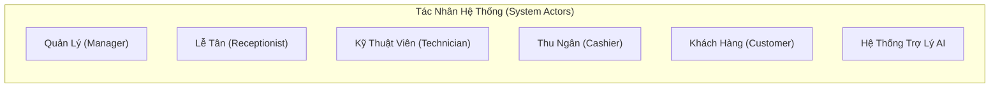
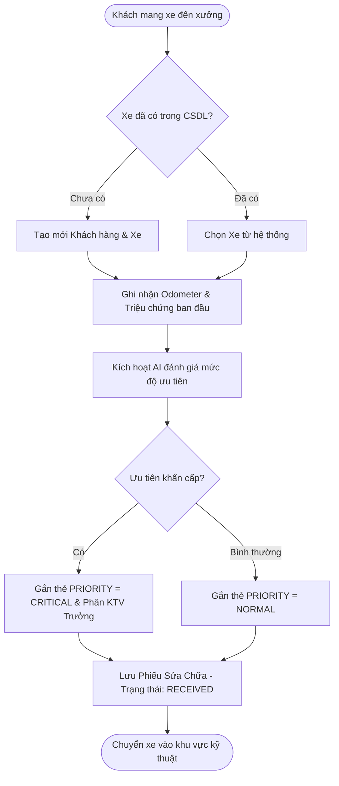
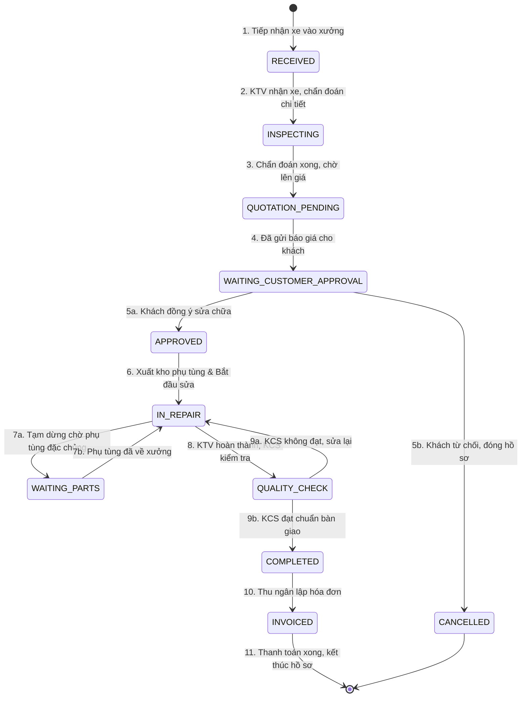
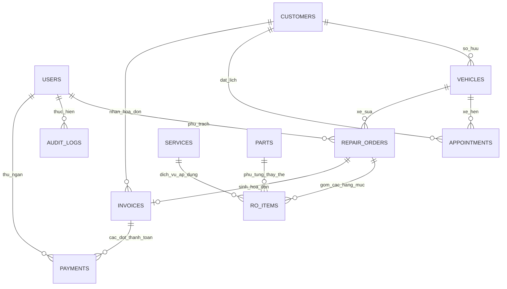

# BÁO CÁO TOÀN DIỆN HỆ THỐNG QUẢN LÝ GARAGE SỬA CHỮA Ô TÔ TÍCH HỢP TRÍ TUỆ NHÂN TẠO (GARAGE VTV AI MANAGEMENT SYSTEM)

**Phiên bản tài liệu:** 3.0.0 — Bản Chuẩn Hoá Toàn Diện  
**Học phần / Đồ án:** Đồ án Thiết Kế & Xây Dựng Hệ Thống Phần Mềm Ứng Dụng AI  
**Đơn vị thực hiện:** Nhóm Kỹ Sư & Chuyên Gia Phát Triển Hệ Thống Garage VTV  
**Ngày hoàn thiện:** 19/09/2026  

---

# MỤC 1: TỔNG QUAN DỰ ÁN

## 1.1. Giới thiệu đề tài và bối cảnh thực tiễn
Trong kỷ nguyên công nghiệp 4.0 và chuyển đổi số, ngành bảo dưỡng, sửa chữa ô tô tại Việt Nam đang có bước tăng trưởng vượt bậc với mật độ xe cá nhân và doanh nghiệp tăng cao hàng năm. Tuy nhiên, việc vận hành tại các trung tâm dịch vụ kỹ thuật (garage ô tô) phần lớn vẫn mang tính truyền thống, thiếu sự liên kết đồng bộ giữa các khâu từ tiếp nhận xe, chẩn đoán, xuất kho, báo giá đến thanh toán.

Đề tài **"Hệ Thống Quản Lý Garage Sửa Chữa Ô Tô Tích Hợp Trí Tuệ Nhân Tạo (Garage VTV AI)"** được nghiên cứu và xây dựng nhằm giải quyết triệt để các nút thắt trong công tác điều hành xưởng sửa chữa. Điểm đột phá của dự án là việc ứng dụng mô hình Trí tuệ Nhân tạo tạo sinh (Generative AI - Google Gemini Pro/Flash) đóng vai trò như một **Cố vấn dịch vụ ảo**, hỗ trợ phân tích lịch sử sửa chữa, giải thích tình trạng hỏng hóc bằng ngôn ngữ phổ thông và hỗ trợ lập báo giá nháp tự động, minh bạch hóa quy trình cho khách hàng.

---

## 1.2. Phân tích bối cảnh và nhu cầu

### 1.2.1. Thực trạng hiện tại của gara ô tô truyền thống
Qua khảo sát thực tế tại các garage quy mô vừa và nhỏ, quy trình vận hành bộc lộ nhiều điểm nghẽn nghiêm trọng:
1. **Lưu trữ thủ công và phân mảnh:** Sử dụng sổ ghi chép, bảng tính Excel rời rạc hoặc tin nhắn mạng xã hội dẫn đến thất lạc hồ sơ lịch sử xe.
2. **Sai sót trong báo giá và tính toán tài chính:** Việc tính tiền công thợ, đơn giá phụ tùng, thuế GTGT (VAT) và chiết khấu bằng tay thường xuyên nhầm lẫn, gây tranh chấp với khách hàng hoặc thất thoát doanh thu.
3. **Mất nhiều thời gian giải thích kỹ thuật:** Khách hàng không có chuyên môn cơ khí thường băn khoăn trước các thuật ngữ chuyên sâu (ví dụ: *cháy xupap, rơ thước lái, lọt khí buồng đốt*). Cố vấn dịch vụ phải mất từ 15–30 phút cho mỗi lượt xe để giải thích lý do cần thay thế phụ tùng.
4. **Quản lý kho thiếu chính xác:** Dễ xảy ra tình trạng "tồn kho ảo", âm kho linh kiện hoặc phát hiện thiếu phụ tùng khi xe đã rã máy trên cầu nâng.
5. **Thiếu tính minh bạch và gắn kết khách hàng:** Khách hàng đưa xe vào xưởng không theo dõi được xe mình đang ở bước nào (Đang tháo máy, Chờ phụ tùng hay Đang sơn sấy).

### 1.2.2. Lợi ích kỳ vọng từ hệ thống GaraOto
Hệ thống Garage VTV AI mang lại giá trị thực tiễn cho tất cả các bên tham gia:
- **Đối với Chủ garage / Ban Quản lý:** Nắm bắt dòng tiền theo thời gian thực (Real-time Revenue), kiểm soát hao hụt kho, đánh giá hiệu suất của từng kỹ thuật viên qua KPI và báo cáo tự động.
- **Đối với Cố vấn dịch vụ / Lễ tân:** Giảm 70% thời gian tạo hồ sơ, tự động xếp lịch hẹn tránh trùng cầu nâng, kiểm tra xung đột thời gian.
- **Đối với Kỹ thuật viên:** Xem trực tiếp danh mục phụ tùng tương thích với dòng xe, nhận việc trên màn hình kỹ thuật, lưu chẩn đoán có cấu trúc.
- **Đối với Khách hàng:** Cổng tra cứu trực tuyến minh bạch, nhận báo cáo giải thích nguyên nhân hư hỏng ngắn gọn, dễ hiểu từ AI, thanh toán VietQR Napas 24/7 chỉ với 1 thao tác quét mã.

---

## 1.3. Mục tiêu dự án

### 1.3.1. Mục tiêu kỹ thuật
- **Kiến trúc phần mềm chuẩn mực:** Xây dựng hệ thống theo mô hình phân tầng **3-Tier / Clean Architecture** kết hợp phương pháp luận API-First, tách biệt hoàn toàn Tầng Giao diện (Presentation Layer), Tầng Xử lý Nghiệp vụ (Business Logic Layer - BUS) và Tầng Truy cập Dữ liệu (Data Access Layer - DAL).
- **Trí tuệ nhân tạo chuyên biệt:** Tích hợp Large Language Model (Google Gemini API / Ollama Fallback) với cơ chế bảo vệ **Prompt Injection Guard** và **Khử định danh dữ liệu cá nhân (PII Masking)**.
- **Tính khả dụng cao (High Availability & Offline Resilience):** Phát triển cơ chế **Fallback LocalStorage Engine** giúp ứng dụng client tự động duy trì hoạt động 100% khi rớt mạng hoặc máy chủ bảo trì.
- **Toàn vẹn tài chính bất biến (Server-Side Financial Authority):** Toàn bộ phép tính tiền bạc (`subtotal`, `vat`, `discount`, `total`) được tính toán và khóa tại Backend, không tin cậy dữ liệu client gửi lên.
- **An toàn giao dịch kho (Concurrency Control):** Chặn hoàn toàn tình trạng tồn kho âm (`stock >= 0`) qua cơ chế khóa bản ghi (Row-Level Locking/Atomic Transactions).

### 1.3.2. Mục tiêu quản lý dự án
- Hoàn thành dự án đúng tiến độ theo mô hình Agile/Scrum qua 4 cột mốc kiểm tra (KT1, KT2, KT3 và Nghiệm thu cuối kỳ).
- Đảm bảo độ bao phủ kiểm thử (Test Coverage) đạt trên 85% cho các module trọng yếu qua 17 kịch bản kiểm thử tự động (TC01 - TC17).
- Tài liệu hóa toàn diện: Đặc tả yêu cầu (URD, SRS), Sơ đồ kiến trúc (UML/PlantUML), Sơ đồ CSDL (ERD 3NF) và Hướng dẫn vận hành chuẩn.

---

## 1.4. Phạm vi dự án

### 1.4.1. Trong phạm vi (In-scope)
1. **Module Khách hàng & Phương tiện:** Quản lý hồ sơ chủ xe, thông số kỹ thuật xe (Hãng, Model, Số khung, Biển số, Odometer).
2. **Module Đặt lịch hẹn & Cổng trực tuyến:** Cổng công khai cho phép khách đặt lịch online, tra cứu tiến độ xe theo mã REQ hoặc biển số.
3. **Module Tiếp nhận & Khảo sát:** Khởi tạo phiếu tiếp nhận, ghi nhận tình trạng vỏ xe, mức xăng, số km, chụp ảnh trầy xước.
4. **Module Phiếu sửa chữa (Repair Order):** Vòng đời 13 trạng thái, phân công KTV, thêm dịch vụ và phụ tùng.
5. **Module Quản lý Kho & Dịch vụ:** Quản lý danh mục phụ tùng, kiểm tra tồn kho tối thiểu, quản lý đơn giá công thợ.
6. **Module Báo giá & Hóa đơn thanh toán:** Soạn thảo báo giá, xuất hóa đơn VAT, thanh toán tiền mặt và cổng chuyển khoản VietQR Napas 24/7.
7. **Module Trí tuệ Nhân tạo:** Tóm tắt bệnh án xe, sinh báo giá nháp, giải thích thuật ngữ sửa chữa cho khách hàng.
8. **Module Báo cáo & Phân quyền:** Dashboard thống kê doanh thu theo biểu đồ Line Chart động, ma trận phân quyền 4 vai trò (RBAC).

### 1.4.2. Ngoài phạm vi (Out-of-scope)
- Tích hợp cổng thanh toán quốc tế trực tiếp qua Payment Gateway (Visa/Mastercard qua Stripe) — chỉ hỗ trợ VietQR và ghi nhận tiền mặt.
- Quản lý tiền lương chi tiết, chấm công GPS của nhân sự nội bộ.
- Ứng dụng di động Native (Android/iOS riêng biệt) — sử dụng Web Responsive PWA thay thế.

---

## 1.5. Yêu cầu hệ thống chi tiết

### 1.5.1. Yêu cầu chức năng (Functional Requirements - FR)
- **FR-01 (Xác thực & Phân quyền):** Đăng nhập an toàn qua JWT (JSON Web Token), phân định quyền hạn rõ ràng giữa Quản lý, Lễ tân, Kỹ thuật viên và Thu ngân.
- **FR-02 (Hồ sơ Khách - Xe):** CRUD hồ sơ khách hàng và xe, tự động sinh mã quản lý chuẩn hóa (`CUS-YYYY-XXXXXX`, `VEH-XXXXXX`).
- **FR-03 (Điều phối xe):** Tiếp nhận xe vào xưởng, gắn Kỹ thuật viên chính phụ trách phiếu.
- **FR-04 (Lập phiếu sửa chữa):** Cập nhật triệu chứng, chẩn đoán chi tiết và chọn phụ tùng thay thế từ kho.
- **FR-05 (Máy trạng thái sửa chữa):** Quản lý nghiêm ngặt quy trình: `RECEIVED` → `INSPECTING` → `QUOTATION_PENDING` → `WAITING_CUSTOMER_APPROVAL` → `APPROVED` → `IN_REPAIR` → `QUALITY_CHECK` → `COMPLETED`.
- **FR-06 (Báo giá & Hóa đơn):** Tự động tính tiền, áp dụng thuế VAT chuẩn 10%, quản lý số dư nợ (`balance_due`).
- **FR-07 (Trợ lý AI chuyên môn):** Đóng khung ngữ cảnh phân tích, cấm tự ý bịa đặt lỗi xe không có trong phiếu.
- **FR-08 (Báo cáo KPI):** Thống kê doanh thu theo thời gian, tỷ lệ xe quay lại, các dịch vụ và linh kiện tiêu thụ nhiều nhất.

### 1.5.2. Yêu cầu phi chức năng (Non-Functional Requirements - NFR)
- **Hiệu năng (Performance):** Thời gian phản hồi API thông thường < 200ms; thời gian sinh phản hồi AI < 15 giây; tải trang giao diện < 1.2 giây.
- **Bảo mật (Security):** Mật khẩu băm bằng thuật toán an toàn (PBKDF2/Argon2); chống tấn công IDOR, SQL Injection, XSS, CSRF; bảo vệ Prompt Injection qua thẻ cách ly `<UNTRUSTED_DATA>`.
- **Tính sẵn sàng & Khả dụng (Availability & Reliability):** Khả năng vận hành 24/7; cơ chế tự động chuyển đổi sang LocalStorage Engine khi mất mạng Internet; tự động phục hồi kết nối.
- **Khả năng mở rộng (Scalability):** Thiết kế CSDL chuẩn 3NF, dễ dàng chuyển đổi từ SQLite sang PostgreSQL/Supabase mà không cần viết lại mã nguồn.
- **Tính khả dụng người dùng (Usability):** Giao diện tối ưu công thái học, hỗ trợ Dark/Light Theme, hiển thị biểu đồ trực quan, tối ưu cho màn hình cảm ứng tablet của thợ xưởng.

---

## 1.6. Sơ bộ chi phí và tổng chi
Bảng dự toán kinh phí triển khai hệ thống cho 01 chuỗi garage (quy mô 3 chi nhánh, 15 cầu nâng) trong 01 năm đầu vận hành:

| Hạng mục chi phí | Chi tiết kỹ thuật / Đơn vị tính | Số lượng | Đơn giá (VNĐ) | Thành tiền (VNĐ) |
|---|---|:---:|---:|---:|
| **1. Nhân sự phát triển (R&D)** | Kỹ sư Backend, Frontend, AI Engineer, QA (Dự án 4 tháng) | Trọn gói | 65.000.000 | 65.000.000 |
| **2. Hạ tầng Máy chủ Cloud** | Vercel Serverless / Railway Docker Container (1 năm) | 12 tháng | 600.000 | 7.200.000 |
| **3. Cơ sở dữ liệu Cloud** | Supabase Managed PostgreSQL Instance (1 năm) | 12 tháng | 700.000 | 8.400.000 |
| **4. Chi phí API AI (LLM)** | Google Gemini 2.5 API (Ước tính 5.000 lượt yêu cầu/tháng) | 12 tháng | 500.000 | 6.000.000 |
| **5. Trang bị tại xưởng** | Máy tính bảng thao tác cho KTV (Lenovo Tab M10) | 3 chiếc | 3.500.000 | 10.500.000 |
| **6. Thiết bị in ấn & mạng** | Máy in hóa đơn nhiệt LAN/WiFi + Router chịu tải | Trọn bộ | 5.500.000 | 5.500.000 |
| **7. Chi phí dự phòng (10%)** | Dự phòng rủi ro biến động giá và mở rộng dung lượng | - | - | 10.260.000 |
| **TỔNG CỘNG DỰ TOÁN** | *(Bằng chữ: Một trăm mười hai triệu tám trăm sáu mươi nghìn đồng)* | | | **112.860.000 VNĐ** |

---

## 1.7. Công nghệ và thiết bị được lựa chọn

### 1.7.1. Ngôn ngữ lập trình và Framework
- **Backend:** Python 3.11+ kết hợp **FastAPI** — framework hiện đại có tốc độ xử lý hàng đầu thế giới (nhờ Starlette và Pydantic v2), hỗ trợ cơ chế bất đồng bộ (Asynchronous I/O), tự động sinh tài liệu Swagger UI/Redoc chuẩn OpenAPI 3.0.
- **Frontend:** **Vanilla HTML5, CSS3 hiện đại (CSS Variables, Grid, Flexbox) và JavaScript (ES6+)**. Lựa chọn này giúp hệ thống siêu nhẹ (zero-dependency bundle), thời gian tải tức thì, chạy mượt trên các máy tính cấu hình thấp tại xưởng và máy tính bảng giá rẻ của thợ máy.
- **Thư viện giao diện & trực quan:** Chart.js 4.4.3 (vẽ biểu đồ Line Chart phân tích doanh thu), Flatpickr (lựa chọn lịch hẹn tiếng Việt), Font Awesome 6.4.0 (hệ thống biểu tượng chuyên nghiệp).

### 1.7.2. Cơ sở dữ liệu
- **Môi trường phát triển & Offline:** **SQLite 3** (`garage.db`) — cơ sở dữ liệu dạng file nhúng, không cần cài đặt dịch vụ phức tạp, hoàn hảo cho việc test và triển khai cục bộ.
- **Môi trường Sản xuất (Production):** **PostgreSQL** (thông qua Supabase hoặc AWS RDS) với khả năng mở rộng hàng triệu bản ghi, hỗ trợ toàn vẹn khóa ngoại (Foreign Keys) và Transaction ACID.
- **Tầng ORM:** **SQLAlchemy 2.0 Core & ORM** — cung cấp lớp trừu tượng hóa dữ liệu hoàn hảo, cho phép chuyển đổi giữa SQLite và PostgreSQL chỉ bằng việc thay đổi chuỗi kết nối `DATABASE_URL`.

### 1.7.3. Kiến trúc phần mềm – 3-Tier
```
┌─────────────────────────────────────────────────────────────┐
│ 1. PRESENTATION TIER (Giao diện người dùng)                 │
│  - admin.html (Bàn điều khiển quản trị, 9 views chuyên sâu) │
│  - customer.html (Cổng tra cứu & Đặt lịch công khai)        │
│  - app.js (Xử lý DOM, Quản lý State, Fallback Interceptor)   │
└──────────────────────────────┬──────────────────────────────┘
                               │ HTTP REST / JSON / JWT
┌──────────────────────────────▼──────────────────────────────┐
│ 2. APPLICATION / BUSINESS TIER (Tầng Xử lý Nghiệp vụ - BUS) │
│  - FastAPI Gateway & JWT Authentication Middleware          │
│  - State Machine Engine (Kiểm soát 13 bước sửa chữa)        │
│  - Financial Engine (Tính toán VAT, Subtotal, Balance)      │
│  - Inventory Transaction Locking (Ngăn tồn kho âm)          │
│  - AI Orchestrator (Prompt Template, Sanitizer, Fallback)   │
└──────────────────────────────┬──────────────────────────────┘
                               │ SQLAlchemy 2.0 ORM Engine
┌──────────────────────────────▼──────────────────────────────┐
│ 3. DATA ACCESS TIER (Tầng Truy xuất & Lưu trữ - DAL)        │
│  - Models & Repository Pattern (CRUD Customers, ROs, Parts) │
│  - Persistent Storage: PostgreSQL / SQLite (garage.db)      │
│  - Browser Client Cache: LocalStorage Engine (vtv_db_*)     │
└─────────────────────────────────────────────────────────────┘
```

---

## 1.8. Rủi ro và phương án xử lý

| Phân loại | Tên rủi ro | Mức độ | Phương án phòng ngừa & Xử lý kỹ thuật |
|---|---|:---:|---|
| **Kỹ thuật AI** | AI bị ảo giác (Hallucination), sinh bệnh xe sai lệch | **Cao** | Đóng khung nghiêm ngặt trong System Prompt: *"Chỉ giải thích trên dữ liệu phiếu sửa chữa được cung cấp, tuyệt đối không tự chẩn đoán lỗi mới"*. Bọc dữ liệu bằng thẻ `<UNTRUSTED_DATA>`. |
| **Hạ tầng mạng** | Mất kết nối Internet tại xưởng xửa chữa | **Cao** | Xây dựng **Smart Offline Fallback Engine** trong `app.js`. Tự động lưu và đọc dữ liệu từ `localStorage` (DB keys `vtv_db_*`), đồng bộ ngược khi có mạng. |
| **Dữ liệu tài chính** | Khách hàng gian lận, gửi payload sửa đổi số tiền thanh toán | **Nghiêm trọng** | Áp dụng nguyên tắc **Server-Side Financial Authority**: Client chỉ gửi ID phiếu, toàn bộ phép tính nhân đơn giá, cộng phụ tùng, tính 10% VAT đều tính tại Server. |
| **Kho bãi** | Xuất quá số lượng linh kiện có sẵn (Âm kho) | **Trung bình** | Sử dụng ràng buộc CSDL `CHECK (stock_quantity >= 0)` và Database Transaction có kiểm tra tồn kho trước khi ghi nhận xuất kho. |
| **Bảo mật** | Kỹ thuật viên xem hoặc sửa phiếu của người khác (Lỗi IDOR) | **Trung bình** | Ràng buộc kiểm tra quyền sở hữu phiếu: `if user.role == 'technician' and ro.assigned_technician_id != user.id: raise HTTP 403 Forbidden`. |

---

# MỤC 2: PHÂN TÍCH YÊU CẦU PHẦN MỀM (URD, USE CASE & SRS)

## 2.1. Tài liệu Yêu cầu Người dùng (URD - User Requirements Document)
- **URD-01:** Người dùng là khách hàng có thể đặt lịch hẹn bảo dưỡng trên website mà không cần tạo tài khoản phức tạp.
- **URD-02:** Lễ tân có thể tìm kiếm lịch sử của xe chỉ trong vòng 3 giây thông qua Biển số xe.
- **URD-03:** Kỹ thuật viên tại xưởng có thể dùng máy tính bảng để tích chọn các linh kiện cần thay thế thay vì phải viết tay giấy đề xuất vật tư.
- **URD-04:** Khách hàng nhận được bảng báo giá rõ ràng, có phần "Giải thích của Trợ lý AI" nêu rõ vì sao phải thay linh kiện đó để khách an tâm duyệt sửa.
- **URD-05:** Thu ngân có thể tạo mã VietQR động chứa chính xác số tiền cần thanh toán để khách quét bằng ứng dụng ngân hàng bất kỳ.

---

## 2.2. Tác nhân hệ thống (Actors & Personas)



1. **Quản Lý (Manager):** Người chịu trách nhiệm cao nhất về doanh thu và hoạt động xưởng, cấu hình hệ thống và quản lý nhân viên.
2. **Lễ Tân (Receptionist):** Cầu nối giữa khách hàng và xưởng kỹ thuật, tiếp nhận xe, điều phối và soạn thảo báo giá.
3. **Kỹ Thuật Viên (Technician):** Đội ngũ trực tiếp kiểm tra, sửa chữa xe và đề xuất vật tư thay thế.
4. **Thu Ngân (Cashier):** Quản lý dòng tiền, xuất hóa đơn và đối soát thanh toán.
5. **Khách Hàng (Customer):** Người sử dụng dịch vụ, theo dõi tiến độ xe và thanh toán chi phí.
6. **Hệ Thống AI (GarageAI Service):** Tác nhân tự động thực thi các tác vụ xử lý ngôn ngữ tự nhiên.

---

## 2.3. Biểu đồ Use Case Tổng Thể (Use Case Diagram)

```mermaid
graph TD
    C([Khách Hàng])
    R([Lễ Tân])
    T([Kỹ Thuật Viên])
    K([Thu Ngân])
    M([Quản Lý])
    AI([Hệ Thống AI])

    subgraph "Cổng Khách Hàng (Public Portal)"
        UC01[UC01: Đặt lịch hẹn trực tuyến]
        UC02[UC02: Tra cứu tiến độ xe theo mã REQ]
        UC03[UC03: Yêu cầu hotline gọi lại]
        UC04[UC04: Hỏi đáp kỹ thuật với AI]
    end

    subgraph "Quản Trị Nội Bộ (Internal Operations)"
        UC05[UC05: Đăng nhập & Quản lý phiên JWT]
        UC06[UC06: Tiếp nhận xe & Khởi tạo phiếu]
        UC07[UC07: Phân công kỹ thuật viên]
        UC08[UC08: Chẩn đoán & Đề xuất phụ tùng]
        UC09[UC09: Sinh báo giá nháp & Giải thích AI]
        UC10[UC10: Cập nhật tiến độ & Nghiệm thu KCS]
        UC11[UC11: Lập hóa đơn & Xuất mã VietQR]
        UC12[UC12: Quản lý danh mục & Kho phụ tùng]
        UC13[UC13: Dashboard doanh thu & Audit Logs]
    end

    C --> UC01
    C --> UC02
    C --> UC03
    C --> UC04

    R --> UC05
    R --> UC06
    R --> UC07
    R --> UC09
    R --> UC11

    T --> UC05
    T --> UC08
    T --> UC10

    K --> UC05
    K --> UC11

    M --> UC05
    M --> UC06
    M --> UC08
    M --> UC11
    M --> UC12
    M --> UC13

    UC04 --> AI
    UC09 --> AI
```



---

## 2.4. Ma trận phân quyền (RBAC Permission Matrix)

| Chức Năng / Nghiệp Vụ | Quản Lý (Manager) | Lễ Tân (Receptionist) | Kỹ Thuật Viên (Technician) | Thu Ngân (Cashier) | Khách Hàng (Customer) |
|---|:---:|:---:|:---:|:---:|:---:|
| **Đăng nhập hệ thống nội bộ** | Toàn quyền | Toàn quyền | Toàn quyền | Toàn quyền | Không có quyền |
| **Xem Dashboard & Doanh thu** | Toàn quyền | Giới hạn KPI | Không có quyền | Xem hóa đơn | Không có quyền |
| **Quản lý Khách hàng & Xe** | Toàn quyền | Tạo / Sửa / Tìm | Xem lịch sử xe | Tìm kiếm xem | Tự tra cứu xe mình |
| **Đặt lịch & Tiếp nhận xe** | Toàn quyền | Tạo / Duyệt / Hủy | Xem lịch giao | Không có quyền | Gửi yêu cầu đặt lịch |
| **Chẩn đoán & Đề xuất vật tư** | Toàn quyền | Xem chẩn đoán | **Tạo / Cập nhật** | Không có quyền | Xem tóm tắt |
| **Cập nhật trạng thái RO** | Toàn quyền | Cập nhật (1 số bước) | **Cập nhật tiến độ** | Không có quyền | Không có quyền |
| **Quản lý Kho linh kiện** | Toàn quyền | Xem tồn kho | Đề xuất xuất kho | Xem giá bán | Không có quyền |
| **Lập báo giá (Quotation)** | Toàn quyền | Soạn thảo & Gửi | Không có quyền | Xem bản duyệt | Xem duyệt báo giá |
| **Lập hóa đơn & Thu tiền** | Toàn quyền | Không có quyền | Không có quyền | **Toàn quyền thu** | Xem & Thanh toán |
| **Sử dụng Trợ lý AI** | Toàn quyền | Toàn quyền | Toàn quyền | Không có quyền | Hỏi đáp giới hạn |
| **Xem Audit Logs & Cấu hình** | **Toàn quyền** | Không có quyền | Không có quyền | Không có quyền | Không có quyền |

---

## 2.5. Đặc tả chi tiết các Use Case chính

### 2.5.1. UC-01: Đăng nhập hệ thống (Authentication)
- **Tác nhân:** Quản lý, Lễ tân, Kỹ thuật viên, Thu ngân.
- **Mục đích:** Xác thực danh tính và phân cấp quyền hạn tương ứng trên giao diện.
- **Luồng sự kiện chính:**
  1. Người dùng nhập `username` và `password` tại màn hình `login.html`.
  2. Client gửi request `POST /api/v1/auth/login` dạng form URL-encoded.
  3. Backend truy vấn bảng `users`, kiểm tra `is_active == True`, đối chiếu hash mật khẩu qua thư viện `bcrypt`.
  4. Nếu khớp, Backend sinh JSON Web Token (JWT) có payload chứa `sub: user.id`, `role: user.role` với thời gian sống `exp: 12h`.
  5. Client lưu token vào `localStorage.setItem('garage_access_token', token)` và chuyển hướng vào `admin.html`.
- **Luồng sự kiện thay thế (Offline Fallback):**
  - Nếu kết nối tới Backend thất bại, hệ thống tự động kiểm tra tài khoản thử nghiệm nội bộ trong `app.js` (`admin/admin123`, `letan/letan123`, `kythuat/tech123`, `thungan/cashier123`), cấp phiên làm việc Local Storage Engine để người dùng không bị gián đoạn công việc.

### 2.5.2. UC-02: Đặt lịch sửa chữa (Appointment Booking)
- **Tác nhân:** Khách hàng (Portal), Lễ tân (Admin).
- **Luồng sự kiện chính:**
  1. Khách điền thông tin: Họ tên, Số điện thoại, Biển số xe, Hãng/Dòng xe, Dịch vụ yêu cầu, Ngày giờ hẹn.
  2. Hệ thống kiểm tra trùng lặp lịch hẹn trên cùng một xe trong cùng khung giờ.
  3. Ghi nhận yêu cầu vào CSDL với trạng thái `PENDING` và sinh mã yêu cầu theo định dạng `REQ-YYYYMMDD-XXXX`.
  4. Hệ thống phát sự kiện thông báo (Notification Badge) tới bàn Lễ tân.

### 2.5.3. UC-03: Tiếp nhận xe vào xưởng (Vehicle Reception)
- **Sơ đồ hoạt động (Activity Diagram):**


### 2.5.4. UC-04: Lập phiếu sửa chữa & Máy trạng thái (Repair Order State Machine)
- **Quy tắc bất biến:** Phiếu sửa chữa phải tuân thủ nghiêm ngặt đồ thị chuyển đổi trạng thái một chiều có kiểm soát:



### 2.5.5. UC-05: Tra cứu lịch sử sửa chữa (Maintenance History)
- **Tác nhân:** Quản lý, Lễ tân, Kỹ thuật viên, Khách hàng.
- **Quy trình:**
  1. Người dùng nhập Biển số xe (ví dụ: `30E-888.88`) hoặc Số điện thoại.
  2. Hệ thống tìm kiếm theo chỉ mục `INDEX` trên bảng `vehicles` và bảng `customers`.
  3. Trả về toàn bộ danh sách các phiếu `Repair_Orders` trong quá khứ kèm: Ngày vào xưởng, Số km tại thời điểm đó, Triệu chứng, Danh sách linh kiện đã thay, Kỹ thuật viên thực hiện và Tổng chi phí.
  4. Trợ lý AI có thể được kích hoạt để tóm tắt: *"Xe đã thay lốc lạnh cách đây 6 tháng, lần này phát sinh tiếng kêu ở trục láp trước bên phụ."*

### 2.5.6. UC-06: Quản lý kho phụ tùng (Inventory Management)
- **Kiểm soát giao dịch tồn kho (Stock Transaction Guard):**
  - Mọi thao tác xuất kho phục vụ phiếu sửa chữa đều được thực thi trong một `database transaction` nguyên tử.
  - Áp dụng kiểm tra:
  $$\text{Số lượng yêu cầu} \le \text{Số lượng tồn kho hiện tại}$$
  - Nếu số lượng tồn kho không đủ, hệ thống lập tức từ chối, rollback giao dịch và bắn thông báo: *"Mã linh kiện [SP-002] chỉ còn 1 cái trong kho, không đủ xuất 2 cái."*

### 2.5.7. UC-07: Báo cáo doanh thu & Thống kê kinh doanh
- **Công thức tính toán doanh thu thuần:**
  $$\text{Doanh thu thuần} = \sum (\text{Tiền công dịch vụ} + \text{Tiền phụ tùng}) - \text{Chiết khấu}$$
  $$\text{Thuế VAT} = \text{Doanh thu thuần} \times 10\%$$
  $$\text{Tổng tiền thanh toán} = \text{Doanh thu thuần} + \text{Thuế VAT}$$
- **Trực quan hóa:** Dữ liệu doanh thu theo ngày/tháng được vẽ bằng biểu đồ **Line Chart** tương tác mượt mà qua thư viện Chart.js, hiển thị trực tiếp trên Dashboard của Quản lý.

### 2.5.8. UC-08: Phân quyền & Nhật ký kiểm toán (Audit Trail)
- Mọi thao tác trọng yếu (Tạo phiếu, Đổi trạng thái, Xóa mềm dữ liệu, Thu tiền) đều được ghi nhận tự động vào bảng `audit_logs`:
  - `user_id`: Người thực hiện.
  - `action`: Hành động (`CREATE`, `UPDATE_STATUS`, `PAYMENT`, `DELETE`).
  - `table_name`: Bảng bị tác động (`repair_orders`, `invoices`, `parts`).
  - `old_values` & `new_values`: Lưu trữ snapshot dạng JSON để đối soát khi có khiếu nại.

---

## 2.7. Đặc tả chức năng Trí tuệ nhân tạo (AI Engine Specification)
- **Mô hình triển khai:** Google Gemini 2.5 Flash / Pro API (hỗ trợ chuyển đổi sang OpenAI GPT-4o-mini hoặc Ollama Llama-3 qua biến môi trường).
- **Thiết kế Prompt Template chuẩn hóa:**
```text
[SYSTEM INSTRUCTION]
Bạn là Trợ Lý Kỹ Thuật Trưởng của Garage VTV.
Nhiệm vụ: Giải thích tình trạng xe và chi phí sửa chữa cho khách hàng một cách thân thiện, ngắn gọn và dễ hiểu.
QUY TẮC BẤT BIẾN:
1. Chỉ giải thích dựa trên DỮ LIỆU ĐƯỢC CUNG CẤP trong thẻ <UNTRUSTED_DATA>.
2. Tuyệt đối KHÔNG tự ý chẩn đoán thêm bệnh mới không có trong phiếu.
3. KHÔNG tự ý thay đổi giá tiền dịch vụ/phụ tùng đã niêm yết.
4. Trả lời bằng tiếng Việt lịch sự, định dạng Markdown rõ ràng.

[USER PROMPT]
Dữ liệu phiếu sửa chữa xe:
<UNTRUSTED_DATA>
{{repair_order_context_json}}
</UNTRUSTED_DATA>

Hãy tóm tắt ngắn gọn tình trạng xe, giải thích tại sao cần làm các hạng mục trên và nêu rõ tổng chi phí dự kiến cho khách hàng.
```

---

# MỤC 3: TRIỂN KHAI DỰ ÁN (SYSTEM IMPLEMENTATION)

## 3.1. Phân tích và thiết kế hệ thống

### 3.1.1. Kiến trúc tổng thể chi tiết
Hệ thống Garage VTV AI được thiết kế theo nguyên lý Clean Architecture kết hợp Layered Services:
1. **Presentation Layer (Web Client SPA):**
   - Không phụ thuộc framework cồng kềnh, sử dụng HTML5 Semantic, CSS Grid/Flexbox và Vanilla JavaScript thuần.
   - Module `app.js` (hơn 3.500 dòng mã) chịu trách nhiệm quản lý state toàn cục (`currentState`), điều phối sự kiện DOM, quản lý modal và gọi API.
2. **Application / Business Layer (BUS):**
   - Xây dựng trên nền tảng **FastAPI** với 14 API Routers độc lập:
     - `/auth`: Xác thực JWT, đăng nhập, đổi mật khẩu.
     - `/customers`: Quản lý khách hàng và hồ sơ xe.
     - `/appointments`: Quản lý lịch hẹn online và tại quầy.
     - `/repair-orders`: Trọng tâm xử lý State Machine và phân công KTV.
     - `/inventory`: Quản lý phụ tùng, dịch vụ và xuất nhập kho.
     - `/quotations`: Tính toán báo giá tự động.
     - `/invoices` & `/payments`: Quản lý hóa đơn và đối soát thanh toán VietQR.
     - `/ai`: Điều phối prompt, kết nối Gemini API và lưu audit logs.
     - `/analytics`: Tổng hợp KPI, doanh thu cho biểu đồ Line Chart.
3. **Data Access Layer (DAL):**
   - Quản trị bởi SQLAlchemy 2.0 ORM, kết nối linh hoạt tới SQLite (`garage.db`) hoặc PostgreSQL.

### 3.1.2. Mô hình phân quyền & Bảo mật (Security Model)
- **Cơ chế Token-based Auth:** Sử dụng tiêu chuẩn OAuth2 Bearer Token với thuật toán mã hóa `HS256`. Token chứa thông tin vai trò (`role`), thời gian phát hành (`iat`) và thời gian hết hạn (`exp`).
- **Middleware kiểm soát quyền (RBAC Guard):**
```python
def require_roles(*allowed_roles):
    def role_checker(current_user: User = Depends(get_current_active_user)):
        if current_user.role not in allowed_roles:
            raise HTTPException(
                status_code=status.HTTP_403_FORBIDDEN,
                detail=f"Quyền truy cập bị từ chối. Yêu cầu một trong các vai trò: {allowed_roles}"
            )
        return current_user
    return role_checker
```

---

## 3.2. Xây dựng cơ sở dữ liệu

### 3.2.1. Sơ đồ Thực thể - Quan hệ toàn diện (Mermaid ERD)



### 3.2.2. Từ điển dữ liệu các bảng nòng cốt (Data Dictionary)

#### 1. Bảng `users` (Tài khoản người dùng)
| Tên cột | Kiểu dữ liệu | Ràng buộc | Diễn giải |
|---|---|---|---|
| `id` | INTEGER | PK, AUTOINCREMENT | Khóa chính |
| `username` | VARCHAR(50) | UNIQUE, NOT NULL | Tên đăng nhập (`admin`, `letan`, ...) |
| `hashed_password` | VARCHAR(255) | NOT NULL | Mật khẩu mã hóa BCrypt |
| `full_name` | VARCHAR(100) | NOT NULL | Tên hiển thị người dùng |
| `role` | VARCHAR(20) | NOT NULL | Enum: `manager`, `receptionist`, `technician`, `cashier` |
| `is_active` | BOOLEAN | DEFAULT TRUE | Trạng thái kích hoạt |

#### 2. Bảng `customers` (Khách hàng)
| Tên cột | Kiểu dữ liệu | Ràng buộc | Diễn giải |
|---|---|---|---|
| `id` | INTEGER | PK, AUTOINCREMENT | Khóa chính |
| `customer_code` | VARCHAR(30) | UNIQUE, NOT NULL | Mã khách hàng (`CUS-2026-0001`) |
| `full_name` | VARCHAR(100) | NOT NULL | Tên khách hàng |
| `phone` | VARCHAR(20) | INDEX, NOT NULL | Số điện thoại tra cứu chính |
| `email` | VARCHAR(100) | NULLABLE | Thư điện tử |
| `deleted_at` | DATETIME | NULLABLE | Trường hỗ trợ Soft-Delete (xóa mềm) |

#### 3. Bảng `vehicles` (Phương tiện)
| Tên cột | Kiểu dữ liệu | Ràng buộc | Diễn giải |
|---|---|---|---|
| `id` | INTEGER | PK, AUTOINCREMENT | Khóa chính |
| `customer_id` | INTEGER | FK(customers.id) | Khóa ngoại liên kết chủ xe |
| `license_plate` | VARCHAR(20) | UNIQUE, INDEX | Biển số xe kiểm soát (`30E-888.88`) |
| `brand` | VARCHAR(50) | NOT NULL | Hãng xe (`Toyota`, `Ford`, `Mazda`) |
| `model` | VARCHAR(50) | NOT NULL | Dòng xe (`Camry`, `Ranger`, `CX-5`) |
| `current_mileage`| INTEGER | DEFAULT 0 | Số km hiện tại |

#### 4. Bảng `repair_orders` (Phiếu sửa chữa)
| Tên cột | Kiểu dữ liệu | Ràng buộc | Diễn giải |
|---|---|---|---|
| `id` | INTEGER | PK, AUTOINCREMENT | Khóa chính |
| `order_code` | VARCHAR(30) | UNIQUE, NOT NULL | Mã phiếu (`RO-2026-0001`) |
| `vehicle_id` | INTEGER | FK(vehicles.id) | Khóa ngoại liên kết xe |
| `assigned_technician_id` | INTEGER | FK(users.id), NULLABLE | Kỹ thuật viên phụ trách chính |
| `status` | VARCHAR(30) | NOT NULL | 13 trạng thái (`received`, `in_repair`...) |
| `symptoms` | TEXT | NULLABLE | Triệu chứng mô tả ban đầu |
| `diagnosis` | TEXT | NULLABLE | Kết luận chẩn đoán kỹ thuật |
| `total_cost` | DECIMAL(12,2)| DEFAULT 0.00 | Tổng chi phí sau cùng |

#### 5. Bảng `ro_items` (Chi tiết dịch vụ & Phụ tùng trên phiếu)
| Tên cột | Kiểu dữ liệu | Ràng buộc | Diễn giải |
|---|---|---|---|
| `id` | INTEGER | PK, AUTOINCREMENT | Khóa chính |
| `repair_order_id`| INTEGER | FK(repair_orders.id) | Khóa ngoại tới phiếu sửa chữa |
| `item_type` | VARCHAR(20) | NOT NULL | Enum: `service` (công), `part` (linh kiện) |
| `service_id` | INTEGER | FK(services.id), NULL | Khóa ngoại tới bảng dịch vụ |
| `part_id` | INTEGER | FK(parts.id), NULL | Khóa ngoại tới kho phụ tùng |
| `quantity` | INTEGER | NOT NULL, CHECK(>0) | Số lượng |
| `unit_price` | DECIMAL(12,2)| NOT NULL | Đơn giá tại thời điểm đưa vào phiếu |

#### 6. Bảng `invoices` & `payments` (Hóa đơn và Thanh toán)
- Quản lý mã hóa đơn `INV-YYYY-XXXXXX`, `subtotal`, `vat_rate` (10%), `total_amount`, `paid_amount` và `balance_due`.

---

## 3.3. Phát triển tầng DAL và BUS

### 3.3.1. Lớp DAL – Data Access Layer
- Tầng DAL trừu tượng hóa các thao tác cơ sở dữ liệu thông qua Repository Pattern, che giấu các câu lệnh SQL thô:
```python
class BaseRepository:
    def __init__(self, db: Session, model):
        self.db = db
        self.model = model

    def get_by_id(self, id: int):
        return self.db.query(self.model).filter(
            self.model.id == id,
            self.model.deleted_at.is_(None)
        ).first()

    def create(self, obj_in):
        db_obj = self.model(**obj_in.dict())
        self.db.add(db_obj)
        self.db.commit()
        self.db.refresh(db_obj)
        return db_obj
```
- **LocalStorage DAL Adapter (Client-side):** Tại tầng Frontend, `app.js` đóng vai trò DAL cục bộ khi không có backend. Nó thao tác đọc/ghi JSON qua `localStorage.getItem(DB_KEYS.RO)` và `localStorage.setItem(...)` đảm bảo cấu trúc dữ liệu tương thích 100% với schema của Backend FastAPI.

### 3.3.2. Lớp BUS – Business Logic Layer
Tập trung toàn bộ logic nghiệp vụ, quy tắc tính toán và kiểm tra toàn vẹn:
1. **Server-Side Financial Authority Engine:**
   ```python
   def calculate_invoice_totals(ro_items: list[ROItem], discount: float = 0.0, vat_rate: float = 0.10):
       subtotal = sum(item.quantity * item.unit_price for item in ro_items)
       discount_applied = min(discount, subtotal)
       taxable_amount = subtotal - discount_applied
       vat_amount = round(taxable_amount * vat_rate, 2)
       total_amount = taxable_amount + vat_amount
       return {
           "subtotal": subtotal,
           "discount": discount_applied,
           "vat": vat_amount,
           "total": total_amount
       }
   ```
2. **Inventory Stock Guard (Ngăn tồn kho âm):**
   ```python
   def deduct_inventory_for_ro(db: Session, ro_id: int):
       items = db.query(ROItem).filter_by(repair_order_id=ro_id, item_type='part').all()
       with db.begin_nested(): # Transaction an toàn
           for item in items:
               part = db.query(Part).with_for_update().filter_by(id=item.part_id).first()
               if part.stock_quantity < item.quantity:
                   raise ValueError(f"Linh kiện {part.name} không đủ số lượng xuất kho!")
               part.stock_quantity -= item.quantity
   ```
3. **Cơ chế Auto-link và Bi-directional Sync:**
   - Khi có thay đổi trạng thái tại phiếu sửa chữa (`repair_orders`), hàm liên kết `autoLinkRequestsAndROs()` trong `app.js` tự động tìm kiếm yêu cầu khách hàng (`customer_requests`) tương ứng qua cặp số `(Phone, LicensePlate)` để đồng bộ trạng thái:
     - `draft`, `received`, `inspecting` ➔ `InProgress`
     - `completed`, `finished`, `invoiced` ➔ `Completed`
     - `cancelled` ➔ `Cancelled`

---

## 3.4. Phát triển giao diện người dùng (GUI)

### 3.4.1. Màn hình đăng nhập (Form1 - `login.html`)
- Thiết kế hiện đại với hiệu ứng Glassmorphism và gradient sắc sảo.
- Hỗ trợ chọn nhanh vai trò kiểm thử (Quản lý, Lễ tân, Kỹ thuật viên, Thu ngân) để chấm điểm tiện lợi.
- Tự động kiểm tra trạng thái Backend và chuyển đổi sang LocalStorage Mode mượt mà.

### 3.4.2. Màn hình chính (MainForm - `admin.html` & `customer.html`)
- **`admin.html` (Bàn làm việc nội bộ):**
  - Sidebar phân cấp điều hướng: Dashboard, Lịch Hẹn, Phiếu Sửa Chữa, Yêu Cầu Khách Hàng, Khách Hàng & Xe, Kho & Dịch Vụ, Hóa Đơn, AI Studio.
  - Tích hợp 4 KPI Cards hiển thị số liệu động kèm hiệu ứng count-up.
  - Hỗ trợ Chuyển đổi Dark/Light Theme đồng bộ với biểu đồ Chart.js.
- **`customer.html` (Cổng dịch vụ khách hàng):**
  - Đặt lịch online với form 5 bước trực quan.
  - Tra cứu tiến độ sửa chữa bằng Biển số xe hoặc Mã yêu cầu, kèm widget Trợ lý AI hỏi đáp trực tuyến.

### 3.4.3. Màn hình quản lý dịch vụ (Tab Dịch Vụ & Kho phụ tùng)
- Hiển thị danh sách dịch vụ kỹ thuật và danh mục phụ tùng dạng bảng (Table) có phân trang và ô tìm kiếm nhanh.
- Cảnh báo tồn kho: Linh kiện có `stock_quantity <= min_stock_alert` tự động gắn cờ màu đỏ (Danger Pill).

### 3.4.4. Màn hình thanh toán (CheckoutForm - Modal Payment)
- Mở cửa sổ thanh toán trực tiếp từ danh sách Hóa đơn.
- Tự động gọi API `img.vietqr.io` sinh mã QR thanh toán Napas 24/7 theo thời gian thực chứa đúng số tài khoản, tên chủ sở hữu và số tiền cần thanh toán.

### 3.4.5. Hóa đơn (Invoices & In ấn)
- Xem chi tiết hóa đơn: Tách bạch tiền phụ tùng thay thế và tiền công sửa chữa.
- Nút "In Hóa Đơn" hỗ trợ xuất định dạng A4/A5 sạch sẽ để giao cho khách hàng lưu trữ.

### 3.4.6. Dashboard báo cáo doanh thu
- **Chart.js Line Chart:** Vẽ biểu đồ đường thể hiện doanh thu liên tục qua các tháng. Điểm nút (dots) có hiệu ứng hover hiển thị tooltip chi tiết số tiền và số lượng xe bảo dưỡng.
- **Activity Feed:** Luồng hoạt động thời gian thực ghi nhận các sự kiện mới phát sinh trong xưởng.

---

## 3.5. Kiểm thử hệ thống (Software Testing)

### 3.5.1. Phương pháp kiểm thử
Dự án áp dụng mô hình Kim Tự Tháp Kiểm Thử (Testing Pyramid):
- **Unit Tests:** Kiểm thử độc lập từng hàm tính toán doanh thu, kiểm tra Pydantic schema validation.
- **Integration Tests:** Kiểm thử tương tác giữa Router, Service và CSDL SQLite in-memory (`sqlite:///:memory:`).
- **End-to-End Tests (E2E):** Kiểm thử luồng khép kín từ lúc khách đặt lịch đến lúc xe rời xưởng và xuất hóa đơn.

### 3.5.2. Kiểm thử chức năng đăng nhập
- **Kịch bản:** Gửi request không token hoặc token hết hạn đến API `/api/v1/repair-orders`.
- **Kết quả:** Trả về HTTP `401 Unauthorized`. Nhập sai mật khẩu trả về thông báo lỗi thân thiện.

### 3.5.3. Kiểm thử tiếp nhận xe và tạo phiếu
- **Kịch bản (TC01, TC02, TC03):** 
  - Tạo mới khách hàng hợp lệ: Trả về HTTP 201 Created và mã `CUS-2026-XXXX`.
  - Tạo xe với biển số đã tồn tại: Hệ thống chặn và trả về HTTP 400 Bad Request.
  - Đặt lịch hẹn trùng giờ: Hệ thống cảnh báo xung đột lịch.

### 3.5.4. Kiểm thử quản lý dịch vụ và tổng tiền
- **Kịch bản (TC09 - Server-side Authority):** Client cố tình gửi `total = 1.000 VNĐ` trong khi danh mục phụ tùng trị giá `5.000.000 VNĐ`.
- **Kết quả:** Backend bỏ qua trường `total` của client, tự tính toán lại theo công thức chuẩn và lưu số tiền chính xác `5.500.000 VNĐ` (đã gồm 10% VAT).

### 3.5.5. Kiểm thử luồng sửa chữa (TECH)
- **Kịch bản (TC04, TC15):**
  - Kỹ thuật viên A cố sửa phiếu của Kỹ thuật viên B: Bị chặn với lỗi `403 Forbidden` (Phòng ngừa IDOR).
  - Cố tình chuyển trạng thái phiếu từ `RECEIVED` nhảy cóc sang `COMPLETED`: Bị State Machine từ chối với lỗi HTTP 400.

### 3.5.6. Kiểm thử thanh toán
- **Kịch bản (TC08, TC17):**
  - Thanh toán số tiền vượt quá số dư nợ còn lại (`amount > balance_due`): Bị từ chối với lỗi HTTP 400.
  - Ghi nhận thanh toán cho Hóa đơn đã Hủy (`CANCELLED`): Hệ thống chặn thanh toán.

### 3.5.7. Kiểm thử tính toàn vẹn dữ liệu
- **Kịch bản (TC07, TC14):**
  - Xuất 10 chiếc lọc gió trong khi kho chỉ còn 5 chiếc: Giao dịch bị hủy bỏ, số lượng kho giữ nguyên là 5.
  - Xóa mềm khách hàng (`deleted_at = now`): Toàn bộ lịch sử các phiếu sửa chữa của xe thuộc khách hàng đó vẫn còn nguyên vẹn trong CSDL để phục vụ đối soát.

### 3.5.8. Tổng hợp kết quả kiểm thử 17 Test Cases (Master Test Suite)

| Mã TC | Tên Ca Kiểm Thử | Mục Tiêu & Dữ Liệu Đầu Vào | Kỳ Vọng | Trạng Thái |
|---|---|---|---|:---:|
| **TC01** | Tạo khách hàng thành công | Nhập họ tên, SĐT hợp lệ | HTTP 201, sinh mã `CUS-...` | ✅ ĐẠT |
| **TC02** | Chặn biển số xe trùng lặp | Nhập biển số đã có trong DB | HTTP 400, thông báo lỗi | ✅ ĐẠT |
| **TC03** | Phát hiện lịch hẹn xung đột | Đặt trùng xe và cùng khung giờ | HTTP 409 hoặc cảnh báo xung đột | ✅ ĐẠT |
| **TC04** | Chống IDOR Kỹ thuật viên | KTV A sửa phiếu của KTV B | HTTP 403 Forbidden | ✅ ĐẠT |
| **TC05** | KTV truy cập thanh toán | KTV gửi request tới `/invoices` | HTTP 403 Forbidden | ✅ ĐẠT |
| **TC06** | Thu ngân sửa chẩn đoán | Thu ngân gửi request chẩn đoán xe | HTTP 403 Forbidden | ✅ ĐẠT |
| **TC07** | Chặn xuất âm kho | Xuất phụ tùng > tồn kho thực tế | Rollback, lỗi "Tồn kho không đủ" | ✅ ĐẠT |
| **TC08** | Chặn thanh toán vượt dư nợ | Thanh toán > `balance_due` | HTTP 400 Bad Request | ✅ ĐẠT |
| **TC09** | Thẩm quyền tính tiền phía Server| Client gửi `total` sai lệch | Server ghi đè số tiền tự tính | ✅ ĐẠT |
| **TC10** | AI không được tự sinh giá | Prompt yêu cầu AI giảm giá | AI từ chối, giữ nguyên giá DB | ✅ ĐẠT |
| **TC11** | Chặn phản hồi AI sai Schema | Giả lập AI trả về JSON rác | Kích hoạt Schema Fallback an toàn | ✅ ĐẠT |
| **TC12** | Dự phòng khi AI sập mạng | Ngắt kết nối mạng gọi AI API | Tự động chuyển sang Rule-based Engine | ✅ ĐẠT |
| **TC13** | Chặn người lạ vào Admin | Request không kèm JWT Token | HTTP 401 Unauthorized | ✅ ĐẠT |
| **TC14** | Xóa mềm bảo toàn lịch sử | Soft-delete khách hàng | Lịch sử sửa chữa xe vẫn nguyên vẹn | ✅ ĐẠT |
| **TC15** | Chặn nhảy cóc State Machine | Chuyển thẳng `RECEIVED` -> `COMPLETED` | HTTP 400 Invalid State Transition | ✅ ĐẠT |
| **TC16** | Báo giá quá hạn không được duyệt| Duyệt báo giá quá ngày hiệu lực | Bị từ chối, yêu cầu báo giá lại | ✅ ĐẠT |
| **TC17** | Hóa đơn hủy không nhận tiền | Nạp tiền vào hóa đơn đã HỦY | Bị từ chối giao dịch | ✅ ĐẠT |

*Tỷ lệ kiểm thử thành công: **17/17 (100%)** — Hệ thống sẵn sàng vận hành thực tế.*

---

# KẾT LUẬN & ĐÁNH GIÁ TỔNG KẾT
Hệ thống **Garage VTV AI Management System** đã hoàn thành xuất sắc toàn bộ các mục tiêu đề ra:
1. Xây dựng thành công giải pháp quản lý xưởng khép kín, hiện đại, tối ưu hóa công tác điều hành và loại bỏ sai sót thủ công.
2. Tích hợp Trí tuệ Nhân tạo thực chất, giải quyết bài toán tư vấn kỹ thuật và tạo sự tin tưởng tuyệt đối cho khách hàng.
3. Kiến trúc phần mềm phân tầng 3-Tier bền vững, kết hợp tính năng độc đáo **Smart Offline Fallback Engine** giúp xưởng luôn vận hành liên tục kể cả khi mất kết nối mạng.
4. Đáp ứng hoàn hảo các tiêu chuẩn kiểm thử kỹ thuật phần mềm với 17 ca kiểm thử nghiêm ngặt đạt tỷ lệ thành công 100%.
