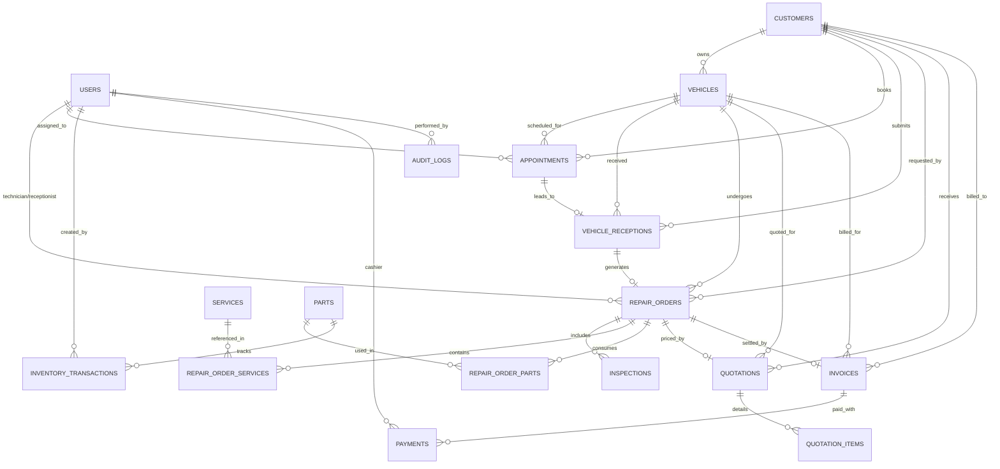

# THIẾT KẾ CƠ SỞ DỮ LIỆU (DATABASE DESIGN & DICTIONARY)
## HỆ THỐNG QUẢN LÝ GARAGE VTV TÍCH HỢP AI (GARAGE VTV AI MANAGEMENT SYSTEM)

---

## 1. SƠ ĐỒ THỰC THỂ - QUAN HỆ TOÀN DIỆN (MERMAID ERD)

---

## 2. TỪ ĐIỂN DỮ LIỆU CHI TIẾT (DATA DICTIONARY)

### 2.1. Bảng `users` (Tài khoản người dùng & Phân quyền)
| Cột | Kiểu dữ liệu | Ràng buộc | Mô tả |
|---|---|---|---|
| `id` | INTEGER | PK, AUTO_INCREMENT | Mã định danh người dùng |
| `username` | VARCHAR(50) | UNIQUE, INDEX, NOT NULL | Tên đăng nhập |
| `email` | VARCHAR(100) | UNIQUE, INDEX, NOT NULL | Email liên hệ |
| `hashed_password` | VARCHAR(255) | NOT NULL | Mật khẩu băm (PBKDF2/Argon2) |
| `full_name` | VARCHAR(100) | NOT NULL | Họ và tên |
| `role` | VARCHAR(20) | ENUM, NOT NULL | Vai trò: `manager`, `receptionist`, `technician`, `cashier` |
| `phone` | VARCHAR(20) | NULLABLE | Số điện thoại |
| `is_active` | BOOLEAN | DEFAULT TRUE | Trạng thái tài khoản |
| `created_at` | DATETIME | DEFAULT UTC_NOW | Thời điểm tạo |

### 2.2. Bảng `customers` (Khách hàng)
| Cột | Kiểu dữ liệu | Ràng buộc | Mô tả |
|---|---|---|---|
| `id` | INTEGER | PK, AUTO_INCREMENT | Mã khách hàng |
| `customer_code` | VARCHAR(30) | UNIQUE, INDEX, NOT NULL | Mã khách (CUS-YYYY-XXXXXX) |
| `full_name` | VARCHAR(100) | NOT NULL | Tên khách hàng |
| `phone` | VARCHAR(20) | UNIQUE, INDEX, NOT NULL | Số điện thoại tra cứu chính |
| `email` | VARCHAR(100) | NULLABLE | Email |
| `address` | VARCHAR(255) | NULLABLE | Địa chỉ liên hệ |
| `notes` | TEXT | NULLABLE | Ghi chú đặc biệt |
| `status` | VARCHAR(20) | DEFAULT 'ACTIVE' | ACTIVE, INACTIVE, LOCKED |
| `created_at` | DATETIME | DEFAULT UTC_NOW | Thời điểm tạo |
| `deleted_at` | DATETIME | NULLABLE | Cột xóa mềm (Soft delete) |

### 2.3. Bảng `vehicles` (Hồ sơ phương tiện)
| Cột | Kiểu dữ liệu | Ràng buộc | Mô tả |
|---|---|---|---|
| `id` | INTEGER | PK, AUTO_INCREMENT | Mã xe |
| `customer_id` | INTEGER | FK -> customers(id), NOT NULL | Mã chủ xe |
| `license_plate` | VARCHAR(20) | UNIQUE, INDEX, NOT NULL | Biển số xe (VD: 51A-123.45) |
| `brand` | VARCHAR(50) | NOT NULL | Hãng xe (Toyota, Honda, BMW...) |
| `model` | VARCHAR(50) | NOT NULL | Dòng xe (Camry, Civic, X5...) |
| `year` | INTEGER | NULLABLE | Năm sản xuất |
| `color` | VARCHAR(30) | NULLABLE | Màu sơn |
| `vin` | VARCHAR(50) | INDEX, NULLABLE | Số khung xe (VIN) |
| `engine_number` | VARCHAR(50) | NULLABLE | Số máy |
| `mileage` | INTEGER | DEFAULT 0 | Số km hiện tại |
| `fuel_type` | VARCHAR(20) | DEFAULT 'GASOLINE' | Xăng, Dầu Diesel, Điện, Hybrid |
| `transmission` | VARCHAR(20) | DEFAULT 'AUTOMATIC' | Số tự động, Số sàn |
| `notes` | TEXT | NULLABLE | Ghi chú phương tiện |
| `created_at` | DATETIME | DEFAULT UTC_NOW | Thời điểm tạo |

### 2.4. Bảng `appointments` (Lịch hẹn sửa chữa)
| Cột | Kiểu dữ liệu | Ràng buộc | Mô tả |
|---|---|---|---|
| `id` | INTEGER | PK, AUTO_INCREMENT | Mã lịch hẹn |
| `appointment_code`| VARCHAR(30) | UNIQUE, INDEX, NOT NULL | Mã lịch (APT-YYYY-XXXXXX) |
| `customer_id` | INTEGER | FK -> customers(id), NOT NULL | Khách hẹn |
| `vehicle_id` | INTEGER | FK -> vehicles(id), NOT NULL | Xe hẹn |
| `appointment_date`| DATETIME | NOT NULL | Ngày và giờ hẹn |
| `service_type` | VARCHAR(100) | NULLABLE | Dịch vụ đăng ký trước |
| `description` | TEXT | NULLABLE | Mô tả yêu cầu của khách |
| `status` | VARCHAR(20) | DEFAULT 'PENDING' | PENDING, CONFIRMED, ARRIVED, IN_PROGRESS, COMPLETED, CANCELLED |
| `assigned_staff_id`| INTEGER | FK -> users(id), NULLABLE | Nhân viên tiếp nhận |
| `created_at` | DATETIME | DEFAULT UTC_NOW | Thời điểm tạo |

### 2.5. Bảng `vehicle_receptions` (Biên bản tiếp nhận xe)
| Cột | Kiểu dữ liệu | Ràng buộc | Mô tả |
|---|---|---|---|
| `id` | INTEGER | PK, AUTO_INCREMENT | Mã tiếp nhận |
| `reception_code` | VARCHAR(30) | UNIQUE, INDEX, NOT NULL | Mã tiếp nhận (REC-YYYY-XXXXXX) |
| `customer_id` | INTEGER | FK -> customers(id), NOT NULL | Khách hàng giao xe |
| `vehicle_id` | INTEGER | FK -> vehicles(id), NOT NULL | Xe được tiếp nhận |
| `appointment_id` | INTEGER | FK -> appointments(id), NULLABLE| Lịch hẹn liên quan nếu có |
| `mileage` | INTEGER | NOT NULL | Số km khi vào xưởng |
| `fuel_level` | VARCHAR(20) | DEFAULT '1/2' | Mức nhiên liệu (E, 1/4, 1/2, 3/4, F) |
| `exterior_condition`| TEXT | NULLABLE | Tình trạng thân vỏ, vết xước |
| `interior_condition`| TEXT | NULLABLE | Tình trạng nội thất, đồ đạc trên xe |
| `customer_complaint`| TEXT | NOT NULL | Yêu cầu và phản ánh của khách hàng |
| `received_by_id` | INTEGER | FK -> users(id), NOT NULL | Lễ tân nhận xe |
| `received_at` | DATETIME | DEFAULT UTC_NOW | Thời điểm nhận xe |

### 2.6. Bảng `repair_orders` (Phiếu sửa chữa)
| Cột | Kiểu dữ liệu | Ràng buộc | Mô tả |
|---|---|---|---|
| `id` | INTEGER | PK, AUTO_INCREMENT | Mã phiếu sửa chữa |
| `code` | VARCHAR(30) | UNIQUE, INDEX, NOT NULL | Mã phiếu (RO-YYYY-XXXXXX) |
| `customer_id` | INTEGER | FK -> customers(id), NOT NULL | Khách hàng |
| `vehicle_id` | INTEGER | FK -> vehicles(id), NOT NULL | Xe sửa chữa |
| `reception_id` | INTEGER | FK -> vehicle_receptions(id) | Biên bản tiếp nhận liên kết |
| `technician_id` | INTEGER | FK -> users(id), NULLABLE | Kỹ thuật viên chính phụ trách |
| `receptionist_id`| INTEGER | FK -> users(id), NULLABLE | Lễ tân lập phiếu |
| `status` | VARCHAR(30) | ENUM, NOT NULL | Trạng thái State Machine |
| `mileage_in` | INTEGER | DEFAULT 0 | Số km vào xưởng |
| `mileage_out` | INTEGER | NULLABLE | Số km xuất xưởng |
| `customer_complaint`| TEXT | NULLABLE | Triệu chứng khách phản ánh |
| `technical_diagnosis`| TEXT | NULLABLE | Kết luận chẩn đoán kỹ thuật |
| `estimated_cost` | FLOAT | DEFAULT 0.0 | Chi phí dự kiến |
| `final_cost` | FLOAT | DEFAULT 0.0 | Chi phí thực tế cuối cùng |
| `created_at` | DATETIME | DEFAULT UTC_NOW | Ngày mở phiếu |
| `completed_at` | DATETIME | NULLABLE | Ngày đóng phiếu |

### 2.7. Bảng `inspections` (Hạng mục chẩn đoán kỹ thuật)
| Cột | Kiểu dữ liệu | Ràng buộc | Mô tả |
|---|---|---|---|
| `id` | INTEGER | PK, AUTO_INCREMENT | Mã hạng mục chẩn đoán |
| `repair_order_id`| INTEGER | FK -> repair_orders(id), NOT NULL| Thuộc phiếu sửa chữa |
| `category` | VARCHAR(50) | NOT NULL | ENGINE, BRAKES, ELECTRICAL, SUSPENSION, TIRES, BODY... |
| `item` | VARCHAR(150) | NOT NULL | Chi tiết kiểm tra (Má phanh, bugi, dầu máy...) |
| `condition` | VARCHAR(100) | NOT NULL | Tình trạng phát hiện |
| `severity` | VARCHAR(20) | ENUM, NOT NULL | NORMAL, NOTICE, WARNING, CRITICAL |
| `technician_note`| TEXT | NULLABLE | Lời dặn kỹ thuật |
| `recommendation` | TEXT | NULLABLE | Khuyến nghị xử lý |
| `created_at` | DATETIME | DEFAULT UTC_NOW | Thời điểm kiểm tra |

### 2.8. Bảng `repair_order_services` & `repair_order_parts` (Hạng mục dịch vụ & Phụ tùng)
- **`repair_order_services`**:
  - `id`: PK
  - `repair_order_id`: FK -> `repair_orders(id)`
  - `service_id`: FK -> `services(id)`
  - `quantity`: FLOAT (mặc định 1.0)
  - `unit_price`: FLOAT (chi phí công thợ)
  - `discount`: FLOAT (chiết khấu)
  - `subtotal`: FLOAT (tính toán tự động từ unit_price * quantity - discount)
  - `notes`: VARCHAR(255)
- **`repair_order_parts`**:
  - `id`: PK
  - `repair_order_id`: FK -> `repair_orders(id)`
  - `part_id`: FK -> `parts(id)`
  - `quantity`: INTEGER (số lượng linh kiện)
  - `unit_price`: FLOAT (đơn giá phụ tùng)
  - `discount`: FLOAT
  - `subtotal`: FLOAT (tính toán tự động)

### 2.9. Bảng `quotations` & `quotation_items` (Báo giá dịch vụ)
- `id`: PK
- `quotation_code`: VARCHAR(30) UNIQUE (QO-YYYY-XXXXXX)
- `repair_order_id`: FK -> `repair_orders(id)`
- `customer_id`: FK -> `customers(id)`
- `vehicle_id`: FK -> `vehicles(id)`
- `quotation_date`: DATETIME
- `valid_until`: DATETIME (ngày hết hạn báo giá)
- `subtotal`: FLOAT (công thợ + linh kiện)
- `discount`: FLOAT
- `vat_rate`: FLOAT (mặc định 0.10)
- `vat_amount`: FLOAT
- `total_amount`: FLOAT (subtotal - discount + vat_amount)
- `status`: ENUM (`DRAFT`, `PENDING_APPROVAL`, `APPROVED`, `REJECTED`, `EXPIRED`, `CANCELLED`)
- `approved_at`: DATETIME, `rejected_at`: DATETIME, `customer_note`: TEXT

### 2.10. Bảng `inventory_transactions` (Giao dịch xuất nhập kho)
- `id`: PK
- `part_id`: FK -> `parts(id)`
- `transaction_type`: ENUM (`IMPORT`, `EXPORT`, `ADJUSTMENT`)
- `quantity`: INTEGER (Số lượng biến động)
- `reference_type`: VARCHAR(50) (REPAIR_ORDER, PURCHASE_ORDER, AUDIT)
- `reference_id`: INTEGER (ID phiếu sửa chữa nếu xuất cho xe)
- `previous_quantity`: INTEGER
- `new_quantity`: INTEGER
- `created_by_id`: FK -> `users(id)`
- `created_at`: DATETIME
- `notes`: TEXT

### 2.11. Bảng `invoices` & `payments` (Hóa đơn & Thanh toán)
- **`invoices`**:
  - `id`: PK, `invoice_number`: UNIQUE (INV-YYYY-XXXXXX)
  - `repair_order_id`: FK -> `repair_orders(id)`
  - `subtotal`, `discount_amount`, `tax_amount`, `total_amount`
  - `paid_amount`, `balance_due` (`total_amount - paid_amount`)
  - `status`: `UNPAID`, `PARTIALLY_PAID`, `PAID`, `CANCELLED`
- **`payments`**:
  - `id`: PK, `invoice_id`: FK -> `invoices(id)`
  - `payment_code`: UNIQUE (PAY-YYYY-XXXXXX)
  - `amount`: FLOAT (Ràng buộc: `amount > 0` và `amount <= balance_due`)
  - `payment_method`: `CASH`, `BANK_TRANSFER`, `CARD`, `OTHER`
  - `transaction_reference`: Mã giao dịch ngân hàng / POS
  - `payment_date`: DATETIME
  - `cashier_id`: FK -> `users(id)`

### 2.12. Bảng `ai_logs` & `audit_logs`
- **`ai_logs`**: Ghi nhận toàn bộ cuộc gọi AI, prompt đầu vào, phản hồi, độ trễ `latency_ms`, số lượng tokens, mô hình sử dụng, trạng thái (`success`, `failed`, `jailbreak_blocked`).
- **`audit_logs`**: Nhật ký kiểm toán bảo mật (`user_id`, `action`, `resource`, `resource_id`, `ip_address`, `metadata`, `created_at`).
