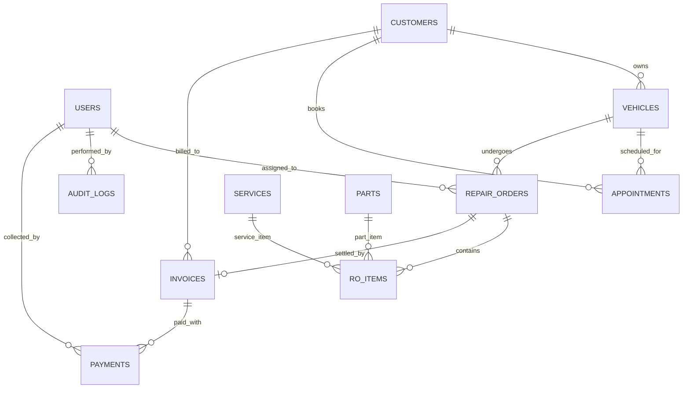

# TÀI LIỆU THIẾT KẾ CƠ SỞ DỮ LIỆU TOÀN DIỆN (DATABASE SPECIFICATION)
# HỆ THỐNG QUẢN LÝ GARAGE Ô TÔ TÍCH HỢP AI - GARAGE VTV ENGINE PRO

---

## 1. TỔNG QUAN CƠ SỞ DỮ LIỆU
Hệ thống sử dụng cơ sở dữ liệu quan hệ chuẩn hóa bậc 3 (3NF) lưu trữ trên **SQLite 3 (`garage.db`)** và tương thích hoàn toàn với **PostgreSQL**.
*   **Số lượng bảng:** 13 bảng thực thể nghiệp vụ và kiểm toán.
*   **Chiến lược toàn vẹn:** Cưỡng chế khóa ngoại (`PRAGMA foreign_keys = ON`), ràng buộc duy nhất (Unique), kiểm tra số lượng (`CHECK >= 0`) và xóa mềm (`deleted_at`).

---

## 2. SƠ ĐỒ THỰC THỂ - QUAN HỆ (MERMAID ERD)

---

## 3. TỪ ĐIỂN DỮ LIỆU CHI TIẾT 13 BẢNG (DATA DICTIONARY)

### 3.1. Bảng `users` (Tài khoản người dùng)
| Tên cột | Kiểu dữ liệu | PK | FK | Ràng buộc | Diễn giải |
|---|---|:---:|:---:|---|---|
| `id` | INTEGER | ✔ | | AUTOINCREMENT | Khóa chính |
| `username` | VARCHAR(50) | | | UNIQUE, NOT NULL, INDEX | Tên đăng nhập |
| `email` | VARCHAR(100) | | | UNIQUE, NOT NULL | Email liên hệ |
| `hashed_password` | VARCHAR(255) | | | NOT NULL | Chuỗi băm BCrypt |
| `full_name` | VARCHAR(100) | | | NOT NULL | Họ và tên |
| `role` | VARCHAR(20) | | | ENUM, NOT NULL | `manager`, `receptionist`, `technician`, `cashier` |
| `is_active` | BOOLEAN | | | DEFAULT TRUE | Trạng thái kích hoạt |
| `created_at` | DATETIME | | | DEFAULT CURRENT_TIMESTAMP | Thời điểm tạo |

### 3.2. Bảng `customers` (Khách hàng)
| Tên cột | Kiểu dữ liệu | PK | FK | Ràng buộc | Diễn giải |
|---|---|:---:|:---:|---|---|
| `id` | INTEGER | ✔ | | AUTOINCREMENT | Khóa chính |
| `customer_code` | VARCHAR(30) | | | UNIQUE, NOT NULL, INDEX | Mã khách hàng (`CUS-YYYY-XXXXXX`) |
| `full_name` | VARCHAR(100) | | | NOT NULL | Tên khách hàng |
| `phone` | VARCHAR(20) | | | UNIQUE, NOT NULL, INDEX | Số điện thoại tra cứu chính |
| `email` | VARCHAR(100) | | | NULLABLE | Email nhận hóa đơn |
| `address` | VARCHAR(255) | | | NULLABLE | Địa chỉ liên hệ |
| `created_at` | DATETIME | | | DEFAULT CURRENT_TIMESTAMP | Ngày tham gia |
| `deleted_at` | DATETIME | | | NULLABLE | Dấu thời gian xóa mềm (Soft Delete) |

### 3.3. Bảng `vehicles` (Phương tiện)
| Tên cột | Kiểu dữ liệu | PK | FK | Ràng buộc | Diễn giải |
|---|---|:---:|:---:|---|---|
| `id` | INTEGER | ✔ | | AUTOINCREMENT | Khóa chính |
| `customer_id` | INTEGER | | ✔ | REFERENCES customers(id) | Khóa ngoại chủ xe |
| `license_plate` | VARCHAR(20) | | | UNIQUE, NOT NULL, INDEX | Biển số xe kiểm soát duy nhất |
| `brand` | VARCHAR(50) | | | NOT NULL | Hãng sản xuất (`Toyota`, `Ford`...) |
| `model` | VARCHAR(50) | | | NOT NULL | Dòng xe (`Camry`, `Ranger`...) |
| `year` | INTEGER | | | NULLABLE | Năm sản xuất |
| `current_mileage`| INTEGER | | | DEFAULT 0 | Số km hiện tại (Odometer) |
| `created_at` | DATETIME | | | DEFAULT CURRENT_TIMESTAMP | Thời điểm thêm xe |
| `deleted_at` | DATETIME | | | NULLABLE | Xóa mềm |

### 3.4. Bảng `appointments` (Lịch hẹn dịch vụ)
| Tên cột | Kiểu dữ liệu | PK | FK | Ràng buộc | Diễn giải |
|---|---|:---:|:---:|---|---|
| `id` | INTEGER | ✔ | | AUTOINCREMENT | Khóa chính |
| `customer_id` | INTEGER | | ✔ | REFERENCES customers(id) | Khóa ngoại khách |
| `vehicle_id` | INTEGER | | ✔ | REFERENCES vehicles(id) | Khóa ngoại xe |
| `appointment_time`| DATETIME | | | NOT NULL, INDEX | Thời gian hẹn sửa |
| `status` | VARCHAR(20) | | | DEFAULT 'SCHEDULED' | `SCHEDULED`, `CONFIRMED`, `CANCELLED` |
| `notes` | TEXT | | | NULLABLE | Ghi chú yêu cầu của khách |

### 3.5. Bảng `repair_orders` (Phiếu sửa chữa)
| Tên cột | Kiểu dữ liệu | PK | FK | Ràng buộc | Diễn giải |
|---|---|:---:|:---:|---|---|
| `id` | INTEGER | ✔ | | AUTOINCREMENT | Khóa chính |
| `order_code` | VARCHAR(30) | | | UNIQUE, NOT NULL, INDEX | Mã phiếu (`RO-YYYY-XXXXXX`) |
| `vehicle_id` | INTEGER | | ✔ | REFERENCES vehicles(id) | Khóa ngoại xe sửa |
| `assigned_technician_id`| INTEGER| | ✔ | REFERENCES users(id), NULL | KTV phụ trách chính |
| `status` | VARCHAR(30) | | | NOT NULL, INDEX | 13 trạng thái máy |
| `symptoms` | TEXT | | | NULLABLE | Mô tả triệu chứng ban đầu |
| `diagnosis` | TEXT | | | NULLABLE | Kết luận chẩn đoán KTV |
| `mileage_at_reception` | INTEGER | | | NOT NULL | Số km khi vào xưởng |
| `total_cost` | DECIMAL(12,2)| | | DEFAULT 0.00 | Tổng chi phí quyết toán |
| `created_at` | DATETIME | | | DEFAULT CURRENT_TIMESTAMP | Thời điểm mở phiếu |
| `updated_at` | DATETIME | | | ON UPDATE CURRENT_TIMESTAMP| Thời điểm cập nhật |

### 3.6. Bảng `ro_items` (Chi tiết dịch vụ & phụ tùng trên phiếu)
| Tên cột | Kiểu dữ liệu | PK | FK | Ràng buộc | Diễn giải |
|---|---|:---:|:---:|---|---|
| `id` | INTEGER | ✔ | | AUTOINCREMENT | Khóa chính |
| `repair_order_id`| INTEGER | | ✔ | REFERENCES repair_orders(id)| Khóa ngoại phiếu sửa chữa |
| `item_type` | VARCHAR(20) | | | NOT NULL | Enum: `service`, `part` |
| `service_id` | INTEGER | | ✔ | REFERENCES services(id), NULL| Khóa ngoại dịch vụ |
| `part_id` | INTEGER | | ✔ | REFERENCES parts(id), NULL | Khóa ngoại phụ tùng |
| `quantity` | INTEGER | | | NOT NULL, CHECK(quantity > 0)| Số lượng |
| `unit_price` | DECIMAL(12,2)| | | NOT NULL | Đơn giá niêm yết tại thời điểm tạo |

### 3.7. Bảng `services` (Danh mục dịch vụ kỹ thuật)
| Tên cột | Kiểu dữ liệu | PK | FK | Ràng buộc | Diễn giải |
|---|---|:---:|:---:|---|---|
| `id` | INTEGER | ✔ | | AUTOINCREMENT | Khóa chính |
| `service_code` | VARCHAR(30) | | | UNIQUE, NOT NULL | Mã dịch vụ (`SRV-001`) |
| `name` | VARCHAR(150) | | | NOT NULL | Tên dịch vụ bảo dưỡng/sửa chữa |
| `labor_cost` | DECIMAL(12,2)| | | NOT NULL | Tiền công thợ niêm yết |
| `category` | VARCHAR(50) | | | NULLABLE | Nhóm: Động cơ, Phanh, Điện... |

### 3.8. Bảng `parts` (Kho linh kiện phụ tùng)
| Tên cột | Kiểu dữ liệu | PK | FK | Ràng buộc | Diễn giải |
|---|---|:---:|:---:|---|---|
| `id` | INTEGER | ✔ | | AUTOINCREMENT | Khóa chính |
| `part_code` | VARCHAR(50) | | | UNIQUE, NOT NULL, INDEX | Mã phụ tùng kỹ thuật |
| `name` | VARCHAR(150) | | | NOT NULL | Tên linh kiện |
| `sell_price` | DECIMAL(12,2)| | | NOT NULL | Giá bán lẻ niêm yết |
| `stock_quantity`| INTEGER | | | NOT NULL, CHECK(stock_quantity >= 0)| Tồn kho thực tế (Không âm) |
| `min_stock_alert`| INTEGER | | | DEFAULT 5 | Ngưỡng cảnh báo sắp hết kho |

### 3.9. Bảng `quotations` (Báo giá dịch vụ)
| Tên cột | Kiểu dữ liệu | PK | FK | Ràng buộc | Diễn giải |
|---|---|:---:|:---:|---|---|
| `id` | INTEGER | ✔ | | AUTOINCREMENT | Khóa chính |
| `quotation_code`| VARCHAR(30) | | | UNIQUE, NOT NULL | Mã báo giá (`QUO-YYYY-XXXXXX`) |
| `repair_order_id`| INTEGER | | ✔ | REFERENCES repair_orders(id)| Khóa ngoại RO |
| `discount_amount`| DECIMAL(12,2)| | | DEFAULT 0.00 | Tiền chiết khấu |
| `valid_until` | DATETIME | | | NOT NULL | Thời hạn hiệu lực báo giá |
| `status` | VARCHAR(20) | | | DEFAULT 'PENDING' | `PENDING`, `APPROVED`, `REJECTED` |

### 3.10. Bảng `invoices` (Hóa đơn dịch vụ)
| Tên cột | Kiểu dữ liệu | PK | FK | Ràng buộc | Diễn giải |
|---|---|:---:|:---:|---|---|
| `id` | INTEGER | ✔ | | AUTOINCREMENT | Khóa chính |
| `invoice_code` | VARCHAR(30) | | | UNIQUE, NOT NULL, INDEX | Mã hóa đơn (`INV-YYYY-XXXXXX`) |
| `repair_order_id`| INTEGER | | ✔ | REFERENCES repair_orders(id), UNIQUE| Khóa ngoại RO (1-1) |
| `subtotal` | DECIMAL(12,2)| | | NOT NULL | Tiền trước thuế |
| `vat_rate` | DECIMAL(4,2) | | | DEFAULT 0.10 | Thuế VAT 10% |
| `total_amount` | DECIMAL(12,2)| | | NOT NULL | Tổng thanh toán sau thuế |
| `paid_amount` | DECIMAL(12,2)| | | DEFAULT 0.00 | Số tiền đã thanh toán |
| `status` | VARCHAR(20) | | | NOT NULL | `UNPAID`, `PARTIAL`, `PAID`, `CANCELLED` |

### 3.11. Bảng `payments` (Lịch sử thanh toán hóa đơn)
| Tên cột | Kiểu dữ liệu | PK | FK | Ràng buộc | Diễn giải |
|---|---|:---:|:---:|---|---|
| `id` | INTEGER | ✔ | | AUTOINCREMENT | Khóa chính |
| `invoice_id` | INTEGER | | ✔ | REFERENCES invoices(id) | Khóa ngoại hóa đơn |
| `amount` | DECIMAL(12,2)| | | NOT NULL, CHECK(amount > 0) | Số tiền nạp |
| `payment_method`| VARCHAR(30) | | | NOT NULL | `Cash`, `BankTransfer` (VietQR) |
| `payment_date` | DATETIME | | | DEFAULT CURRENT_TIMESTAMP | Thời điểm thu tiền |

### 3.12. Bảng `customer_requests` (Yêu cầu đặt lịch online)
| Tên cột | Kiểu dữ liệu | PK | FK | Ràng buộc | Diễn giải |
|---|---|:---:|:---:|---|---|
| `id` | INTEGER | ✔ | | AUTOINCREMENT | Khóa chính |
| `request_code` | VARCHAR(30) | | | UNIQUE, NOT NULL, INDEX | Mã yêu cầu (`REQ-YYYYMMDD-XXXX`) |
| `full_name` | VARCHAR(100) | | | NOT NULL | Tên người đặt |
| `phone` | VARCHAR(20) | | | NOT NULL, INDEX | Số điện thoại |
| `license_plate` | VARCHAR(20) | | | NOT NULL | Biển số xe |
| `service_type` | VARCHAR(100) | | | NOT NULL | Gói dịch vụ |
| `status` | VARCHAR(20) | | | DEFAULT 'Pending' | `Pending`, `Contacted`, `Converted` |

### 3.13. Bảng `audit_logs` & `ai_logs` (Nhật ký kiểm toán & AI)
*   `audit_logs`: `id`, `user_id`, `action`, `table_name`, `record_id`, `old_values`, `new_values`, `timestamp`.
*   `ai_logs`: `id`, `user_id`, `model_name`, `prompt_hash`, `tokens_used`, `latency_ms`, `status`, `timestamp`.
