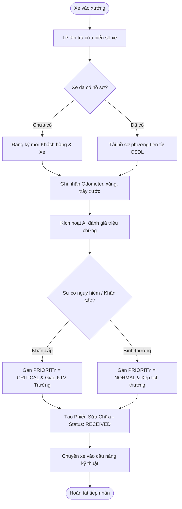
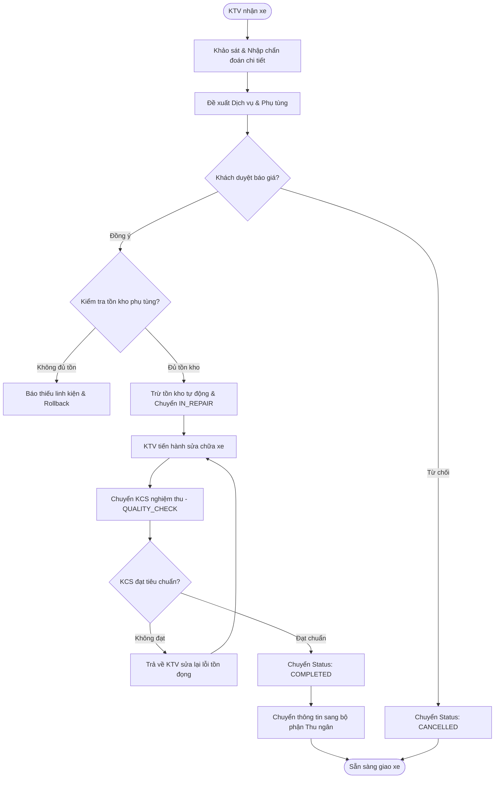
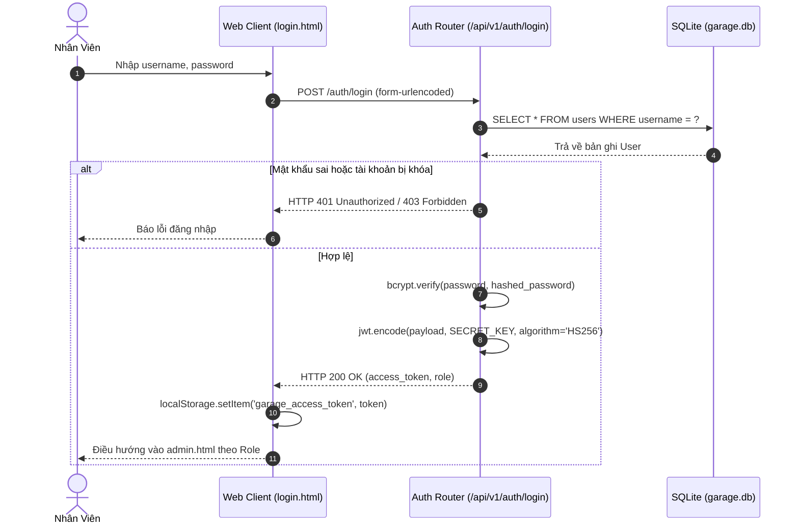
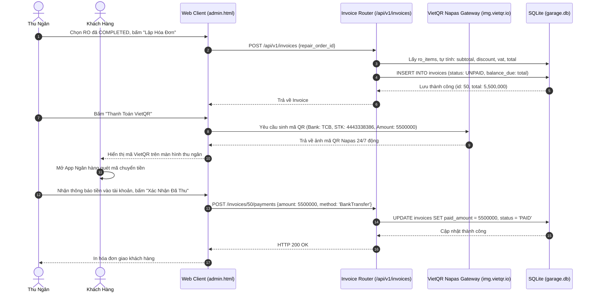
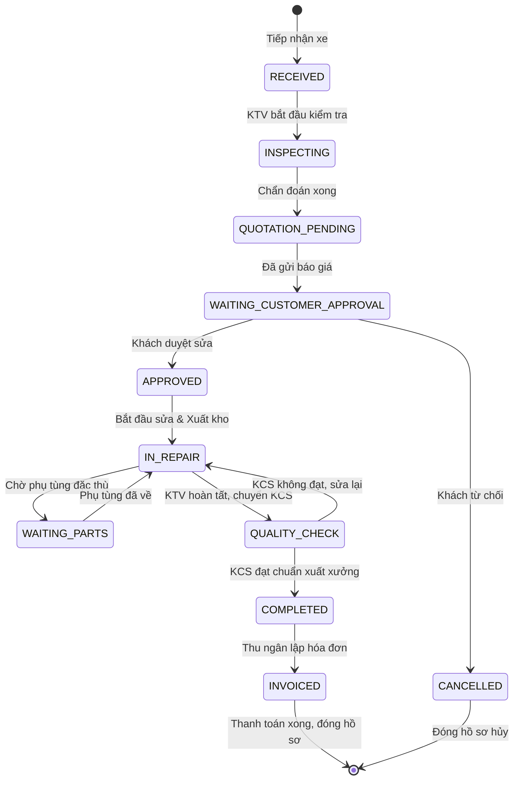
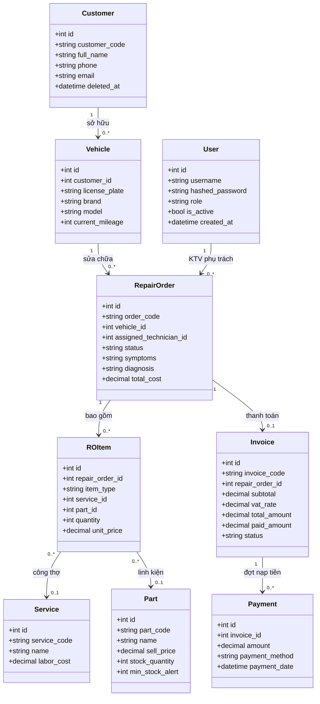
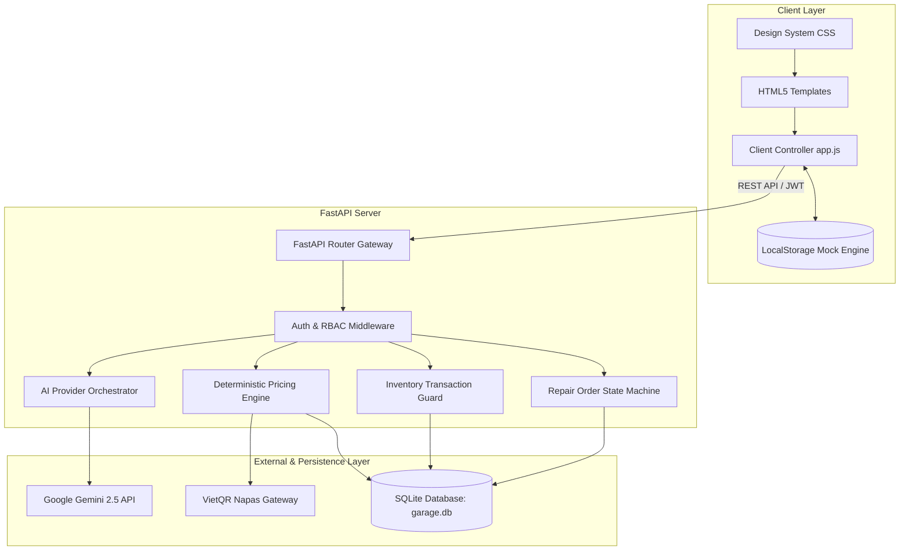
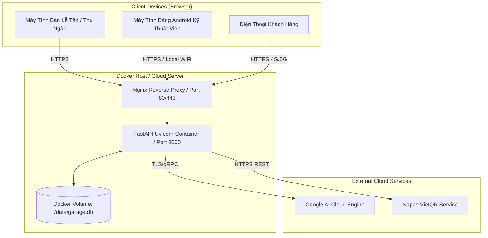

# BỘ TÀI LIỆU SƠ ĐỒ UML TOÀN DIỆN (UML DIAGRAMS SPECIFICATION)
# HỆ THỐNG QUẢN LÝ GARAGE Ô TÔ TÍCH HỢP AI - GARAGE VTV ENGINE PRO

---

## 1. BIỂU ĐỒ USE CASE (USE CASE DIAGRAMS)

### 1.1. Biểu đồ Use Case Tổng Quát

```mermaid
graph TD
    Customer((Khách Hàng))
    Receptionist((Lễ Tân))
    Technician((Kỹ Thuật Viên))
    Cashier((Thu Ngân))
    Manager((Quản Lý / Admin))
    AI_Service[Google Gemini AI]

    subgraph "Hệ Thống Garage VTV Engine Pro"
        UC_Auth[UC-01: Đăng nhập & Quản lý phiên JWT]
        UC_Booking[UC-02: Đặt lịch hẹn sửa chữa online]
        UC_Reception[UC-03: Tiếp nhận xe & Ghi nhận Odometer]
        UC_RO[UC-04: Quản lý Phiếu sửa chữa State Machine]
        UC_History[UC-05: Tra cứu lịch sử sửa chữa]
        UC_Inventory[UC-06: Quản lý Kho linh kiện & Dịch vụ]
        UC_Billing[UC-07: Báo giá, Hóa đơn & VietQR]
        UC_Report[UC-08: Báo cáo Doanh thu Line Chart]
        UC_AI[UC-09: Trợ lý AI Tóm tắt & Giải thích]
        UC_Audit[UC-10: Nhật ký kiểm toán Audit Log]
    end

    Customer --> UC_Booking
    Customer --> UC_History
    Customer --> UC_AI

    Receptionist --> UC_Auth
    Receptionist --> UC_Reception
    Receptionist --> UC_Booking
    Receptionist --> UC_Billing
    Receptionist --> UC_History
    Receptionist --> UC_AI

    Technician --> UC_Auth
    Technician --> UC_RO
    Technician --> UC_Inventory
    Technician --> UC_History
    Technician --> UC_AI

    Cashier --> UC_Auth
    Cashier --> UC_Billing
    Cashier --> UC_Report

    Manager --> UC_Auth
    Manager --> UC_Reception
    Manager --> UC_RO
    Manager --> UC_Inventory
    Manager --> UC_Billing
    Manager --> UC_Report
    Manager --> UC_Audit
    Manager --> UC_AI

    UC_AI --> AI_Service
```

---

## 2. BIỂU ĐỒ HOẠT ĐỘNG (ACTIVITY DIAGRAMS)

### 2.1. Tiếp nhận xe và Phân loại ưu tiên

### 2.2. Luồng Sửa chữa và Nghiệm thu chất lượng KCS

---

## 3. BIỂU ĐỒ TUẦN TỰ (SEQUENCE DIAGRAMS)

### 3.1. Xác thực và Phân quyền (Login Sequence)

### 3.2. Lập hóa đơn và Thanh toán VietQR

---

## 4. BIỂU ĐỒ MÁY TRẠNG THÁI (STATE MACHINE DIAGRAM)

---

## 5. BIỂU ĐỒ LỚP (CLASS DIAGRAM)

---

## 6. BIỂU ĐỒ THÀNH PHẦN (COMPONENT DIAGRAM)

---

## 7. BIỂU ĐỒ TRIỂN KHAI (DEPLOYMENT DIAGRAM)

