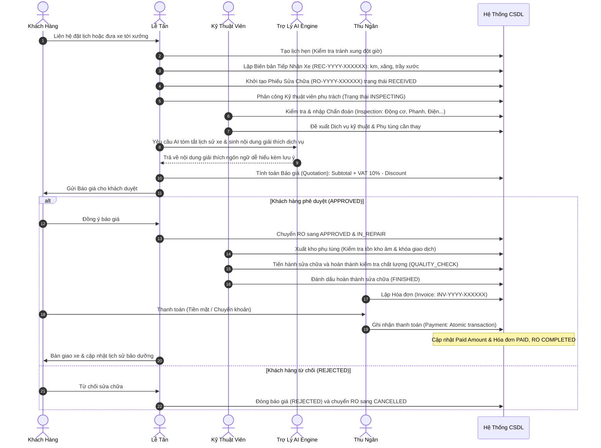
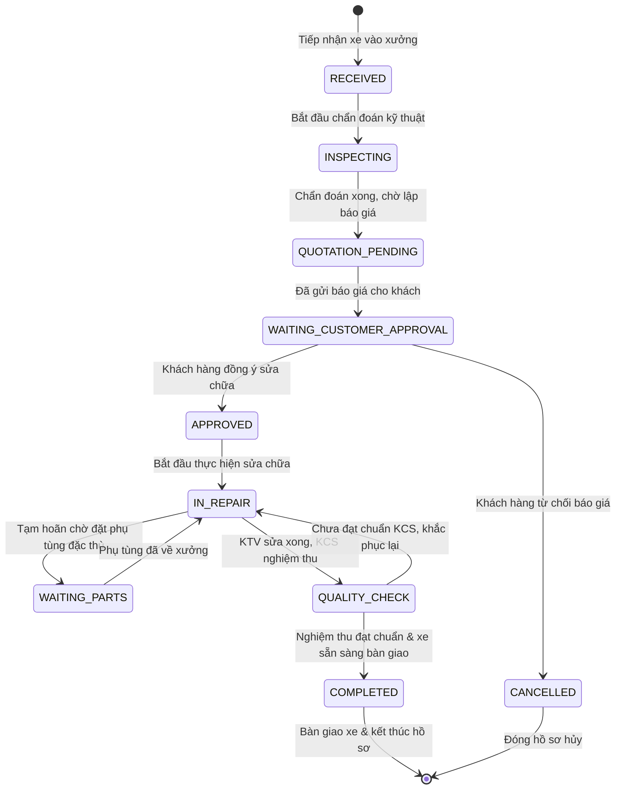

# TÀI LIỆU ĐẶC TẢ YÊU CẦU HỆ THỐNG (REQUIREMENTS SPECIFICATION)
## HỆ THỐNG QUẢN LÝ GARAGE VTV TÍCH HỢP AI (GARAGE VTV AI MANAGEMENT SYSTEM)

**Phiên bản:** 2.0.0  
**Ngày cập nhật:** 02/09/2026  
**Kiến trúc:** Clean Architecture & API-First

---

## 1. TỔNG QUAN HỆ THỐNG & ĐỐI TƯỢNG SỬ DỤNG
Hệ thống Quản lý Garage VTV Tích hợp AI là nền tảng quản trị khép kín quy trình dịch vụ ô tô từ tiếp nhận, chẩn đoán, báo giá, sửa chữa, kiểm định chất lượng đến thanh toán hóa đơn và chăm sóc khách hàng.

### 1.1. Các Tác Nhân & Vai Trò (Actors & Roles)
Hệ thống triển khai ma trận phân quyền 4 vai trò (RBAC):
1. **Quản Lý / Chủ Garage (Manager / Admin)**: Toàn quyền quản trị danh mục, nhân sự, kho bãi, duyệt báo giá đặc biệt, quản lý doanh thu, cấu hình AI và nhật ký kiểm toán (Audit Logs).
2. **Lễ Tân (Receptionist)**: Đặt lịch hẹn, tiếp nhận xe vào xưởng (Vehicle Reception), ghi nhận tình trạng vỏ xe, số km, mức nhiên liệu, tạo phiếu sửa chữa sơ bộ, soạn thảo báo giá nháp gửi khách.
3. **Kỹ Thuật Viên (Technician)**: Nhận xe được phân công, thực hiện chẩn đoán đa hạng mục (Engine, Brakes, Electrical, Suspension...), ghi chú kỹ thuật, đề xuất vật tư phụ tùng và cập nhật tiến độ sửa chữa.
4. **Thu Ngân (Cashier)**: Quản lý hóa đơn dịch vụ, ghi nhận các đợt thanh toán (Tiền mặt, Chuyển khoản, Thẻ), in hóa đơn VAT và lập báo cáo thu chi hàng ngày.

---

## 2. MA TRẬN PHÂN QUYỀN (PERMISSION MATRIX)

| Module / Chức năng | Manager | Receptionist | Technician | Cashier |
|---|:---:|:---:|:---:|:---:|
| **Dashboard & Báo Cáo Tổng Hợp** | Toàn quyền | Xem giới hạn | Xem công việc cá nhân | Xem doanh thu |
| **Quản Lý Khách Hàng & Xe** | Toàn quyền | Tạo / Sửa / Tra cứu | Xem lịch sử kỹ thuật | Tra cứu thông tin |
| **Lịch Hẹn & Tiếp Nhận Xe** | Toàn quyền | Tạo / Check-in / Hủy | Xem lịch | Không |
| **Chẩn Đoán Kỹ Thuật (Inspection)** | Toàn quyền | Xem kết quả | **Tạo & Cập nhật** | Không |
| **Phiếu Sửa Chữa (Repair Order)** | Toàn quyền | Tạo / Chuyển trạng thái | Cập nhật tiến độ | Xem chi phí |
| **Phân Công Kỹ Thuật Viên** | Toàn quyền | Gợi ý phân công | Nhận việc | Không |
| **Kho & Quản Lý Phụ Tùng** | Toàn quyền | Xem tồn kho | Đề xuất xuất kho | Xem giá bán |
| **Báo Giá (Quotation)** | Toàn quyền | Soạn nháp / Gửi khách | Xem hạng mục | Xem bản duyệt |
| **Hóa Đơn & Thanh Toán** | Toàn quyền | Xem hóa đơn | Không | **Lập hóa đơn & Thu tiền** |
| **Trợ Lý AI (Tóm tắt, Báo giá, Giải thích)** | Toàn quyền | Sử dụng trợ lý | Sử dụng trợ lý | Không |
| **Quản Trị Người Dùng & Cấu Hình** | **Toàn quyền** | Không | Không | Không |
| **Nhật Ký Kiểm Toán (Audit Logs)** | **Xem toàn bộ** | Không | Không | Không |

---

## 3. SƠ ĐỒ USE CASE TỔNG THỂ (USE CASE DIAGRAM)

```mermaid
graph TD
    User([Người Dùng Hệ Thống])
    Manager([Quản Lý / Admin])
    Receptionist([Lễ Tân])
    Technician([Kỹ Thuật Viên])
    Cashier([Thu Ngân])

    User <|-- Manager
    User <|-- Receptionist
    User <|-- Technician
    User <|-- Cashier

    subgraph "Hệ Thống Garage VTV AI"
        UC_Auth[Đăng Nhập / Quản Lý Phiên JWT]
        UC_Customer[Quản Lý Khách Hàng & Hồ Sơ Xe]
        UC_Appointment[Đặt Lịch Hẹn & Kiểm Tra Xung Đột]
        UC_Reception[Tiếp Nhận Xe & Ghi Nhận Hiện Trạng]
        UC_Inspection[Khảo Sát & Chẩn Đoán Đa Hạng Mục]
        UC_RO[Quản Lý Phiếu Sửa Chữa State Machine]
        UC_Quotation[Tính Toán & Soạn Thảo Báo Giá]
        UC_Inventory[Quản Lý Tồn Kho & Xuất Vật Tư Giao Dịch]
        UC_Invoice[Lập Hóa Đơn & Ghi Nhận Thanh Toán Atomic]
        UC_AI[Trợ Lý AI: Tóm Tắt Lịch Sử, Giải Thích Dịch Vụ, Báo Giá Nháp]
        UC_Report[Báo Cáo Doanh Thu, Phụ Tùng, Hiệu Suất KTV]
        UC_Audit[Nhật Ký Kiểm Toán & Cấu Hình Hệ Thống]
    end

    User --> UC_Auth
    Receptionist --> UC_Customer
    Receptionist --> UC_Appointment
    Receptionist --> UC_Reception
    Receptionist --> UC_Quotation
    Receptionist --> UC_AI

    Technician --> UC_Inspection
    Technician --> UC_RO
    Technician --> UC_Inventory
    Technician --> UC_AI

    Cashier --> UC_Invoice
    Cashier --> UC_Report

    Manager --> UC_Customer
    Manager --> UC_RO
    Manager --> UC_Quotation
    Manager --> UC_Inventory
    Manager --> UC_Invoice
    Manager --> UC_Report
    Manager --> UC_Audit
    Manager --> UC_AI
```

---

## 4. QUY TRÌNH NGHIỆP VỤ LIÊN TỤC (BUSINESS WORKFLOW)

Quy trình quản lý dịch vụ từ khi khách hàng liên hệ đến khi bàn giao xe:



---

## 5. MÁY TRẠNG THÁI PHIẾU SỬA CHỮA (STATE MACHINE)

Quy trình chuyển đổi trạng thái của Phiếu Sửa Chữa (`RepairOrder`) được kiểm soát chặt chẽ ở tầng Server-side:



Mọi hành vi chuyển trạng thái trái luồng (ví dụ từ `RECEIVED` nhảy thẳng sang `COMPLETED`) đều bị hệ thống phát hiện và trả về mã lỗi HTTP `400 Bad Request` kèm thông báo chi tiết.
