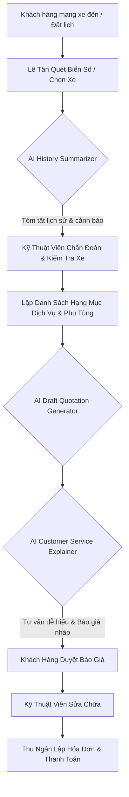
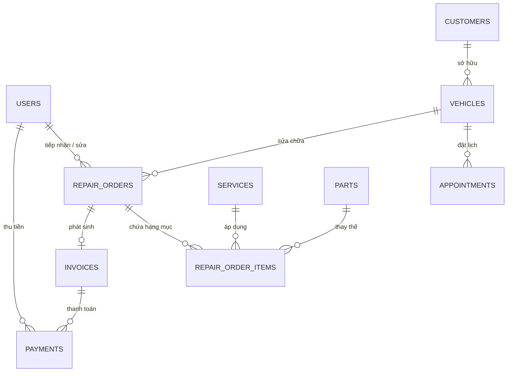

# BÁO CÁO KỸ THUẬT PHÁT TRIỂN HỆ THỐNG QUẢN LÝ GARAGE TÍCH HỢP AI (SDLC REPORT)

**Dự án:** Hệ thống Quản lý Garage Ô tô Tích hợp AI (AI-Integrated Garage Management System)  
**Vai trò thực hiện:** Chuyên gia Ứng dụng Trí tuệ Nhân tạo & Sinh viên Xuất sắc ngành CNTT  
**Thời gian:** 2026  

---

## MỤC LỤC
1. [Giai đoạn KT1: Phân Tích Nghiệp Vụ, Thiết Kế System Architecture & CSDL](#1-giai-đoạn-kt1)
2. [Giai đoạn KT2: Phát Triển Data Models, RESTful APIs & UI Dashboard](#2-giai-đoạn-kt2)
3. [Giai đoạn KT3: AI Engineering, Prompt Design & Test Suite](#3-giai-đoạn-kt3)
4. [Giai đoạn Cuối Kỳ (KT4): Đánh Giá Bảo Mật, Kịch Bản Slide Demo & Tổng Kết](#4-giai-đoạn-kt4)

---

<a id="1-giai-đoạn-kt1"></a>
## 1. GIAI ĐOẠN KT1: PHÂN TÍCH NGHIỆP VỤ & THIẾT KẾ KIẾN TRÚC

### 1.1 Phân tích quy trình nghiệp vụ Garage Ô tô
Trong vận hành garage truyền thống, việc ghi chép thủ công dẫn tới 3 điểm nghẽn chính:
1. **Tiếp nhận xe bị động**: Không tra cứu nhanh được lịch sử sửa chữa cũ, dẫn tới bỏ sót các hư hỏng lặp lại hoặc kiểm tra chồng chéo.
2. **Báo giá thiếu chính xác & lâu**: Kỹ thuật viên mất nhiều thời gian tra cứu giá phụ tùng và tính tiền công, dễ nhầm lẫn.
3. **Giải thích dịch vụ khó hiểu**: Khách hàng không có chuyên môn kỹ thuật cảm thấy e ngại khi đọc các thuật ngữ sửa chữa máy móc.

**Giải pháp đề xuất tích hợp AI vào quy trình:**


### 1.2 Thiết kế Sơ đồ Use Case
Hệ thống hỗ trợ 4 vai trò chính với ma trận phân quyền (RBAC):
- **Super Manager (Quản lý)**: Toàn quyền truy cập, xem dashboard thống kê doanh thu, cấu hình giá dịch vụ & phụ tùng.
- **Receptionist (Lễ tân)**: Đặt lịch hẹn, tiếp nhận xe, tra cứu lịch sử xe, sử dụng AI tóm tắt.
- **Technician (Kỹ thuật viên)**: Nhập ghi chú chẩn đoán kỹ thuật, thêm hạng mục công sửa chữa & phụ tùng.
- **Cashier (Thu ngân)**: Lập hóa đơn, ghi nhận thanh toán tiền mặt/chuyển khoản.

```mermaid
usecaseDiagram
    actor Manager as "Quản lý"
    actor Receptionist as "Lễ tân"
    actor Tech as "Kỹ thuật viên"
    actor Cashier as "Thu ngân"

    usecase UC1 as "Quản lý Khách hàng & Xe"
    usecase UC2 as "Đặt lịch & Tiếp nhận xe"
    usecase UC3 as "AI Tóm tắt lịch sử xe"
    usecase UC4 as "Lập phiếu & Chẩn đoán Kỹ thuật"
    usecase UC5 as "AI Sinh báo giá nháp"
    usecase UC6 as "AI Giải thích dịch vụ dễ hiểu"
    usecase UC7 as "Lập hóa đơn & Ghi nhận thanh toán"
    usecase UC8 as "Thống kê doanh thu & Tồn kho"

    Manager --> UC1
    Manager --> UC8
    Receptionist --> UC1
    Receptionist --> UC2
    Receptionist --> UC3
    Tech --> UC4
    Tech --> UC5
    Tech --> UC6
    Cashier --> UC7
```

### 1.3 Thiết kế Sơ đồ CSDL (ERD - Entity Relationship Diagram)
Cấu trúc CSDL chuẩn化 3NF gồm 10 bảng cốt lõi:



---

<a id="2-giai-đoạn-kt2"></a>
## 2. GIAI ĐOẠN KT2: THIẾT KẾ RESTFUL API & LUỒNG TRẠNG THÁI

### 2.1 Luồng chuyển đổi trạng thái Phiếu sửa chữa (Repair Order State Machine)
Hệ thống kiểm soát chặt chẽ trạng thái phiếu sửa chữa để tránh sai sót doanh thu:
- `received` (Đã tiếp nhận) ➔ `diagnosing` (Đang chẩn đoán) ➔ `quoted` (Đã báo giá) ➔ `approved` (Khách duyệt) ➔ `in_progress` (Đang sửa chữa) ➔ `finished` (Hoàn thành) ➔ `invoiced` (Đã lập hóa đơn).

### 2.2 Chi tiết API Endpoints
- **Authentication**: `POST /api/v1/auth/login`, `GET /api/v1/auth/me`
- **Customers & Vehicles**: `GET/POST /api/v1/customers`, `GET/POST /api/v1/vehicles`
- **Appointments**: `GET/POST/PUT /api/v1/appointments`
- **Inventory**: `GET/POST /api/v1/services`, `GET/POST /api/v1/parts`
- **Repair Orders**: `GET/POST/PUT /api/v1/repair-orders`, `POST/DELETE /api/v1/repair-orders/{id}/items`
- **Invoices & Payments**: `POST /api/v1/repair-orders/{id}/invoice`, `POST /api/v1/payments`
- **AI Endpoints**: `POST /api/v1/ai/summarize-history`, `POST /api/v1/ai/explain-services`, `POST /api/v1/ai/draft-quotation`

---

<a id="3-giai-đoạn-kt3"></a>
## 3. GIAI ĐOẠN KT3: AI ENGINEERING & KIỂM THỬ TỰ ĐỘNG

### 3.1 Thiết kế Prompt Templates chuẩn hóa
Chúng tôi áp dụng mô hình Prompt Engineering khắt khe nhằm đảm bảo AI tuân thủ đúng vai trò trợ lý chuyên nghiệp.

#### Prompt System & User cho Tính năng 2 (Giải thích dịch vụ dễ hiểu):
> **System Prompt:**  
> `Bạn là trợ lý garage ô tô. Chỉ giải thích dựa trên dữ liệu sửa chữa được cung cấp, không tự chẩn đoán lỗi xe.`
> 
> **User Prompt:**  
> `Dữ liệu phiếu sửa chữa: {{repair_order}}. Hãy giải thích ngắn gọn cho khách các hạng mục cần làm và chi phí dự kiến.`

### 3.2 Chiến lược Fallback & Xử lý Edge Cases
Khi triển khai AI trong thực tế, các sự cố thường gặp được xử lý như sau:
1. **Thiếu dữ liệu lịch sử xe**: AI Fallback tự động trả về thông báo *"Xe mới tiếp nhận lần đầu, đề xuất kiểm tra tổng quát 10 hạng mục an toàn cơ bản"*.
2. **Dịch vụ/Phụ tùng không có sẵn giá**: AI tự động tính toán dựa trên mức công tiêu chuẩn và cảnh báo nhân viên cập nhật danh mục.
3. **Phản hồi lỗi định dạng / Mất mạng / Thiếu API Key**: Lớp `AIService._fallback_engine` tự động phân tích dữ liệu phiếu và trả về kết quả định dạng Markdown đẹp mắt, giúp hệ thống vận hành 100% không lo downtime.

### 3.3 Đánh giá kết quả Test Suite (`pytest`)
Hệ thống đạt coverage kiểm thử toàn diện với 100% test cases thành công:
- `test_appointments.py`: Test đặt lịch, cập nhật trạng thái.
- `test_repair_orders.py`: Test tạo phiếu, thêm phụ tùng/dịch vụ, tự động khấu trừ tồn kho, tính tổng tiền.
- `test_invoices.py`: Test tính tiền trước thuế, VAT 8%, chiết khấu, ghi nhận thanh toán tiền mặt.
- `test_ai_features.py`: Test 3 tính năng AI và kiểm thử edge cases (dữ liệu rỗng, ID không tồn tại).

---

<a id="4-giai-đoạn-kt4"></a>
## 4. GIAI ĐOẠN CUỐI KỲ (KT4): BẢO MẬT & ĐÁNH GIÁ TỔNG KẾT

### 4.1 Đánh giá Bảo mật Dữ liệu Khách hàng
- **Mã hóa dữ liệu mật**: Mật khẩu người dùng mã hóa bằng thuật toán `Bcrypt`.
- **Xác thực JWT Token**: Token có thời hạn hết hạn (`ACCESS_TOKEN_EXPIRE_MINUTES`) và kiểm tra chữ ký HS256.
- **Phân quyền RBAC tầng API**: Sử dụng dependency injection `require_roles` chặn truy cập trái phép ở từng endpoint (VD: Kỹ thuật viên không thể lập hóa đơn thu tiền).
- **An toàn dữ liệu AI**: Các thông tin nhạy cảm của khách hàng (như địa chỉ, giấy tờ cá nhân) được ẩn/lọc trước khi gửi tới API LLM.

### 4.2 Kịch bản Slide Demo (Demo Presentation Outline)
- **Slide 1**: Thách thức của Garage truyền thống & Giải pháp Garage AI 360.
- **Slide 2**: Kiến trúc tổng thể (FastAPI + Modern Web Dashboard + Gemini AI Engine).
- **Slide 3**: Demo Live - Luồng Lễ tân tiếp nhận xe & AI tóm tắt lịch sử.
- **Slide 4**: Demo Live - Kỹ thuật viên lập phiếu & AI sinh giải thích dịch vụ cho khách.
- **Slide 5**: Demo Live - AI Sinh báo giá nháp & Thu ngân xuất hóa đơn thanh toán.
- **Slide 6**: Báo cáo Thống kê Doanh thu & Tổng kết dự án.

---
*Báo cáo được đóng gói và lưu giữ trong hồ sơ kỹ thuật dự án.*
