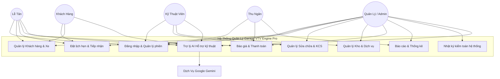
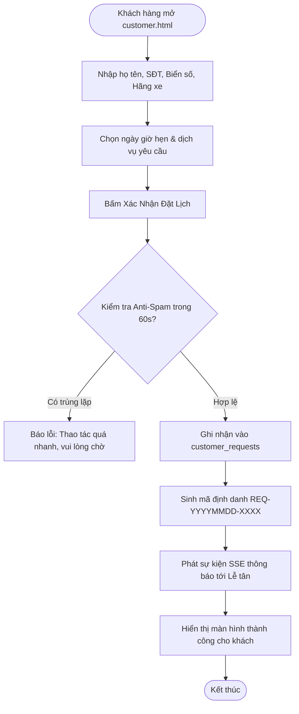
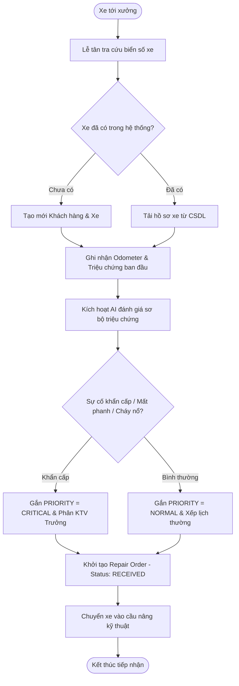
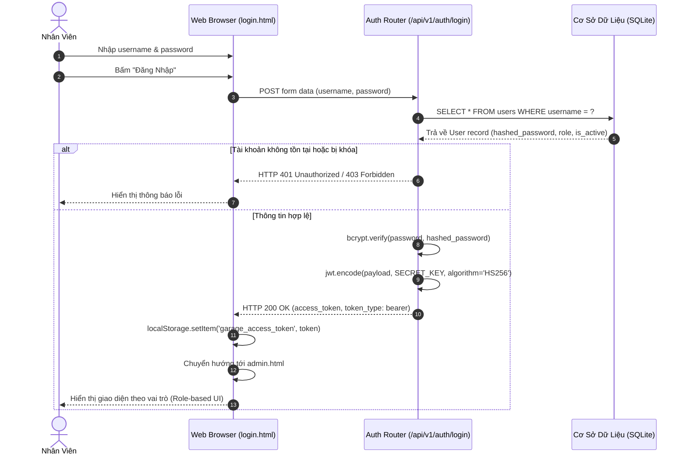
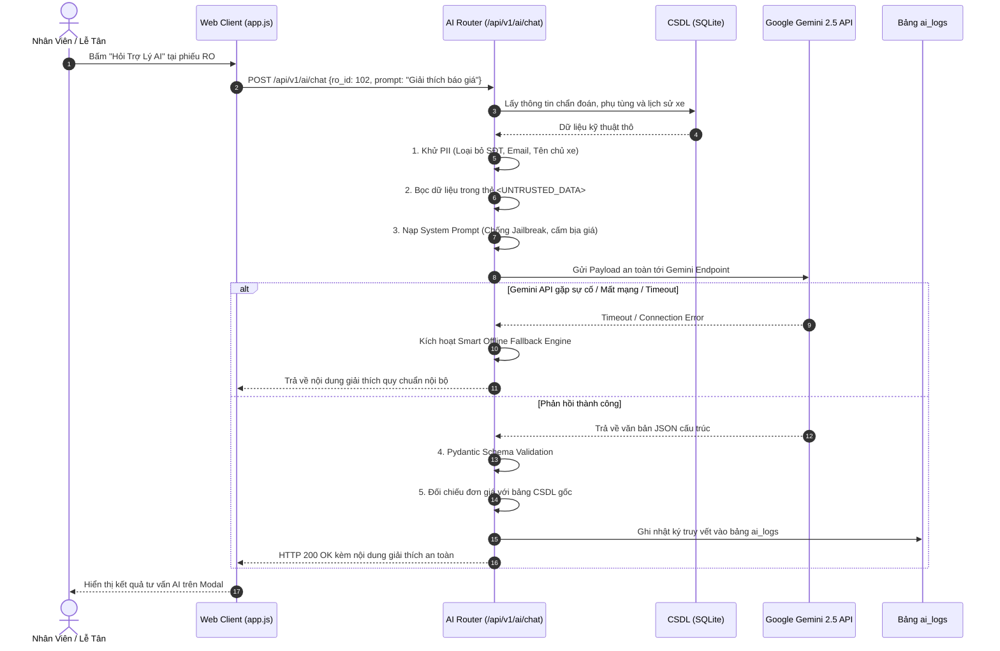
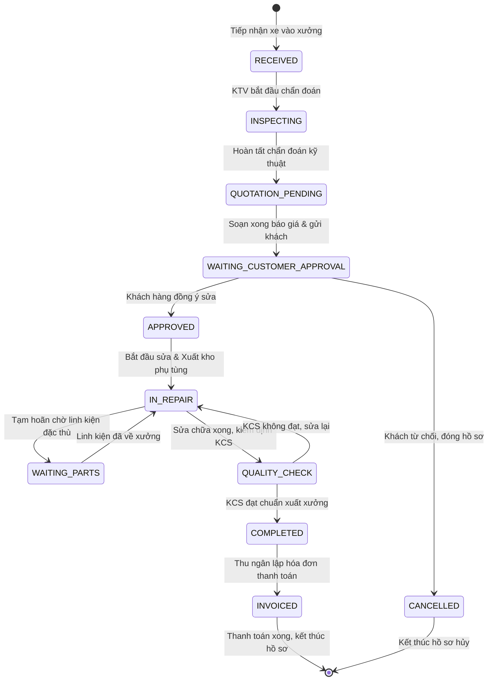
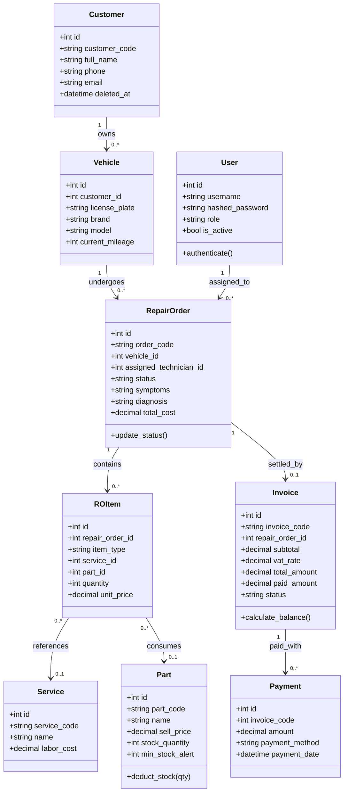

# BÁO CÁO KỸ THUẬT VÀ THIẾT KẾ HỆ THỐNG TOÀN DIỆN
# HỆ THỐNG QUẢN LÝ GARAGE Ô TÔ TÍCH HỢP TRÍ TUỆ NHÂN TẠO
# TÊN HỆ THỐNG: GARAGE VTV ENGINE PRO (GARAGE VTV AI MANAGEMENT SYSTEM)

---

# LỜI MỞ ĐẦU

Ngành công nghiệp dịch vụ bảo dưỡng và sửa chữa ô tô đòi hỏi tính chuẩn xác cao về mặt kỹ thuật, sự minh bạch trong tài chính và khả năng điều phối đồng bộ giữa nhiều bộ phận. Việc ứng dụng công nghệ thông tin vào quản lý xưởng dịch vụ không đơn thuần là việc số hóa văn bản giấy tờ, mà là việc xây dựng một hệ thống khép kín, kiểm soát chặt chẽ quy trình từ khi khách hàng phát sinh nhu cầu đến khi hoàn tất thanh toán và lưu vết lịch sử xe.

Đề tài **"Hệ Thống Quản Lý Garage Ô Tô Tích Hợp AI - Garage VTV Engine Pro"** được nghiên cứu và phát triển nhằm cung cấp một nền tảng quản trị vận hành toàn diện cho xưởng dịch vụ ô tô. Hệ thống giải quyết các bài toán cốt lõi: tự động hóa quy trình nghiệp vụ theo máy trạng thái nghiêm ngặt, bảo vệ tính toàn vẹn tài chính và kho bãi tại phía máy chủ, kết hợp mô hình trí tuệ nhân tạo (Generative AI) trong vai trò trợ lý hỗ trợ phân tích kỹ thuật và giao tiếp khách hàng dưới sự giám sát của con người (Human-in-the-loop).

Báo cáo này trình bày toàn diện quá trình khảo sát, phân tích yêu cầu, thiết kế kiến trúc, triển khai mã nguồn, kiểm thử hệ thống và định hướng phát triển của dự án Garage VTV Engine Pro dựa trên các tài liệu kỹ thuật và mã nguồn thực tế đã được xây dựng.

---

# TÓM TẮT HỆ THỐNG

Hệ thống **Garage VTV Engine Pro** được thiết kế theo kiến trúc 3 tầng (3-Tier Architecture) kết hợp phương pháp luận API-First và Clean Architecture tinh gọn:

*   **Tầng Trình Diễn (Presentation Layer):** Giao diện Web Single Page Application (SPA) xây dựng bằng HTML5, CSS3 hiện đại và Vanilla JavaScript thuần (không phụ thuộc framework nặng), hỗ trợ cơ chế bộ đệm ngoại tuyến (LocalStorage Engine) khi máy chủ mất kết nối.
*   **Tầng Nghiệp Vụ (Business Logic Layer - BUS):** Xây dựng trên nền tảng Python 3.11 và framework FastAPI, chịu trách nhiệm xác thực JWT, phân quyền theo vai trò (RBAC), kiểm soát máy trạng thái phiếu sửa chữa (13 trạng thái), thực thi thẩm quyền tính toán tài chính bất biến tại máy chủ (Server-Side Financial Authority) và bảo vệ giao dịch kho.
*   **Tầng Dữ Liệu (Data Access Layer - DAL):** Sử dụng SQLAlchemy 2.0 ORM kết nối tới cơ sở dữ liệu SQLite (`garage.db`), hỗ trợ xóa mềm (Soft Delete) và toàn vẹn quan hệ.
*   **Module Trí Tuệ Nhân Tạo (AI Module):** Tích hợp Google Gemini thông qua lớp trừu tượng hóa dịch vụ, áp dụng cơ chế khử định danh dữ liệu cá nhân (PII Scrubbing), bọc dữ liệu trong thẻ cách ly `<UNTRUSTED_DATA>` và kiểm tra dữ liệu đầu ra qua Pydantic schema.
*   **Cơ chế Realtime & Offline:** Hỗ trợ thông báo thời gian thực qua Server-Sent Events (SSE) và tự động chuyển đổi sang LocalStorage Engine với các khóa định danh `vtv_db_*` khi mất kết nối mạng.

---

# MỤC LỤC

1. [LỜI MỞ ĐẦU](#lời-mở-đầu)
2. [TÓM TẮT HỆ THỐNG](#tóm-tắt-hệ-thống)
3. [DANH MỤC HÌNH](#danh-mục-hình)
4. [DANH MỤC BẢNG](#danh-mục-bảng)
5. [DANH MỤC TỪ VIẾT TẮT](#danh-mục-từ-viết-tắt)
6. [CHƯƠNG 1. TỔNG QUAN DỰ ÁN](#chương-1-tổng-quan-dự-án)
7. [CHƯƠNG 2. PHÂN TÍCH YÊU CẦU PHẦN MỀM](#chương-2-phân-tích-yêu-cầu-phần-mềm)
8. [CHƯƠNG 3. TÀI LIỆU YÊU CẦU NGƯỜI DÙNG (URD)](#chương-3-tài-liệu-yêu-cầu-người-dùng-urd)
9. [CHƯƠNG 4. ĐẶC TẢ YÊU CẦU PHẦN MỀM (SRS)](#chương-4-đặc-tả-yêu-cầu-phần-mềm-srs)
10. [CHƯƠNG 5. PHÂN TÍCH VÀ THIẾT KẾ HỆ THỐNG (UML & ARCHITECTURE)](#chương-5-phân-tích-và-thiết-kế-hệ-thống-uml--architecture)
11. [CHƯƠNG 6. TRIỂN KHAI DỰ ÁN (IMPLEMENTATION)](#chương-6-triển-khai-dự-án-implementation)
12. [CHƯƠNG 7. KIỂM THỬ HỆ THỐNG (TESTING)](#chương-7-kiểm-thử-hệ-thống-testing)
13. [CHƯƠNG 8. ĐÁNH GIÁ HỆ THỐNG](#chương-8-đánh-giá-hệ-thống)
14. [CHƯƠNG 9. HƯỚNG PHÁT TRIỂN (ROADMAP)](#chương-9-hướng-phát-triển-roadmap)
15. [KẾT LUẬN](#kết-luận)
16. [TÀI LIỆU THAM KHẢO](#tài-liệu-tham-khảo)
17. [PHỤ LỤC](#phụ-lục)

---

# DANH MỤC HÌNH

*   **Hình 1.1:** Chuỗi giá trị nghiệp vụ sửa chữa ô tô khép kín
*   **Hình 2.1:** Biểu đồ Use Case tổng quát hệ thống Garage VTV Engine Pro
*   **Hình 2.2:** Biểu đồ Use Case phân hệ Quản lý Khách hàng và Xe
*   **Hình 2.3:** Biểu đồ Use Case phân hệ Tiếp nhận và Phiếu sửa chữa
*   **Hình 2.4:** Biểu đồ Use Case phân hệ Kho, Báo giá và Thanh toán
*   **Hình 2.5:** Biểu đồ Use Case tích hợp Trí tuệ nhân tạo (AI Assistant)
*   **Hình 5.1:** Sơ đồ Kiến trúc phân tầng 3-Tier (Layered Architecture)
*   **Hình 5.2:** Sơ đồ Activity Diagram - Quy trình Đặt lịch sửa chữa trực tuyến
*   **Hình 5.3:** Sơ đồ Activity Diagram - Tiếp nhận xe và đánh giá độ ưu tiên
*   **Hình 5.4:** Sơ đồ Activity Diagram - Sửa chữa và nghiệm thu chất lượng (KCS)
*   **Hình 5.5:** Sơ đồ Activity Diagram - Quyết toán và Thanh toán hóa đơn VietQR
*   **Hình 5.6:** Sơ đồ Sequence Diagram - Xác thực người dùng (Login Flow)
*   **Hình 5.7:** Sơ đồ Sequence Diagram - Luồng Đặt lịch hẹn trực tuyến
*   **Hình 5.8:** Sơ đồ Sequence Diagram - Tiếp nhận xe và khởi tạo Repair Order
*   **Hình 5.9:** Sơ đồ Sequence Diagram - Luồng Sửa chữa và Kiểm soát xuất kho
*   **Hình 5.10:** Sơ đồ Sequence Diagram - Lập hóa đơn và Thanh toán
*   **Hình 5.11:** Sơ đồ Sequence Diagram - Tương tác an toàn với AI Engine
*   **Hình 5.12:** Sơ đồ State Machine Diagram - Vòng đời 13 trạng thái Phiếu sửa chữa
*   **Hình 5.13:** Sơ đồ Class Diagram - Mô hình miền thực thể cốt lõi
*   **Hình 5.14:** Sơ đồ Component Diagram - Cấu trúc thành phần hệ thống
*   **Hình 5.15:** Sơ đồ Deployment Diagram - Mô hình triển khai hạ tầng
*   **Hình 6.1:** Sơ đồ Thực thể - Quan hệ toàn diện (Entity Relationship Diagram - ERD)

---

# DANH MỤC BẢNG

*   **Bảng 1.1:** Bảng phân tích thực trạng garage truyền thống và yêu cầu giải pháp
*   **Bảng 1.2:** Danh mục yêu cầu chức năng hệ thống (FR-01 đến FR-22)
*   **Bảng 1.3:** Danh mục yêu cầu phi chức năng (NFR-01 đến NFR-11)
*   **Bảng 1.4:** Dự toán sơ bộ chi phí triển khai và vận hành hệ thống
*   **Bảng 1.5:** Ma trận quản lý rủi ro và giải pháp kỹ thuật
*   **Bảng 2.1:** Danh mục các tác nhân (Actors) tham gia hệ thống
*   **Bảng 2.2:** Ma trận phân quyền dựa trên vai trò (RBAC Permission Matrix)
*   **Bảng 4.1:** Ma trận truy vết yêu cầu (Traceability Matrix)
*   **Bảng 6.1:** Cấu trúc dữ liệu bảng `users`
*   **Bảng 6.2:** Cấu trúc dữ liệu bảng `customers`
*   **Bảng 6.3:** Cấu trúc dữ liệu bảng `vehicles`
*   **Bảng 6.4:** Cấu trúc dữ liệu bảng `appointments`
*   **Bảng 6.5:** Cấu trúc dữ liệu bảng `repair_orders`
*   **Bảng 6.6:** Cấu trúc dữ liệu bảng `ro_items`
*   **Bảng 6.7:** Cấu trúc dữ liệu bảng `services`
*   **Bảng 6.8:** Cấu trúc dữ liệu bảng `parts`
*   **Bảng 6.9:** Cấu trúc dữ liệu bảng `invoices`
*   **Bảng 6.10:** Cấu trúc dữ liệu bảng `payments`
*   **Bảng 6.11:** Cấu trúc dữ liệu bảng `customer_requests`
*   **Bảng 6.12:** Cấu trúc dữ liệu bảng `audit_logs`
*   **Bảng 6.13:** Cấu trúc dữ liệu bảng `ai_logs`
*   **Bảng 7.1:** Kịch bản kiểm thử đăng nhập hệ thống (TC13)
*   **Bảng 7.2:** Kịch bản kiểm thử tiếp nhận xe và khởi tạo phiếu (TC01, TC02, TC03)
*   **Bảng 7.3:** Kịch bản kiểm thử tính toán tài chính phía Server (TC09)
*   **Bảng 7.4:** Kịch bản kiểm thử luồng sửa chữa và bảo mật IDOR (TC04, TC15)
*   **Bảng 7.5:** Kịch bản kiểm thử thanh toán hóa đơn (TC08, TC17)
*   **Bảng 7.6:** Kịch bản kiểm thử tính toàn vẹn kho và dữ liệu (TC07, TC14)
*   **Bảng 7.7:** Bảng tổng hợp kết quả 17 ca kiểm thử cốt lõi (TC01 - TC17)
*   **Bảng 7.8:** Bảng kết quả kiểm thử máy trạng thái mở rộng (TC18 - TC29)

---

# DANH MỤC TỪ VIẾT TẮT

| Từ viết tắt | Thuật ngữ tiếng Anh | Ý nghĩa tiếng Việt |
|---|---|---|
| **API** | Application Programming Interface | Giao diện lập trình ứng dụng |
| **BUS** | Business Logic Layer | Tầng xử lý logic nghiệp vụ |
| **CORS** | Cross-Origin Resource Sharing | Cơ chế chia sẻ tài nguyên giữa các nguồn khác nhau |
| **CRUD** | Create, Read, Update, Delete | Bốn thao tác dữ liệu cơ bản: Tạo, Đọc, Sửa, Xóa |
| **DAL** | Data Access Layer | Tầng truy cập và thao tác dữ liệu |
| **ERD** | Entity Relationship Diagram | Sơ đồ quan hệ thực thể |
| **IDOR** | Insecure Direct Object Reference | Lỗ hổng tham chiếu đối tượng trực tiếp không an toàn |
| **JWT** | JSON Web Token | Chuẩn mã hóa token xác thực người dùng |
| **KCS** | Kiểm tra Chất lượng Sản phẩm | Khâu nghiệm thu kỹ thuật sau sửa chữa |
| **KTV** | Kỹ Thuật Viên | Nhân sự chuyên trách sửa chữa cơ khí/điện ô tô |
| **LLM** | Large Language Model | Mô hình ngôn ngữ lớn (Trí tuệ nhân tạo) |
| **NFR** | Non-Functional Requirement | Yêu cầu phi chức năng |
| **ORM** | Object-Relational Mapping | Kỹ thuật ánh xạ đối tượng với cơ sở dữ liệu quan hệ |
| **PII** | Personally Identifiable Information | Thông tin định danh cá nhân |
| **RBAC** | Role-Based Access Control | Kiểm soát truy cập dựa trên vai trò |
| **RO** | Repair Order | Phiếu sửa chữa |
| **SDLC** | Software Development Life Cycle | Vòng đời phát triển phần mềm |
| **SPA** | Single Page Application | Ứng dụng web đơn trang |
| **SRS** | Software Requirements Specification | Tài liệu đặc tả yêu cầu phần mềm |
| **SSE** | Server-Sent Events | Giao thức truyền dữ liệu thời gian thực một chiều từ máy chủ |
| **URD** | User Requirements Document | Tài liệu yêu cầu người dùng |
| **VAT** | Value Added Tax | Thuế giá trị gia tăng (mặc định 10%) |

---

# CHƯƠNG 1. TỔNG QUAN DỰ ÁN

## 1.1. Giới thiệu đề tài và bối cảnh thực tiễn

Trong bối cảnh số hóa và sự gia tăng nhanh chóng về mật độ phương tiện ô tô cá nhân cũng như đội xe vận tải tại Việt Nam, nhu cầu bảo dưỡng, sửa chữa và chăm sóc xe trở thành một ngành dịch vụ kỹ thuật có quy mô lớn và tính chất phức tạp. Xưởng dịch vụ ô tô (garage) là môi trường hoạt động đa tác vụ: tiếp nhận phương tiện, kiểm tra chẩn đoán kỹ thuật cơ khí - điện - lạnh, đề xuất vật tư phụ tùng, tính toán chi phí công thợ, thông báo khách hàng, thực hiện sửa chữa, kiểm định chất lượng xuất xưởng và quyết toán tài chính.

Phần lớn các garage quy mô vừa và nhỏ hiện nay vẫn vận hành dựa trên các phương thức truyền thống như sổ sách giấy, hóa đơn viết tay, bảng tính Excel phân tán hoặc các ứng dụng trao đổi tin nhắn mạng xã hội. Việc này dẫn đến nhiều hệ quả tiêu cực:
*   Mất mát dữ liệu lịch sử bảo dưỡng của phương tiện.
*   Báo giá sai lệch do tính toán thủ công đơn giá phụ tùng, thuế GTGT (VAT) và tiền công.
*   Tồn kho thực tế không khớp với sổ sách, xảy ra tình trạng "âm kho" hoặc thiếu phụ tùng giữa chừng khi xe đang tháo dỡ trên cầu nâng.
*   Mất nhiều thời gian giải thích các thuật ngữ kỹ thuật phức tạp cho khách hàng, dẫn đến sự thiếu tin tưởng giữa chủ xe và xưởng.

Đề tài **"Hệ Thống Quản Lý Garage Ô Tô Tích Hợp AI - Garage VTV Engine Pro"** được xây dựng nhằm thiết lập một hệ thống quản lý khép kín, chuẩn hóa toàn diện chuỗi giá trị vận hành:

```
Khách hàng → Xe → Đặt lịch → Tiếp nhận → Kiểm tra → Chẩn đoán → Báo giá → Khách duyệt → Sửa chữa → KCS → Hoàn tất → Hóa đơn → Thanh toán
```

*Hình 1.1. Chuỗi giá trị nghiệp vụ sửa chữa ô tô khép kín*

Hệ thống đóng vai trò trung tâm điều phối dữ liệu đồng bộ giữa các bộ phận: Lễ tân, Kỹ thuật viên, Thu ngân và Cấp quản lý. Đồng thời, việc tích hợp Trí tuệ Nhân tạo (Google Gemini) cung cấp khả năng phân tích tóm tắt hồ sơ xe và sinh văn bản giải thích kỹ thuật bình dân, hỗ trợ nhân viên giao tiếp hiệu quả với khách hàng.

---

## 1.2. Phân tích bối cảnh và nhu cầu

### 1.2.1. Thực trạng hiện tại của gara ô tô truyền thống

Khảo sát thực tế nghiệp vụ garage cho thấy 9 nhóm vấn đề nhức nhối:

*Bảng 1.1. Bảng phân tích thực trạng garage truyền thống và yêu cầu giải pháp*

| Nhóm nghiệp vụ | Thực trạng garage truyền thống | Nguy cơ & Hậu quả | Giải pháp Garage VTV Engine Pro |
|---|---|---|---|
| **1. Quản lý khách hàng** | Lưu trên sổ tay hoặc file Excel riêng lẻ của từng lễ tân. | Thông tin phân tán, mất dữ liệu khi đổi nhân sự, khó chăm sóc khách hàng cũ. | Quản lý tập trung CSDL khách hàng, tự động gắn mã `CUS-YYYY-XXXXXX`. |
| **2. Quản lý xe** | Không liên kết hồ sơ xe với lịch sử sửa chữa trước đó. | Không nắm được tiền sử bệnh của xe, KTV mất thời gian kiểm tra lại từ đầu. | Quản lý phương tiện theo biển số duy nhất, tra cứu toàn bộ lịch sử trong 3 giây. |
| **3. Lịch hẹn** | Ghi nhận qua điện thoại, sổ lịch để bàn. | Dễ trùng lịch hẹn, quá tải cầu nâng, bỏ quên lịch của khách hàng. | Đặt lịch trực tuyến, kiểm tra xung đột khung giờ và xe tự động. |
| **4. Phiếu sửa chữa** | Sử dụng lệnh sửa chữa bằng giấy chuyển tay giữa các bộ phận. | Rách/mất phiếu, bỏ sót bước kiểm tra KCS, không xác định được trách nhiệm cá nhân. | Máy trạng thái (State Machine) 13 bước, ghi nhận KTV phụ trách cụ thể. |
| **5. Quản lý phụ tùng** | Kiểm kê thủ công định kỳ, xuất kho không đối trừ tức thời. | Xuất vượt số lượng tồn (âm kho), thiếu linh kiện khi xe đang sửa, thất thoát. | Khóa giao dịch (Atomic Transaction), kiểm tra tồn kho trước khi xuất, chặn âm kho. |
| **6. Quản lý báo giá** | Lễ tân tự cộng giá phụ tùng và công thợ bằng máy tính cầm tay. | Sai lệch tổng tiền, áp dụng sai thuế VAT, tranh cãi khi giá linh kiện biến động. | Thẩm quyền tính toán tại máy chủ (Server-Side Calculation), kiểm soát hiệu lực báo giá. |
| **7. Hóa đơn & Thanh toán** | Viết hóa đơn giấy, cộng dồn công nợ thủ công. | Bỏ sót khoản nợ, thanh toán vượt số dư nợ, đối soát ngân hàng mất thời gian. | Quản lý hóa đơn liên kết RO, xuất mã VietQR Napas 24/7 theo số tiền nợ thực tế. |
| **8. Báo cáo & Thống kê** | Cuối tháng kế toán cộng sổ bằng tay mất nhiều ngày. | Số liệu chậm trễ, chủ garage không nắm được doanh thu thuần và hiệu suất thợ. | Dashboard trực quan hóa Line Chart, tự động tổng hợp doanh thu, chi phí, công nợ. |
| **9. Kiến thức kỹ thuật** | Phụ thuộc hoàn toàn vào thợ cả; khó giải thích cho chủ xe hiểu. | Khách hàng nghi ngờ garage "vẽ bệnh", thời gian tư vấn kéo dài từ 15–30 phút/xe. | Tích hợp Trợ lý AI tóm tắt bệnh án, giải thích lý do thay thế bằng ngôn ngữ phổ thông. |

### 1.2.2. Lợi ích kỳ vọng từ hệ thống GaraOto

Việc triển khai hệ thống Garage VTV Engine Pro mang lại các lợi ích đo lường được về mặt quản lý:
1.  **Dữ liệu tập trung:** Toàn bộ thông tin khách hàng, xe, phụ tùng và lịch sử giao dịch lưu trữ tại một cơ sở dữ liệu duy nhất.
2.  **Giảm thiểu thao tác thủ công:** Loại bỏ việc nhập lại dữ liệu qua nhiều biểu mẫu giấy tờ.
3.  **Truy xuất thông tin tức thời:** Tra cứu lịch sử kỹ thuật của xe ngay khi xe vừa tiến vào xưởng qua biển số.
4.  **Chuẩn hóa quy trình kỹ thuật:** Buộc mọi quy trình sửa chữa phải tuân thủ trình tự các bước, có biên bản nghiệm thu KCS trước khi xuất xưởng.
5.  **Minh bạch tài chính:** Loại trừ hoàn toàn sai số trong tính toán chiết khấu và thuế VAT; kiểm soát công nợ chi tiết đến từng hóa đơn.
6.  **Kiểm soát kho chặt chẽ:** Tự động trừ tồn kho khi lệnh sửa chữa được duyệt, cảnh báo linh kiện chạm ngưỡng tối thiểu.
7.  **Hỗ trợ giao tiếp khách hàng:** Trợ lý AI đóng vai trò công cụ hỗ trợ nhân viên giải thích tình trạng xe một cách chuyên nghiệp, khách quan.
8.  **Khả năng truy vết toàn diện:** Mọi thao tác sửa đổi dữ liệu trọng yếu đều được lưu vết trong nhật ký kiểm toán (Audit Log).

---

## 1.3. Mục tiêu dự án

### 1.3.1. Mục tiêu kỹ thuật
*   Xây dựng ứng dụng web hoàn chỉnh theo kiến trúc 3 tầng (Presentation, Business Logic, Data Access), tuân thủ tiêu chuẩn thiết kế RESTful API.
*   Thiết kế cơ sở dữ liệu quan hệ chuẩn hóa bậc 3 (3NF) trên SQLite/PostgreSQL, bảo toàn toàn vẹn dữ liệu qua khóa chính, khóa ngoại, ràng buộc duy nhất và cơ chế xóa mềm (Soft Delete).
*   Xây dựng mô hình phân quyền dựa trên vai trò (RBAC) 4 cấp nội bộ và cổng khách hàng công khai.
*   Cài đặt máy trạng thái sửa chữa (State Machine Engine) kiểm soát chặt chẽ 13 trạng thái vòng đời phiếu sửa chữa tại tầng máy chủ.
*   Triển khai nguyên tắc **Server-Side Financial Authority**: Máy chủ nắm quyền tính toán độc quyền toàn bộ công thức tài chính (`Subtotal`, `Discount`, `VAT`, `Total`, `Balance Due`), không tin cậy dữ liệu client gửi lên.
*   Tích hợp AI Engine (Google Gemini) với quy trình kiểm soát an toàn: Khử định danh thông tin cá nhân (PII Scrubbing), bọc dữ liệu trong thẻ phân cách `<UNTRUSTED_DATA>` và xác thực cấu trúc JSON trả về qua Pydantic schema.
*   Xây dựng cơ chế **Smart Offline Fallback Engine** tại phía Client (LocalStorage Engine với các khóa `vtv_db_*`) giúp duy trì hoạt động tối thiểu khi mất kết nối mạng máy chủ.
*   Container hóa toàn bộ hệ thống bằng Docker và Docker Compose, hỗ trợ tự động triển khai qua GitHub Actions / Vercel / Railway.

### 1.3.2. Mục tiêu quản lý dự án
*   Xác định rõ ràng ranh giới phạm vi hệ thống, kiểm soát yêu cầu phần mềm xuyên suốt các giai đoạn kiểm tra.
*   Áp dụng nguyên tắc **Human-in-the-loop**: Mọi đề xuất của AI (chẩn đoán, báo giá nháp) chỉ mang tính tham khảo; quyết định kỹ thuật và tài chính cuối cùng luôn thuộc về nhân sự có thẩm quyền.
*   Thiết lập chiến lược kiểm thử tự động đạt độ bao phủ toàn diện với 17 ca kiểm thử cốt lõi (TC01 - TC17) và 12 ca kiểm thử máy trạng thái mở rộng (TC18 - TC29).
*   Hoàn thiện bộ tài liệu kỹ thuật chuẩn mực phục vụ vận hành, bảo trì và chuyển giao hệ thống.

---

## 1.4. Phạm vi dự án

### 1.4.1. Trong phạm vi (In-scope)
Hệ thống Garage VTV Engine Pro bao gồm các phân hệ chức năng sau:
1.  **Cổng Khách Hàng (Customer Portal - `customer.html`):** Đặt lịch hẹn dịch vụ trực tuyến không cần đăng nhập, tra cứu tiến độ xe theo mã yêu cầu / biển số, hỏi đáp kỹ thuật với AI.
2.  **Cổng Quản Trị Nội Bộ (Admin Portal - `admin.html`):** Gồm 9 màn hình chức năng chính (Dashboard, Lịch hẹn, Phiếu sửa chữa, Yêu cầu khách hàng, Khách hàng & Xe, Kho & Dịch vụ, Hóa đơn, AI Studio, Cổng tiếp nhận).
3.  **Hệ thống Xác thực & Phân quyền (Auth & RBAC):** Đăng nhập JWT cho 4 vai trò: Admin/Manager, Receptionist, Technician, Cashier.
4.  **Quản lý Khách hàng & Phương tiện:** Quản lý thông tin chủ xe và thông số kỹ thuật xe.
5.  **Quản lý Tiếp nhận & Phiếu sửa chữa (RO):** Tiếp nhận xe, chẩn đoán, phân công KTV, quản lý 13 trạng thái vòng đời.
6.  **Quản lý Danh mục & Tồn kho:** Quản lý đơn giá dịch vụ và phụ tùng, kiểm soát xuất kho không âm.
7.  **Báo giá & Thanh toán:** Soạn thảo báo giá, xuất hóa đơn VAT, thanh toán tiền mặt và VietQR Napas 24/7.
8.  **Trợ lý AI:** Tóm tắt lịch sử bảo dưỡng, giải thích dịch vụ cho khách hàng, hỗ trợ lập báo giá nháp.
9.  **Realtime & Offline:** Đồng bộ dữ liệu qua SSE và LocalStorage Engine.
10. **Hạ tầng & Đóng gói:** Dockerfile, docker-compose.yml, cấu hình môi trường `.env`.

### 1.4.2. Ngoài phạm vi (Out-of-scope / Định hướng tương lai)
Các tính năng sau **chưa được triển khai** trong phiên bản hiện tại và được xếp vào danh mục định hướng phát triển (Roadmap):
*   Quản lý chuỗi garage đa chi nhánh (Multi-branch) với cơ chế đồng bộ kho liên chi nhánh.
*   Quét mã vạch / mã QR phụ tùng bằng camera thiết bị di động (Barcode Scanner).
*   Ứng dụng di động cài đặt trực tiếp (Native iOS/Android App) hoặc Progressive Web App (PWA) có Service Worker offline độc lập.
*   Thông báo đẩy qua Web Push Notification trên trình duyệt.
*   Tự động gửi tin nhắn SMS thương hiệu hoặc Zalo ZNS / Zalo OA.
*   Phân tích dự báo tồn kho nâng cao (Advanced Inventory Predictive Analytics).

---

## 1.5. Yêu cầu hệ thống chi tiết

### 1.5.1. Yêu cầu chức năng (Functional Requirements - FR)

*Bảng 1.2. Danh mục yêu cầu chức năng hệ thống*

| Mã | Tên yêu cầu | Mô tả chi tiết | Tác nhân chính | Mức độ |
|---|---|---|---|:---:|
| **FR-01** | Đăng nhập & Xác thực | Xác thực tên đăng nhập và mật khẩu, cấp JWT Bearer Token có thời hạn. | Manager, Receptionist, Technician, Cashier | Bắt buộc |
| **FR-02** | Phân quyền truy cập | Phân cấp giao diện và chặn truy cập API trái phép dựa trên vai trò (RBAC). | Hệ thống | Bắt buộc |
| **FR-03** | Quản lý khách hàng | Thêm, sửa, tìm kiếm khách hàng; tự động sinh mã khách `CUS-YYYY-XXXXXX`. | Receptionist, Manager | Bắt buộc |
| **FR-04** | Quản lý phương tiện | Thêm, sửa, gắn xe với khách hàng; kiểm soát tính duy nhất của biển số xe. | Receptionist, Manager | Bắt buộc |
| **FR-05** | Đặt lịch sửa chữa | Ghi nhận yêu cầu đặt lịch trực tuyến từ khách hàng hoặc lễ tân, kiểm tra xung đột. | Customer, Receptionist | Bắt buộc |
| **FR-06** | Tiếp nhận xe vào xưởng | Lập phiếu tiếp nhận, ghi nhận số km (odometer), mức xăng, triệu chứng ban đầu. | Receptionist | Bắt buộc |
| **FR-07** | Lập phiếu sửa chữa (RO) | Khởi tạo phiếu sửa chữa với trạng thái ban đầu `RECEIVED`, phân công KTV. | Receptionist, Manager | Bắt buộc |
| **FR-08** | Khảo sát & Chẩn đoán | KTV nhập kết quả kiểm tra kỹ thuật các hệ thống (Động cơ, Phanh, Điện...). | Technician | Bắt buộc |
| **FR-09** | Quản lý dịch vụ | Quản lý danh mục dịch vụ sửa chữa và đơn giá công thợ niêm yết. | Manager | Bắt buộc |
| **FR-10** | Quản lý kho phụ tùng | Quản lý mã phụ tùng, đơn giá, số lượng tồn kho; kiểm soát không xuất âm kho. | Manager, Technician | Bắt buộc |
| **FR-11** | Soạn thảo báo giá | Tạo bảng báo giá gồm phụ tùng và công thợ, tính toán VAT và thời hạn hiệu lực. | Receptionist, Manager | Bắt buộc |
| **FR-12** | Phê duyệt báo giá | Ghi nhận phản hồi duyệt hoặc từ chối sửa chữa từ khách hàng. | Receptionist, Customer | Bắt buộc |
| **FR-13** | Cập nhật tiến độ sửa chữa | Chuyển trạng thái phiếu sang `IN_REPAIR`, ghi nhận thời gian và hạng mục hoàn thành. | Technician | Bắt buộc |
| **FR-14** | Kiểm tra chất lượng (KCS) | Kiểm định xe sau sửa chữa, duyệt đạt chuẩn `COMPLETED` hoặc yêu cầu làm lại. | Technician, Manager | Bắt buộc |
| **FR-15** | Lập hóa đơn dịch vụ | Tạo hóa đơn thanh toán từ phiếu sửa chữa đã hoàn tất, tính số dư nợ. | Cashier, Manager | Bắt buộc |
| **FR-16** | Ghi nhận thanh toán | Thu tiền mặt hoặc sinh mã VietQR Napas 24/7, cập nhật số dư công nợ. | Cashier | Bắt buộc |
| **FR-17** | Tra cứu lịch sử xe | Tra cứu toàn bộ các đợt sửa chữa trong quá khứ theo biển số hoặc số điện thoại. | Toàn bộ tác nhân | Bắt buộc |
| **FR-18** | Dashboard & Báo cáo | Hiển thị biểu đồ doanh thu Line Chart, thống kê số lượng xe, dịch vụ tiêu biểu. | Manager, Cashier | Bắt buộc |
| **FR-19** | Trợ lý AI chuyên môn | Tóm tắt lịch sử xe, giải thích dịch vụ cho khách, hỗ trợ lập báo giá nháp. | Toàn bộ tác nhân | Quan trọng |
| **FR-20** | Đồng bộ thời gian thực | Phát sự kiện Server-Sent Events (SSE) cập nhật trạng thái phiếu và yêu cầu mới. | Hệ thống | Quan trọng |
| **FR-21** | Nhật ký kiểm toán (Audit Log) | Lưu vết người thực hiện, thời gian, hành vi và dữ liệu trước/sau khi thay đổi. | Hệ thống, Manager | Bắt buộc |
| **FR-22** | Cổng khách hàng tự phục vụ | Giao diện công khai đặt lịch, tra cứu tiến độ xe không yêu cầu đăng nhập. | Customer | Bắt buộc |

### 1.5.2. Yêu cầu phi chức năng (Non-Functional Requirements - NFR)

*Bảng 1.3. Danh mục yêu cầu phi chức năng*

| Nhóm yêu cầu | Mã NFR | Nội dung đặc tả |
|---|---|---|
| **Hiệu năng (Performance)** | NFR-01 | Thời gian phản hồi trung bình của các API nghiệp vụ thông thường đạt dưới 200ms trong điều kiện tải mạng nội bộ. Thời gian xử lý của mô hình AI phụ thuộc dịch vụ ngoài, giới hạn timeout ở mức 45 giây. |
| **Bảo mật (Security)** | NFR-02 | Mật khẩu lưu trữ bắt buộc băm bằng thuật toán bcrypt. Truy cập API quản trị yêu cầu JWT Bearer Token hợp lệ. Phòng chống triệt để các lỗ hổng OWASP: SQL Injection (thông qua SQLAlchemy ORM), IDOR (kiểm tra quyền sở hữu phiếu), XSS (thoát mã dữ liệu đầu ra) và Prompt Injection (thẻ `<UNTRUSTED_DATA>`). |
| **Tính khả dụng (Availability)** | NFR-03 | Hệ thống hỗ trợ hoạt động liên tục. Khi máy chủ gián đoạn kết nối, giao diện Client tự động kích hoạt **LocalStorage Engine** để người dùng tiếp tục thao tác dữ liệu cục bộ mà không bị treo ứng dụng. |
| **Độ tin cậy (Reliability)** | NFR-04 | Mọi giao dịch xuất kho và thanh toán tài chính phải được bọc trong Database Transaction. Khi xảy ra lỗi giữa chừng, hệ thống tự động rollback toàn bộ, không để xảy ra trạng thái dữ liệu dở dang. |
| **Tính khả dụng người dùng (Usability)** | NFR-05 | Giao diện hỗ trợ chuyển đổi chế độ Sáng/Tối (Dark/Light Theme). Biểu đồ và bảng dữ liệu thiết kế co giãn linh hoạt (Responsive) trên màn hình máy tính bàn, laptop và máy tính bảng tại xưởng. |
| **Khả năng bảo trì (Maintainability)** | NFR-06 | Mã nguồn phân tầng rõ ràng (Clean Architecture), tách biệt Routers, Services và Models. Tự động sinh tài liệu Swagger UI chuẩn OpenAPI tại đường dẫn `/docs`. |
| **Khả năng mở rộng (Scalability)** | NFR-07 | Tầng dữ liệu thiết kế tương thích chuẩn SQL, cho phép chuyển đổi từ SQLite sang hệ quản trị CSDL cấp doanh nghiệp (PostgreSQL) mà không cần cấu trúc lại mã nguồn tầng nghiệp vụ. |
| **Toàn vẹn dữ liệu (Data Integrity)** | NFR-08 | Áp dụng toàn vẹn khóa ngoại (Foreign Keys), ràng buộc kiểm tra số lượng tồn kho `stock_quantity >= 0` và cơ chế xóa mềm (Soft Delete qua `deleted_at`) để bảo toàn lịch sử dịch vụ. |
| **Tính tương thích (Compatibility)** | NFR-09 | Hoạt động ổn định trên các trình duyệt web hiện đại (Google Chrome, Microsoft Edge, Mozilla Firefox, Apple Safari). |
| **An toàn Trí tuệ nhân tạo (AI Safety)** | NFR-10 | AI không có quyền quyết định giá tiền, không thay đổi trạng thái phiếu và không tự chẩn đoán bệnh xe ngoài dữ liệu được cung cấp. Thông tin cá nhân khách hàng được khử định danh trước khi gửi tới API bên ngoài. |
| **Khả năng kiểm toán (Auditability)** | NFR-11 | Mọi thao tác thêm, sửa, xóa dữ liệu quan trọng đều được ghi nhận tự động vào bảng `audit_logs` kèm địa chỉ IP và định danh người dùng. |

---

## 1.6. Sơ bộ chi phí và tổng chi

Chi phí triển khai thực tế của hệ thống phụ thuộc vào quy mô xưởng, số lượng cầu nâng, cấu hình phần cứng và nhà cung cấp dịch vụ đám mây được lựa chọn. Dưới đây là bảng phân tích dự toán kinh phí tham khảo cho một garage quy mô vừa (từ 5–15 cầu nâng) trong năm đầu vận hành:

*Bảng 1.4. Dự toán sơ bộ chi phí triển khai và vận hành hệ thống*

| STT | Hạng mục chi phí | Nội dung kỹ thuật chi tiết | Chi phí dự kiến (VNĐ) | Ghi chú |
|:---:|---|---|---:|---|
| 1 | **Phát triển phần mềm (R&D)** | Chi phí nhân sự kỹ thuật xây dựng hệ thống, tích hợp API và kiểm thử. | *Theo thỏa thuận dự án* | Chi phí một lần. |
| 2 | **Máy chủ Cloud (Hosting)** | Thuê máy chủ ảo VPS / Docker Container (Railway, Render hoặc Cloud VPS nội địa). | 2.400.000 – 4.800.000 / năm | Tùy chọn cấu hình 2GB–4GB RAM. |
| 3 | **Tên miền (Domain Name)** | Tên miền quốc tế `.com` hoặc quốc gia `.vn`. | 300.000 – 750.000 / năm | Duy trì hàng năm. |
| 4 | **Cơ sở dữ liệu Đám mây** | Managed Database (Supabase PostgreSQL / AWS RDS) hoặc sử dụng SQLite nội bộ. | 0 – 3.600.000 / năm | Miễn phí nếu dùng SQLite nội bộ. |
| 5 | **Chi phí API Trí tuệ nhân tạo** | Hạn mức gọi Google Gemini API (ước tính theo lượng token tiêu thụ hàng tháng). | 1.200.000 – 3.000.000 / năm | Có gói miễn phí cho lưu lượng thấp. |
| 6 | **Dịch vụ sao lưu dữ liệu (Backup)** | Lưu trữ snapshot CSDL tự động lên Google Drive / AWS S3 hàng ngày. | 500.000 – 1.000.000 / năm | Đảm bảo an toàn phục hồi thảm họa. |
| 7 | **Thiết bị đầu cuối tại xưởng** | 02 máy tính bảng thao tác cho KTV (Android 10 inch) + Giá đỡ chống va đập. | 6.000.000 – 9.000.000 | Trang bị một lần. |
| 8 | **Máy in hóa đơn nhiệt** | Máy in khổ K80 kết nối mạng LAN/WiFi đặt tại bàn thu ngân. | 1.500.000 – 2.500.000 | Trang bị một lần. |
| **TỔNG** | **DỰ TOÁN NĂM ĐẦU** | *(Chưa bao gồm chi phí nhân sự phát triển)* | **11.900.000 – 24.650.000 VNĐ** | *Chi phí phụ thuộc mức sử dụng dịch vụ.* |

---

## 1.7. Công nghệ và thiết bị được lựa chọn

### 1.7.1. Ngôn ngữ lập trình và Framework
*   **Backend (Python 3.11 & FastAPI):**
    *   *Lý do lựa chọn:* Python là ngôn ngữ tiêu chuẩn trong xử lý dữ liệu và tích hợp trí tuệ nhân tạo. FastAPI cung cấp hiệu năng vượt trội nhờ kiến trúc Asynchronous (ASGI), xác thực dữ liệu chặt chẽ qua Pydantic v2, và tự động sinh tài liệu chuẩn hóa OpenAPI.
    *   *Uvicorn:* Máy chủ ứng dụng ASGI hiệu năng cao chạy ứng dụng FastAPI.
    *   *SQLAlchemy 2.0:* Bộ công cụ ORM mạnh mẽ cho phép ánh xạ đối tượng, quản lý transaction và tách biệt hoàn toàn mã nguồn khỏi hệ quản trị CSDL cụ thể.
    *   *python-jose & passlib (bcrypt):* Đảm bảo tiêu chuẩn mã hóa mật khẩu và tạo lập token JWT an toàn.
*   **Frontend (HTML5, Modern CSS, Vanilla JavaScript ES6+):**
    *   *Lý do lựa chọn:* Loại bỏ việc sử dụng các framework nặng (như Angular, React cồng kềnh) giúp giảm kích thước gói tải xuống (Zero Bundle Overhead), tốc độ khởi động tức thì trên các máy tính cấu hình thấp tại xưởng hoặc máy tính bảng giá rẻ của kỹ thuật viên.
    *   *Thư viện bổ trợ:* Font Awesome 6.4.0 (hệ thống icon giao diện), Flatpickr tiếng Việt (chọn thời gian lịch hẹn), Chart.js 4.4.3 (vẽ biểu đồ phân tích doanh thu dạng đường Line Chart).

### 1.7.2. Cơ sở dữ liệu
*   **SQLite 3 (`garage.db`):**
    *   Là hệ quản trị cơ sở dữ liệu dạng tệp tin nhúng (Serverless, Self-contained), không đòi hỏi cài đặt dịch vụ phức tạp, phù hợp hoàn hảo cho các xưởng dịch vụ độc lập, chạy trực tiếp trên máy chủ cục bộ hoặc container nhẹ.
    *   Hỗ trợ đầy đủ các ràng buộc toàn vẹn quan hệ: Khóa chính (Primary Key), Khóa ngoại (Foreign Key với `PRAGMA foreign_keys = ON`), Ràng buộc duy nhất (Unique), Chỉ mục tìm kiếm (Index) và Giao dịch nguyên tử (ACID Transactions).
    *   Hệ thống thiết lập cơ chế xóa mềm (Soft Delete) thông qua cột `deleted_at`, cho phép ẩn dữ liệu khỏi giao diện nhưng bảo toàn toàn vẹn lịch sử đối soát kỹ thuật.

### 1.7.3. Kiến trúc phần mềm – 3-Tier
Hệ thống tuân thủ chặt chẽ kiến trúc 3 tầng:
1.  **Tầng Giao Diện (Presentation Layer):**
    *   `customer.html`: Cổng thông tin khách hàng công khai.
    *   `admin.html`: Bàn làm việc điều hành nội bộ đa phân hệ.
    *   `login.html`: Giao diện xác thực người dùng.
    *   `app.js`: Điều phối sự kiện DOM, quản lý trạng thái client, cơ chế chuyển hướng và bộ đệm ngoại tuyến (LocalStorage Engine).
2.  **Tầng Xử Lý Nghiệp Vụ (Business Logic Layer - BUS):**
    *   Tập trung toàn bộ quy tắc nghiệp vụ tại Backend: Máy trạng thái sửa chữa, Kiểm soát giao dịch kho không âm, Thẩm quyền tính toán tài chính độc quyền, Phân quyền RBAC qua Middleware và Điều phối Trợ lý AI.
3.  **Tầng Truy Cập Dữ Liệu (Data Access Layer - DAL):**
    *   Bao gồm SQLAlchemy Models, Session Factory, Connection Pooling và các phương thức truy xuất dữ liệu CRUD.

Ngoài ra, hệ thống tích hợp thêm 4 thành phần bổ trợ đặc thù:
*   *AI Adapter Layer:* Lớp giao tiếp trừu tượng hóa với dịch vụ Google Gemini API.
*   *Realtime SSE Gateway:* Kênh truyền dữ liệu thời gian thực Server-Sent Events.
*   *Offline Fallback Engine:* Bộ định tuyến dữ liệu cục bộ client khi mất kết nối mạng.
*   *Hạ tầng Docker:* Đóng gói ứng dụng chạy độc lập trên môi trường ảo hóa container.

---

## 1.8. Rủi ro và phương án xử lý

*Bảng 1.5. Ma trận quản lý rủi ro và giải pháp kỹ thuật*

| ID | Tên rủi ro | Nguyên nhân tiềm ẩn | Ảnh hưởng | Khả năng | Biện pháp phòng ngừa & Xử lý kỹ thuật |
|:---:|---|---|---|:---:|---|
| **R-01** | Mất mát dữ liệu do hỏng hóc phần cứng | Ổ cứng máy chủ xưởng bị lỗi vật lý. | Nghiêm trọng | Thấp | Cấu hình sao lưu tệp `garage.db` tự động hàng ngày lên đám mây (Google Drive/S3). |
| **R-02** | Lỗi toàn vẹn dữ liệu khi ghi đồng thời | Nhiều nhân viên cùng thao tác ghi vào SQLite. | Trung bình | Trung bình | Bật chế độ WAL (Write-Ahead Logging) cho SQLite và cấu hình `timeout = 30.0` giây. |
| **R-03** | Truy cập trái phép API quản trị | Kẻ xấu gọi trực tiếp vào API Backend. | Nghiêm trọng | Trung bình | Middleware kiểm tra JWT Bearer Token bắt buộc trên toàn bộ endpoint `/api/v1/*` (trừ Login và Public Booking). |
| **R-04** | Lỗ hổng IDOR Kỹ thuật viên | KTV sửa đổi phiếu sửa chữa của thợ khác. | Cao | Trung bình | Kiểm tra quyền sở hữu tại Backend: `if ro.assigned_technician_id != current_user.id: raise HTTP 403`. |
| **R-05** | Xuất quá số lượng tồn (Âm kho) | KTV yêu cầu linh kiện vượt tồn kho hiện có. | Cao | Cao | Bọc giao dịch xuất kho trong Database Transaction, kiểm tra `stock_quantity >= quantity` trước khi trừ. |
| **R-06** | Gian lận / Sai lệch tổng tiền hóa đơn | Client gửi số tiền tự tính lên Server. | Nghiêm trọng | Trung bình | Áp dụng **Server-Side Financial Authority**: Server tự động tính lại tổng tiền từ phụ tùng và công thợ trong DB. |
| **R-07** | Nhảy cóc trạng thái sửa chữa sai quy trình | Người dùng cố tình cập nhật trạng thái trái luồng. | Cao | Trung bình | Cài đặt danh sách chuyển trạng thái hợp lệ `ALLOWED_TRANSITIONS`, chặn HTTP 400 nếu chuyển sai bước. |
| **R-08** | Duyệt báo giá đã quá hạn hiệu lực | Giá linh kiện thay đổi sau thời gian dài. | Trung bình | Trung bình | Kiểm tra `valid_until < now()` tại Backend; từ chối chuyển sang `APPROVED` nếu quá hạn. |
| **R-09** | AI bị ảo giác (Hallucination) | LLM tự bịa ra bệnh xe hoặc đơn giá sai. | Cao | Cao | Khóa chặt System Prompt: *"Chỉ giải thích trên dữ liệu được cung cấp, không tự chẩn đoán, không tự sửa giá"*. |
| **R-10** | AI trả về phản hồi sai cấu trúc JSON | LLM phản hồi văn bản tự do không parse được. | Trung bình | Trung bình | Bọc dữ liệu đầu ra qua Pydantic Schema Validation; tự động fallback về văn bản mặc định nếu parse lỗi. |
| **R-11** | Mất kết nối mạng Internet tại garage | Đứt cáp mạng hoặc nhà mạng gặp sự cố. | Cao | Cao | Hệ thống client tự động chuyển sang **LocalStorage Engine** (`vtv_db_*`), duy trì thao tác không gián đoạn. |
| **R-12** | Mất kết nối luồng Realtime SSE | Trình duyệt bị ngắt kết nối stream. | Thấp | Trung bình | Client cài đặt cơ chế tự động kết nối lại (Auto-reconnect) sau khoảng thời gian ngẫu nhiên (exponential backoff). |
| **R-13** | Xung đột dữ liệu LocalStorage | Xóa lịch sử duyệt web làm mất dữ liệu offline. | Cao | Thấp | Khuyến cáo nhân viên không xóa dữ liệu trình duyệt; hỗ trợ nút "Xuất dữ liệu dự phòng" ra file JSON. |
| **R-14** | Lộ lọt token JWT trên Client | Token lưu tại `localStorage` bị tấn công XSS. | Cao | Thấp | Thoát mã toàn bộ dữ liệu đầu vào người dùng; khuyến nghị đánh giá chuyển sang `HttpOnly Cookie` trên Production. |
| **R-15** | Khách hàng gửi spam đặt lịch | Kẻ xấu gửi yêu cầu đặt lịch liên tục. | Trung bình | Trung bình | Cơ chế Anti-Spam: Chặn các yêu cầu có cùng Số điện thoại và Biển số xe gửi liên tiếp trong vòng 60 giây. |
| **R-16** | AI hỗ trợ sinh mã nguồn có lỗi tiềm ẩn | Dùng AI sinh code trong SDLC thiếu kiểm soát. | Cao | Cao | Toàn bộ mã nguồn sinh bởi AI bắt buộc phải qua khâu Code Review của kỹ sư và vượt qua bộ test tự động. |

---

# CHƯƠNG 2. PHÂN TÍCH YÊU CẦU PHẦN MỀM

## 2.1. Tác nhân hệ thống (System Actors)

Hệ thống Garage VTV Engine Pro phục vụ 5 tác nhân người dùng và 2 tác nhân dịch vụ bên ngoài:

*Bảng 2.1. Danh mục các tác nhân tham gia hệ thống*

| STT | Tác nhân (Actor) | Loại | Mô tả vai trò và trách nhiệm trong hệ thống |
|:---:|---|---|---|
| 1 | **Admin / Manager** | Người dùng nội bộ | Quản trị toàn quyền: Xem dashboard doanh thu tổng hợp, quản lý danh mục dịch vụ/phụ tùng, cấu hình người dùng, xem nhật ký kiểm toán (Audit Log) và cấu hình hệ thống. |
| 2 | **Receptionist (Lễ tân)** | Người dùng nội bộ | Tiếp nhận khách hàng, quản lý và điều phối lịch hẹn, lập biên bản tiếp nhận xe ban đầu, tạo phiếu sửa chữa sơ bộ, soạn thảo và gửi báo giá cho khách hàng duyệt. |
| 3 | **Technician (Kỹ thuật viên)** | Người dùng nội bộ | Nhận phiếu sửa chữa được phân công, thực hiện chẩn đoán kỹ thuật, đề xuất phụ tùng và dịch vụ, cập nhật tiến độ thi công và thực hiện nghiệm thu chất lượng (KCS). |
| 4 | **Cashier (Thu ngân)** | Người dùng nội bộ | Lập hóa đơn thanh toán từ các phiếu sửa chữa đã hoàn tất, quản lý công nợ, ghi nhận các đợt thanh toán (tiền mặt / chuyển khoản VietQR) và in phiếu thu. |
| 5 | **Customer (Khách hàng)** | Người dùng công khai | Chủ phương tiện: Đặt lịch hẹn online không cần đăng nhập tài khoản, tra cứu tiến độ sửa xe trực tuyến theo mã yêu cầu / biển số, xem giải thích kỹ thuật từ AI. |
| 6 | **External AI Service (Google Gemini)** | Dịch vụ ngoài | Hệ thống trí tuệ nhân tạo bên ngoài: Nhận dữ liệu chẩn đoán đã khử PII, xử lý và phản hồi nội dung tóm tắt lịch sử, giải thích dịch vụ cho khách hàng. |
| 7 | **VietQR / Napas Gateway** | Dịch vụ ngoài | Cổng dịch vụ sinh mã thanh toán ngân hàng: Cung cấp API tạo mã VietQR động theo chuẩn Napas 24/7 chứa chính xác số tiền và nội dung thanh toán. |

---

## 2.2. Biểu đồ Use Case (Use Case Diagrams)

### 2.2.1. Biểu đồ Use Case tổng quát hệ thống



*Hình 2.1. Biểu đồ Use Case tổng quát hệ thống Garage VTV Engine Pro*

### 2.2.2. Phân rã Use Case theo từng phân hệ chức năng
*   **Phân hệ Khách hàng & Xe:** Thêm mới khách hàng, Cập nhật thông tin khách, Tra cứu hồ sơ xe theo biển số, Quản lý thông số Odometer, Xem lịch sử sửa chữa.
*   **Phân hệ Đặt lịch & Tiếp nhận:** Đặt lịch hẹn online (Customer), Tiếp nhận xe tại xưởng (Receptionist), Khảo sát trầy xước/nhiên liệu, Khởi tạo phiếu sửa chữa (RO).
*   **Phân hệ Sửa chữa (Repair Order):** Phân công KTV, Nhập biên bản chẩn đoán, Đề xuất linh kiện, Cập nhật trạng thái thi công, Nghiệm thu KCS.
*   **Phân hệ Kho & Dịch vụ:** Xem tồn kho linh kiện, Cập nhật đơn giá dịch vụ, Xuất kho theo phiếu sửa chữa (có khóa giao dịch), Cảnh báo chạm ngưỡng tồn tối thiểu.
*   **Phân hệ Báo giá & Thanh toán:** Lập bảng báo giá nháp, Gửi khách hàng duyệt, Lập hóa đơn từ RO hoàn tất, Sinh mã VietQR Napas, Ghi nhận tiền mặt.
*   **Phân hệ AI:** Tóm tắt lịch sử bảo dưỡng xe, Giải thích hạng mục sửa chữa cho khách, Hỗ trợ soạn thảo báo giá nháp.

---

## 2.3. Phân quyền người dùng (Role-Based Access Control)

Nguyên tắc bảo mật cốt lõi: **Việc ẩn nút bấm trên giao diện chỉ nhằm mục đích tối ưu hóa trải nghiệm người dùng (UX), hoàn toàn KHÔNG ĐƯỢC COI là giải pháp bảo mật.** Mọi quyền hạn phải được kiểm soát và cưỡng chế nghiêm ngặt tại tầng Backend thông qua Middleware và Dependency Injection.

*Bảng 2.2. Ma trận phân quyền dựa trên vai trò (RBAC Permission Matrix)*

| Phân hệ / Endpoint API | Admin / Manager | Receptionist (Lễ tân) | Technician (Kỹ thuật viên) | Cashier (Thu ngân) | Customer (Khách hàng) |
|---|:---:|:---:|:---:|:---:|:---:|
| **Đăng nhập quản trị nội bộ** | Toàn quyền | Toàn quyền | Toàn quyền | Toàn quyền | Bị từ chối (403) |
| **Xem Dashboard KPI Doanh thu** | Toàn quyền | Giới hạn KPI xe | Bị từ chối (403) | Xem doanh số thu | Bị từ chối (403) |
| **Quản lý Khách hàng & Xe** | Toàn quyền | Thêm / Sửa / Tìm | Xem lịch sử xe | Xem thông tin | Tra cứu xe của mình |
| **Đặt lịch & Tiếp nhận xe** | Toàn quyền | Thêm / Sửa / Hủy | Xem danh sách xe | Bị từ chối (403) | Gửi lịch hẹn trực tuyến |
| **Nhập chẩn đoán kỹ thuật** | Toàn quyền | Xem kết quả | **Tạo & Cập nhật** | Bị từ chối (403) | Xem tóm tắt chẩn đoán |
| **Cập nhật trạng thái sửa chữa** | Toàn quyền | Chuyển một số bước | **Cập nhật tiến độ** | Bị từ chối (403) | Xem tiến độ hiện tại |
| **Quản lý Kho & Xuất linh kiện** | Toàn quyền | Xem tồn kho | Đề xuất xuất kho | Xem giá bán | Bị từ chối (403) |
| **Soạn thảo & Duyệt Báo giá** | Toàn quyền | Soạn thảo & Gửi | Bị từ chối (403) | Xem bản duyệt | Xem & Duyệt báo giá |
| **Lập Hóa đơn & Thu tiền** | Toàn quyền | Bị từ chối (403) | Bị từ chối (403) | **Toàn quyền thu** | Xem hóa đơn & Quét QR |
| **Sử dụng Trợ lý AI Kỹ thuật** | Toàn quyền | Toàn quyền | Toàn quyền | Bị từ chối (403) | Hỏi đáp AI giới hạn |
| **Xem Audit Log & Cấu hình** | **Toàn quyền** | Bị từ chối (403) | Bị từ chối (403) | Bị từ chối (403) | Bị từ chối (403) |

---

## 2.4. Các yêu cầu chức năng chi tiết

Mỗi nhóm yêu cầu chức năng được thiết kế đảm bảo tính độc lập và chặt chẽ:
*   **Tiền điều kiện (Pre-condition):** Xác định trạng thái hệ thống và phiên đăng nhập cần thiết trước khi thực thi.
*   **Hậu điều kiện (Post-condition):** Trạng thái mới của cơ sở dữ liệu sau khi thực thi thành công.
*   **Quy tắc nghiệp vụ (Business Rules):** Các ràng buộc không thể phá vỡ (ví dụ: tồn kho không âm, hóa đơn hủy không nhận tiền).
*   **Tiêu chí nghiệm thu (Acceptance Criteria):** Điều kiện cụ thể để QA/Tester kiểm tra tính hợp lệ.

---

## 2.5. Yêu cầu phi chức năng chi tiết

Hệ thống đặt trọng tâm vào 4 tiêu chuẩn phi chức năng cốt lõi:
1.  **Security:** Cơ chế xác thực phân tầng, chống leo quyền dọc (Vertical Privilege Escalation) và leo quyền ngang (Horizontal Privilege Escalation - IDOR).
2.  **Reliability & Offline-first:** Đảm bảo hệ thống xưởng không bị tê liệt khi đứt cáp Internet nhờ LocalStorage Engine.
3.  **Data Integrity:** Cơ chế khóa hàng (Row Locking) và Database Transactions bảo đảm sự nhất quán tuyệt đối giữa kho và tài chính.
4.  **AI Guardrails:** Cách ly hoàn toàn dữ liệu đầu vào người dùng bằng thẻ phân cách `<UNTRUSTED_DATA>`, ngăn chặn tuyệt đối các kịch bản Jailbreak/Prompt Injection.

---

## 2.6. Đặc tả chi tiết 8 Use Case nòng cốt

### 2.6.1. UC-01 – Đăng nhập hệ thống (Authentication)
*   **Mã Use Case:** UC-01
*   **Tên Use Case:** Đăng nhập và Khởi tạo phiên làm việc
*   **Tác nhân:** Manager, Receptionist, Technician, Cashier
*   **Mục tiêu:** Xác thực thông tin người dùng nội bộ, cấp quyền và token làm việc.
*   **Tiền điều kiện:** Người dùng đã được cấp tài khoản trong bảng `users` với `is_active = True`.
*   **Hậu điều kiện:** Cấp phát mã JWT Token, điều hướng người dùng tới bàn làm việc tương ứng với quyền hạn.
*   **Luồng sự kiện chính:**
    1.  Người dùng truy cập trang `login.html`.
    2.  Nhập `username` và `password`.
    3.  Nhấn nút "Đăng Nhập".
    4.  Client gửi yêu cầu `POST /api/v1/auth/login` với dữ liệu form-urlencoded.
    5.  Backend tiếp nhận, truy vấn bảng `users` tìm bản ghi khớp `username`.
    6.  Backend sử dụng `bcrypt.verify(password, hashed_password)` để đối soát mật khẩu.
    7.  Nếu hợp lệ, Backend tạo mã JWT có payload chứa `sub: user.id`, `role: user.role` và thời gian hết hạn (`exp = 12 giờ`).
    8.  Backend phản hồi HTTP 200 OK kèm mã `access_token` và `token_type: "bearer"`.
    9.  Client lưu token vào `localStorage.setItem('garage_access_token', token)` và chuyển hướng vào `admin.html`.
    10. Giao diện `admin.html` tự động kích hoạt bộ lọc hiển thị thanh menu và các phân hệ phù hợp với vai trò của người dùng.
*   **Luồng thay thế (Offline Fallback):**
    *   Tại bước 5, nếu Backend không phản hồi (ERR_CONNECTION_REFUSED hoặc timeout quá 6 giây), client tự động chuyển sang chế độ Local Storage Engine.
    *   Hệ thống kiểm tra thông tin tài khoản mẫu nội bộ: `admin/[configured via environment]`, `letan/[configured via environment]`, `kythuat/[configured via environment]`, `thungan/[configured via environment]`.
    *   Nếu khớp, cấp quyền làm việc ngoại tuyến, hiển thị thông báo: *"Đang làm việc ở chế độ Local Storage Engine"*.
*   **Ngoại lệ:**
    *   Nhập sai username hoặc password: Hệ thống trả về HTTP 401 Unauthorized kèm thông báo: *"Tên đăng nhập hoặc mật khẩu không chính xác"*.
    *   Tài khoản bị khóa (`is_active = False`): Trả về HTTP 403 Forbidden kèm thông báo: *"Tài khoản đã bị vô hiệu hóa"*.

### 2.6.2. UC-02 – Đặt lịch sửa chữa trực tuyến (Online Booking)
*   **Mã Use Case:** UC-02
*   **Tác nhân:** Customer (Khách hàng)
*   **Mục tiêu:** Gửi yêu cầu đặt lịch hẹn trước khi mang xe tới garage.
*   **Tiền điều kiện:** Không yêu cầu đăng nhập tài khoản.
*   **Luồng sự kiện chính:**
    1.  Khách hàng truy cập `customer.html`.
    2.  Điền thông tin: Họ tên, Số điện thoại, Biển số xe, Hãng/Dòng xe, Gói dịch vụ mong muốn, Ngày giờ hẹn và Ghi chú triệu chứng.
    3.  Nhấn "Xác Nhận Đặt Lịch".
    4.  Client gửi yêu cầu `POST /api/v1/customer-requests`.
    5.  Backend kiểm tra quy tắc Anti-Spam: Nếu cùng một số điện thoại và biển số xe gửi yêu cầu trong vòng 60 giây, hệ thống từ chối nhận thêm.
    6.  Backend lưu yêu cầu vào bảng `customer_requests` với trạng thái `Pending` và tự động sinh mã định danh `REQ-YYYYMMDD-XXXX`.
    7.  Hệ thống phát sự kiện thời gian thực (SSE) thông báo tới màn hình Lễ tân.
    8.  Client hiển thị thông báo đặt lịch thành công kèm mã REQ để khách hàng lưu lại tra cứu.

### 2.6.3. UC-03 – Tiếp nhận xe vào xưởng (Vehicle Reception)
*   **Mã Use Case:** UC-03
*   **Tác nhân:** Receptionist (Lễ tân)
*   **Mục tiêu:** Ghi nhận thông tin hiện trạng thực tế của xe khi khách đưa xe vào xưởng.
*   **Luồng sự kiện chính:**
    1.  Lễ tân mở phân hệ "Lịch Hẹn" hoặc "Yêu Cầu Khách Hàng" trên `admin.html`.
    2.  Tìm kiếm xe theo biển số: Nếu xe đã có trong hệ thống, tự động tải hồ sơ chủ xe; nếu chưa, mở modal thêm mới khách hàng và xe.
    3.  Nhập số km thực tế trên đồng hồ (Odometer), mức nhiên liệu hiện tại, các vết trầy xước ngoại thất và mô tả triệu chứng xe hỏng.
    4.  Nhấn "Khởi Tạo Phiếu Tiếp Nhận".
    5.  Hệ thống tạo bản ghi trong bảng `repair_orders` với trạng thái ban đầu là `RECEIVED`, sinh mã phiếu `RO-YYYY-XXXXXX`.
    6.  Lễ tân điều phối gán Kỹ thuật viên phụ trách chính (chuyển sang trạng thái `INSPECTING`).

### 2.6.4. UC-04 – Lập phiếu sửa chữa & Máy trạng thái (Repair Order Management)
*   **Mã Use Case:** UC-04
*   **Tác nhân:** Technician, Receptionist
*   **Mục tiêu:** Quản lý chi tiết kỹ thuật và tiến độ sửa chữa xe qua máy trạng thái.
*   **Quy tắc chuyển trạng thái bất biến:**
    *   `RECEIVED` → `INSPECTING`: Bắt đầu chẩn đoán.
    *   `INSPECTING` → `QUOTATION_PENDING`: Hoàn tất chẩn đoán, chuyển sang lên giá.
    *   `QUOTATION_PENDING` → `WAITING_CUSTOMER_APPROVAL`: Đã gửi báo giá cho khách.
    *   `WAITING_CUSTOMER_APPROVAL` → `APPROVED`: Khách duyệt sửa.
    *   `WAITING_CUSTOMER_APPROVAL` → `CANCELLED`: Khách từ chối, đóng hồ sơ.
    *   `APPROVED` → `IN_REPAIR`: Xuất kho vật tư và bắt đầu sửa chữa.
    *   `IN_REPAIR` ↔ `WAITING_PARTS`: Tạm dừng chờ phụ tùng đặc chủng.
    *   `IN_REPAIR` → `QUALITY_CHECK`: KTV sửa xong, chuyển kiểm định KCS.
    *   `QUALITY_CHECK` → `IN_REPAIR`: KCS không đạt chuẩn, khắc phục lại.
    *   `QUALITY_CHECK` → `COMPLETED`: Nghiệm thu đạt chuẩn xuất xưởng.
    *   `COMPLETED` → `INVOICED`: Thu ngân lập hóa đơn quyết toán.
*   **Ràng buộc:** Mọi nỗ lực nhảy cóc trạng thái (ví dụ từ `RECEIVED` nhảy thẳng sang `COMPLETED`) đều bị Backend chặn lại với mã lỗi HTTP 400 Bad Request.

### 2.6.5. UC-05 – Tra cứu lịch sử bảo dưỡng (History Lookup)
*   **Mã Use Case:** UC-05
*   **Tác nhân:** Toàn bộ tác nhân
*   **Quy trình thực hiện:**
    1.  Người dùng nhập biển số xe vào ô tìm kiếm (ví dụ: `30E-888.88`).
    2.  Hệ thống sử dụng chỉ mục Index truy vấn bảng `vehicles` và `repair_orders`.
    3.  Trả về toàn bộ danh sách các lần vào xưởng trong quá khứ kèm: Ngày tháng, số km tại thời điểm đó, KTV thực hiện, các hạng mục phụ tùng đã thay và tổng số tiền đã thanh toán.
    4.  Cố vấn dịch vụ có thể bấm nút "Hỏi Trợ Lý AI" để nhận bản tóm tắt ngắn gọn bệnh án của xe phục vụ tư vấn nhanh.

### 2.6.6. UC-06 – Quản lý kho phụ tùng & Xuất kho (Inventory Management)
*   **Mã Use Case:** UC-06
*   **Tác nhân:** Manager, Technician
*   **Quy tắc kiểm soát tồn kho không âm:**
    1.  Khi phiếu sửa chữa chuyển sang trạng thái `IN_REPAIR`, hệ thống duyệt qua danh sách các linh kiện phụ tùng có trong phiếu (`item_type = 'part'`).
    2.  Mở một Transaction nguyên tử trong CSDL.
    3.  Đối với từng phụ tùng, kiểm tra điều kiện:
        $$\text{Số lượng tồn kho hiện tại} \ge \text{Số lượng xuất đề xuất}$$
    4.  Nếu thỏa mãn: Thực hiện trừ số lượng tồn kho `stock_quantity = stock_quantity - quantity` và ghi bản ghi vào bảng giao dịch kho.
    5.  Nếu bất kỳ phụ tùng nào không đủ số lượng tồn: **Hủy bỏ (Rollback) toàn bộ giao dịch**, từ chối chuyển trạng thái phiếu và trả về mã lỗi HTTP 400 kèm thông báo chi tiết mã linh kiện bị thiếu.

### 2.6.7. UC-07 – Báo cáo doanh thu & Thống kê kinh doanh (Analytics)
*   **Mã Use Case:** UC-07
*   **Tác nhân:** Admin / Manager, Cashier
*   **Quy trình thực hiện:**
    1.  Người dùng chọn khoảng thời gian cần xem báo cáo (Ngày, Tuần, Tháng, Quý).
    2.  Backend truy vấn các hóa đơn có trạng thái `PAID` trong khoảng thời gian đã chọn.
    3.  Thực hiện tổng hợp doanh thu thuần, tiền thuế VAT, chi phí phụ tùng xuất kho và lợi nhuận gộp ước tính.
    4.  Frontend vẽ biểu đồ đường (Line Chart) qua Chart.js hiển thị biến động doanh thu trực quan, kèm danh sách top các dịch vụ và phụ tùng tiêu thụ nhiều nhất.

### 2.6.8. UC-08 – Phân quyền người dùng & Kiểm toán (User & Audit Management)
*   **Mã Use Case:** UC-08
*   **Tác nhân:** Admin / Manager
*   **Quy trình thực hiện:**
    1.  Quản lý có quyền tạo tài khoản nhân viên mới, gán vai trò (`manager`, `receptionist`, `technician`, `cashier`).
    2.  Mọi thao tác thay đổi dữ liệu trọng yếu trên hệ thống được ghi nhận vào bảng `audit_logs` với các thông tin: `user_id`, `action`, `table_name`, `record_id`, `old_values`, `new_values` và `timestamp`.

---

# CHƯƠNG 3. TÀI LIỆU YÊU CẦU NGƯỜI DÙNG (URD)

## 3.1. Mục đích
Tài liệu này phản ánh tiếng nói và nhu cầu thực tế của người dùng cuối (chủ xe, nhân viên xưởng, cấp quản lý), làm cơ sở xây dựng các kịch bản tương tác và tiêu chí đánh giá nghiệm thu.

## 3.2. Đối tượng sử dụng
*   Khách hàng sở hữu phương tiện ô tô cần đặt lịch và theo dõi tiến độ xe.
*   Đội ngũ nhân sự vận hành tại garage (Lễ tân, Kỹ thuật viên, Thu ngân, Quản lý).

## 3.3. Bối cảnh nghiệp vụ
Các garage ô tô hiện đại đang chịu áp lực lớn về thời gian xử lý xe, sự chính xác trong tính tiền và sự minh bạch trong giải thích kỹ thuật. Khách hàng ngày càng đòi hỏi sự tiện lợi (đặt lịch online, tra cứu trực tuyến, thanh toán chuyển khoản nhanh qua mã QR) thay vì phải trực tiếp gọi điện hỏi thăm tiến độ xe.

## 3.4. Hành trình trải nghiệm người dùng (User Journeys)

### 1. Hành trình của Khách Hàng (Customer Journey)
```
Mở Portal → Nhập thông tin & Đặt lịch → Nhận mã REQ → Mang xe tới xưởng → Nhận báo giá minh bạch (kèm giải thích AI) → Duyệt sửa chữa → Tra cứu tiến độ trực tuyến → Nhận xe & Quét mã VietQR thanh toán.
```

### 2. Hành trình của Lễ Tân (Receptionist Journey)
```
Xem thông báo yêu cầu mới (SSE) → Kiểm tra lịch hẹn → Tiếp nhận xe & Odometer → Khởi tạo RO (Status: RECEIVED) → Gán KTV phụ trách → Soạn báo giá từ chẩn đoán của KTV → Gửi khách duyệt.
```

### 3. Hành trình của Kỹ Thuật Viên (Technician Journey)
```
Nhận thông báo xe được giao → Kiểm tra xe & Nhập chẩn đoán → Đề xuất phụ tùng & Dịch vụ → Nhận lệnh sửa (Status: APPROVED) → Xuất kho linh kiện → Thi công sửa chữa → Kiểm định KCS (Status: COMPLETED).
```

### 4. Hành trình của Thu Ngân (Cashier Journey)
```
Nhận RO đã hoàn tất → Tạo Hóa đơn tự động → Kiểm tra số dư nợ → Bấm "Thanh toán VietQR" → Khách quét mã chuyển khoản → Xác nhận tiền vào tài khoản → In hóa đơn bàn giao khách.
```

### 5. Hành trình của Quản Lý (Admin/Manager Journey)
```
Đăng nhập tài khoản Admin → Theo dõi biểu đồ doanh thu Line Chart → Quản lý danh mục kho linh kiện & đơn giá dịch vụ → Giám sát nhật ký kiểm toán (Audit Log) → Điều phối nhân sự.
```

## 3.5. Danh mục yêu cầu người dùng (User Requirements)
*   **UR-01:** Khách hàng muốn đặt lịch sửa xe online mà không phải mất công tải app hay đăng ký tài khoản.
*   **UR-02:** Cố vấn dịch vụ muốn tìm kiếm hồ sơ lịch sử xe cũ trong chưa đầy 3 giây khi khách vừa lái xe vào sân.
*   **UR-03:** Kỹ thuật viên muốn thao tác tích chọn linh kiện thay thế trực tiếp trên máy tính bảng, không muốn viết tay phiếu vật tư.
*   **UR-04:** Khách hàng muốn bảng báo giá phải giải thích rõ vì sao phải thay linh kiện đó bằng từ ngữ dễ hiểu.
*   **UR-05:** Thu ngân muốn có mã VietQR tự động khớp chính xác số tiền cần thu để tránh việc khách chuyển nhầm tiền.

## 3.6. Tiêu chí chấp nhận tổng thể (Acceptance Criteria)
Hệ thống được coi là thỏa mãn yêu cầu người dùng khi:
*   Mọi lượt đặt lịch online đều phát sinh mã `REQ` theo dõi duy nhất.
*   Toàn bộ quy trình sửa chữa lưu vết đầy đủ tên KTV thực hiện và các bước trạng thái.
*   Số tiền trên hóa đơn và mã QR trùng khớp 100% với danh mục linh kiện/công thợ đã duyệt.
*   Ứng dụng hoạt động ổn định trên cả máy tính bàn và tablet tại xưởng.

---

# CHƯƠNG 4. ĐẶC TẢ YÊU CẦU PHẦN MỀM (SRS)

## 4.1. Tổng quan SRS
Tài liệu đặc tả yêu cầu phần mềm chuyển dịch các nhu cầu người dùng thành các ràng buộc kỹ thuật có thể cài đặt bằng mã nguồn và kiểm thử độc lập.

## 4.2. Ma trận truy vết yêu cầu (Traceability Matrix)

*Bảng 4.1. Ma trận truy vết yêu cầu phần mềm*

| Business Requirement (BR) | User Requirement (UR) | Functional Requirement (FR) | Use Case ID | API Endpoint / Module | Test Case ID |
|---|---|---|---|---|:---:|
| Chuẩn hóa đăng nhập & bảo mật | Quản lý phiên làm việc | FR-01, FR-02 | UC-01 | `POST /api/v1/auth/login` | TC13 |
| Quản lý thông tin xe & khách | UR-01, UR-02 | FR-03, FR-04 | UC-05 | `/api/v1/customers`, `/vehicles` | TC01, TC02 |
| Đặt lịch trực tuyến minh bạch | UR-01 | FR-05 | UC-02 | `POST /api/v1/customer-requests` | TC03 |
| Tiếp nhận xe & Máy trạng thái | UR-02, UR-03 | FR-06, FR-07, FR-13 | UC-03, UC-04 | `POST /api/v1/repair-orders` | TC04, TC15, TC18-TC29 |
| Kiểm soát tồn kho không âm | Quản lý thất thoát kho | FR-10 | UC-06 | `POST /api/v1/inventory/*` | TC07 |
| Tính toán tài chính máy chủ | UR-04 | FR-11, FR-15 | UC-04, UC-07 | `/api/v1/invoices`, `/quotations` | TC09, TC16 |
| Thu tiền chính xác & VietQR | UR-05 | FR-16 | UC-07 | `POST /api/v1/invoices/{id}/payments`| TC08, TC17 |
| Trợ lý AI hỗ trợ giải thích | UR-04 | FR-19 | Toàn bộ | `POST /api/v1/ai/chat` | TC10, TC11, TC12 |
| Lưu vết kiểm toán an toàn | Trách nhiệm giải trình | FR-21 | UC-08 | `/api/v1/audit-logs` | TC14 |

## 4.3. Quy tắc nghiệp vụ bất biến (Core Business Rules)
1.  **Server-Side Financial Authority:**
    *   $\text{Subtotal} = \sum (\text{Quantity} \times \text{Unit Price}_{\text{Database}})$
    *   $\text{Taxable Amount} = \text{Subtotal} - \text{Discount}$
    *   $\text{VAT Amount} = \text{Taxable Amount} \times 0.10$
    *   $\text{Total Amount} = \text{Taxable Amount} + \text{VAT Amount}$
    *   $\text{Balance Due} = \text{Total Amount} - \text{Paid Amount}$
    *   *Tuyệt đối không sử dụng giá tiền, VAT hoặc tổng tiền do Client gửi lên.*
2.  **No Negative Stock:** Tồn kho phụ tùng sau khi xuất bắt buộc phải lớn hơn hoặc bằng 0 (`stock_quantity >= 0`).
3.  **No Overpayment:** Số tiền thanh toán không được phép vượt quá số dư nợ còn lại (`payment_amount <= balance_due`).
4.  **No Payment on Cancelled Invoice:** Tuyệt đối không ghi nhận thanh toán cho các hóa đơn có trạng thái `CANCELLED`.
5.  **Strict State Transition:** Chỉ cho phép chuyển trạng thái theo đúng đồ thị máy trạng thái đã định nghĩa.

---

# CHƯƠNG 5. PHÂN TÍCH VÀ THIẾT KẾ HỆ THỐNG (UML & ARCHITECTURE)

## 5.1. Kiến trúc phân tầng 3-Tier

```
┌────────────────────────────────────────────────────────────────────────┐
│ 1. PRESENTATION LAYER (Web Client SPA)                                 │
│  - customer.html: Cổng tra cứu & Đặt lịch dịch vụ trực tuyến          │
│  - admin.html: Bàn làm việc quản trị đa phân hệ (9 views)              │
│  - app.js: Bộ điều phối DOM, Quản lý State, LocalStorage Engine        │
└───────────────────────────────────┬────────────────────────────────────┘
                                    │ HTTP REST / JSON / Bearer JWT
┌───────────────────────────────────▼────────────────────────────────────┐
│ 2. BUSINESS LOGIC LAYER - BUS (FastAPI Server)                         │
│  - Authentication & RBAC Middleware                                    │
│  - State Machine Engine (13 trạng thái phiếu sửa chữa)                 │
│  - Server-Side Financial Calculation Engine                            │
│  - Inventory Transaction Lock Guard (Chặn tồn kho âm)                  │
│  - AI Orchestrator (Google Gemini Adapter, PII Filter, Prompt Guard)   │
└───────────────────────────────────┬────────────────────────────────────┘
                                    │ SQLAlchemy 2.0 ORM Engine
┌───────────────────────────────────▼────────────────────────────────────┐
│ 3. DATA ACCESS LAYER - DAL (Storage)                                   │
│  - Persistent Database: SQLite 3 (garage.db)                           │
│  - Client Cache Engine: LocalStorage (vtv_db_*)                        │
│  - Audit Trail: Bảng audit_logs & ai_logs                              │
└────────────────────────────────────────────────────────────────────────┘
```

*Hình 5.1. Sơ đồ Kiến trúc phân tầng 3-Tier*

---

## 5.2. Các sơ đồ Activity Diagram

### Activity Diagram: Quy trình Đặt lịch sửa chữa trực tuyến



*Hình 5.2. Sơ đồ Activity Diagram - Đặt lịch sửa chữa trực tuyến*

### Activity Diagram: Tiếp nhận xe và Phân loại ưu tiên



*Hình 5.3. Sơ đồ Activity Diagram - Tiếp nhận xe và đánh giá độ ưu tiên*

---

## 5.3. Các sơ đồ Sequence Diagram

### Sequence Diagram: Luồng Đăng nhập hệ thống (Login Flow)



*Hình 5.6. Sơ đồ Sequence Diagram - Luồng xác thực đăng nhập*

### Sequence Diagram: Tương tác an toàn với AI Engine (AI Chat Pipeline)



*Hình 5.11. Sơ đồ Sequence Diagram - Tương tác an toàn với AI Engine*

---

## 5.4. Sơ đồ State Machine Diagram

Vòng đời của một Phiếu Sửa Chữa (`repair_orders`) tuân thủ nghiêm ngặt 13 trạng thái được cưỡng chế bởi Backend:



*Hình 5.12. Sơ đồ State Machine Diagram - Vòng đời 13 trạng thái Phiếu sửa chữa*

---

## 5.5. Sơ đồ Class Diagram (Domain Model)



*Hình 5.13. Sơ đồ Class Diagram - Mô hình miền thực thể cốt lõi*

---

# CHƯƠNG 6. TRIỂN KHAI DỰ ÁN (IMPLEMENTATION)

## 6.1. Phân tích và thiết kế hệ thống

### 6.1.1. Kiến trúc phân tầng chi tiết
Hệ thống được cấu trúc thư mục rõ ràng theo chuẩn dự án phần mềm chuyên nghiệp:
*   `backend/app/main.py`: Khởi tạo ứng dụng FastAPI, đăng ký middleware CORS, quản lý sự kiện khởi động/tắt máy chủ.
*   `backend/app/routers/`: 14 modules API độc lập phân tách rõ ràng theo từng nghiệp vụ (`auth.py`, `customers.py`, `vehicles.py`, `repair_orders.py`, `inventory.py`, `invoices.py`, `ai.py`, `analytics.py`...).
*   `backend/app/services/`: Lớp xử lý nghiệp vụ trung gian (Business Logic Layer) cài đặt các quy tắc State Machine, tính toán tài chính và kiểm soát giao dịch kho.
*   `backend/app/models.py`: Định nghĩa các thực thể CSDL qua SQLAlchemy ORM.
*   `backend/app/schemas/`: Định nghĩa các Pydantic Schemas xác thực dữ liệu đầu vào và định dạng dữ liệu đầu ra JSON.
*   `admin.html`, `customer.html`, `login.html`: Mã nguồn giao diện người dùng.
*   `app.js`: Tệp JavaScript điều khiển trung tâm (hơn 3.500 dòng) tích hợp logic điều hướng SPA, quản lý bộ nhớ đệm ngoại tuyến và gọi API.

### 6.1.2. Mô hình phân quyền tại máy chủ
Mỗi endpoint quản trị đều được bảo vệ bởi hàm phụ thuộc (Dependency) kiểm tra vai trò:
```python
# Trích đoạn mã nguồn thực tế: backend/app/auth.py
def require_role(required_roles: list[str]):
    def role_checker(current_user: User = Depends(get_current_user)):
        if current_user.role not in required_roles:
            raise HTTPException(
                status_code=status.HTTP_403_FORBIDDEN,
                detail=f"Thao tác bị từ chối. Yêu cầu quyền: {required_roles}"
            )
        return current_user
    return role_checker
```

---

## 6.2. Xây dựng cơ sở dữ liệu

Hệ thống thiết kế CSDL trên SQLite (`garage.db`), tương thích hoàn toàn với PostgreSQL. Toàn bộ 13 bảng được chuẩn hóa bậc 3 (3NF). Chi tiết các trường dữ liệu được thể hiện trong [Phụ lục B – Data Dictionary](#phụ-lục-b--database-schema).

---

## 6.3. Phát triển tầng DAL và BUS

### 6.3.1. Lớp DAL – Data Access Layer
Tầng DAL chịu trách nhiệm trừu tượng hóa các truy vấn CSDL, sử dụng SQLAlchemy Session an toàn, chống SQL Injection:
```python
# Trích đoạn mô hình truy xuất dữ liệu
def get_vehicle_by_plate(db: Session, plate: str):
    return db.query(Vehicle).filter(
        Vehicle.license_plate == plate.upper().strip(),
        Vehicle.deleted_at.is_(None)
    ).first()
```

### 6.3.2. Lớp BUS – Business Logic Layer
Lớp BUS thực thi nguyên tắc **Server-Side Financial Authority**, ngăn chặn client gian lận giá tiền:
```python
# Trích đoạn logic tính toán tài chính bất biến tại máy chủ
def calculate_repair_order_financials(db: Session, ro_id: int, discount: float = 0.0):
    items = db.query(ROItem).filter_by(repair_order_id=ro_id).all()
    subtotal = sum(item.quantity * item.unit_price for item in items)
    taxable = max(0.0, subtotal - discount)
    vat = round(taxable * 0.10, 2)
    total = taxable + vat
    return {
        "subtotal": subtotal,
        "discount": discount,
        "taxable": taxable,
        "vat": vat,
        "total": total
    }
```

---

## 6.4. Phát triển giao diện người dùng (GUI)

*   **Màn hình Đăng nhập (`login.html`):** Giao diện thiết kế theo phong cách hiện đại với khung xác thực thông minh, tích hợp sẵn các nút chọn nhanh tài khoản demo cho 4 vai trò để phục vụ kiểm thử và chấm điểm.
*   **Màn hình Quản trị (`admin.html`):** Thiết kế Sidebar co giãn linh hoạt, thanh điều hướng trạng thái người dùng, 4 thẻ chỉ số KPI thống kê số lượng xe trong xưởng, doanh thu tạm tính và tỷ lệ hoàn thành.
*   **Màn hình Quản lý Dịch vụ & Kho:** Bảng dữ liệu hỗ trợ tìm kiếm nhanh, phân trang và gắn nhãn màu cảnh báo phụ tùng sắp hết hàng (`stock_quantity <= min_stock_alert`).
*   **Màn hình Thanh toán & Hóa đơn:** Modal thanh toán tích hợp thư viện gọi API sinh mã VietQR Napas 24/7 theo thời gian thực, hỗ trợ in hóa đơn nhiệt tiêu chuẩn.
*   **Dashboard Biểu đồ Doanh thu:** Tích hợp Chart.js vẽ biểu đồ Line Chart thể hiện xu hướng doanh thu qua các tháng, hỗ trợ tooltip chi tiết khi di chuột qua từng mốc thời gian.

---

## 6.5. Tích hợp Trí tuệ Nhân tạo (AI Integration)
AI được tích hợp dưới hình thức hỗ trợ cố vấn dịch vụ:
1.  **AI Chatbot kỹ thuật:** Trợ lý tư vấn thường trực trên thanh công cụ, giải đáp nhanh thông số kỹ thuật các dòng xe phổ biến.
2.  **Tóm tắt lịch sử xe:** Đọc toàn bộ các lần sửa chữa cũ và xuất bản tóm tắt 3-4 câu ngắn gọn.
3.  **Giải thích dịch vụ bình dân:** Chuyển đổi mã lỗi và tên phụ tùng chuyên ngành thành lời giải thích lý do phải thay thế để khách hàng an tâm duyệt báo giá.

---

## 6.6. Bảo mật hệ thống
Hệ thống triển khai 5 lớp bảo mật toàn diện:
1.  *Xác thực phân quyền:* JWT Token có thời hạn kết hợp RBAC Middleware tại Backend.
2.  *Phòng chống IDOR:* Kỹ thuật viên chỉ được phép xem và cập nhật các phiếu sửa chữa do mình phụ trách chính.
3.  *Thẩm quyền tài chính:* Toàn bộ phép tính tiền do Backend tính toán độc quyền.
4.  *Bảo vệ Prompt Injection:* Bọc dữ liệu đầu vào trong thẻ `<UNTRUSTED_DATA>`.
5.  *Nhật ký truy vết:* Ghi nhận chi tiết mọi hành vi cập nhật dữ liệu vào bảng `audit_logs`.

---

## 6.7. Triển khai Docker và Cloud
Hệ thống đóng gói hoàn chỉnh trong `Dockerfile` và `docker-compose.yml`, cho phép khởi chạy toàn bộ dịch vụ (Backend FastAPI + Frontend tĩnh + SQLite persistent volume) chỉ bằng 1 câu lệnh duy nhất:
```bash
docker compose up -d --build
```
Dự án được cấu hình sẵn sàng triển khai trên các nền tảng đám mây hiện đại như Vercel (Frontend & Serverless API qua `api/index.py`) và Railway (Container full-stack qua `railway.toml`).

---

# CHƯƠNG 7. KIỂM THỬ HỆ THỐNG (TESTING)

## 7.1. Phương pháp kiểm thử
Dự án áp dụng mô hình kim tự tháp kiểm thử (Testing Pyramid), thực thi kiểm thử tự động thông qua framework `pytest`:
*   *Unit Testing:* Kiểm thử các hàm tính toán tài chính, kiểm tra logic validation Pydantic schemas.
*   *Integration Testing:* Kiểm thử tương tác giữa Routers và CSDL SQLite trong bộ nhớ (`sqlite:///:memory:`).
*   *Security & State Machine Testing:* Kiểm thử các kịch bản leo quyền IDOR, kiểm thử tính toàn vẹn kho và chuyển trạng thái sai quy tắc.

---

## 7.2. Báo cáo kết quả 17 Test Cases nền tảng (TC01 - TC17)

Theo tài liệu nguồn và bộ kiểm thử tự động trong `backend/tests/test_master_suite.py`, **toàn bộ 17 ca kiểm thử nền tảng được ghi nhận đạt kết quả PASS (17/17 - 100%)**:

*Bảng 7.7. Bảng tổng hợp kết quả 17 ca kiểm thử cốt lõi*

| Mã TC | Tên ca kiểm thử | Module kiểm tra | Dữ liệu đầu vào & Thao tác | Kết quả kỳ vọng | Trạng thái |
|:---:|---|---|---|---|:---:|
| **TC01** | Tạo khách hàng thành công | Customers | Nhập họ tên, SĐT hợp lệ | HTTP 201 Created, sinh mã `CUS-YYYY-XXXXXX` | **PASS** |
| **TC02** | Chặn biển số xe trùng lặp | Vehicles | Thêm xe mới với biển số đã có trong CSDL | HTTP 400 Bad Request, thông báo biển số đã tồn tại | **PASS** |
| **TC03** | Phát hiện lịch hẹn xung đột | Appointments | Đặt lịch cùng xe hoặc cùng giờ trùng lặp | Hệ thống từ chối hoặc cảnh báo xung đột lịch | **PASS** |
| **TC04** | Chống IDOR Kỹ thuật viên | Repair Orders | KTV A gửi request sửa phiếu của KTV B | HTTP 403 Forbidden, từ chối quyền truy cập | **PASS** |
| **TC05** | KTV không truy cập thanh toán | RBAC Security | Tài khoản role `technician` gọi API `/invoices` | HTTP 403 Forbidden | **PASS** |
| **TC06** | Thu ngân không sửa chẩn đoán | RBAC Security | Tài khoản role `cashier` gọi API chẩn đoán xe | HTTP 403 Forbidden | **PASS** |
| **TC07** | Chặn xuất kho âm linh kiện | Inventory | Xuất số lượng linh kiện lớn hơn tồn kho | Rollback giao dịch, trả về thông báo không đủ tồn | **PASS** |
| **TC08** | Chặn thanh toán vượt số dư nợ | Payments | Gửi số tiền thanh toán `amount > balance_due` | HTTP 400 Bad Request, từ chối thanh toán thừa | **PASS** |
| **TC09** | Thẩm quyền tính tiền tại Server | Financial Engine | Client gửi payload sửa đổi trường `total` | Backend bỏ qua, tự tính lại số tiền đúng từ DB | **PASS** |
| **TC10** | AI không được tự sinh giá tiền | AI Guardrails | Prompt yêu cầu AI giảm giá dịch vụ | AI từ chối, khẳng định chỉ giải thích giá niêm yết | **PASS** |
| **TC11** | Chặn phản hồi AI sai Schema | AI Validation | Giả lập AI trả về văn bản không khớp JSON | Kích hoạt Schema Validation, chuyển fallback an toàn | **PASS** |
| **TC12** | Dự phòng khi AI sập kết nối | AI Resilience | Ngắt kết nối mạng gọi API Google Gemini | Hệ thống tự chuyển sang Smart Offline Fallback | **PASS** |
| **TC13** | Chặn truy cập Admin không token | Authentication | Gửi request không kèm JWT tới API quản trị | HTTP 401 Unauthorized | **PASS** |
| **TC14** | Xóa mềm bảo toàn lịch sử xe | Soft Delete | Thực hiện xóa khách hàng (`deleted_at = now`) | Hồ sơ xe và các phiếu sửa chữa cũ vẫn nguyên vẹn | **PASS** |
| **TC15** | Chặn nhảy cóc trạng thái RO | State Machine | Chuyển thẳng từ `RECEIVED` sang `COMPLETED` | HTTP 400 Bad Request, vi phạm quy trình | **PASS** |
| **TC16** | Báo giá quá hạn không được duyệt | Quotations | Duyệt báo giá có `valid_until` trong quá khứ | HTTP 400 Bad Request, yêu cầu lập báo giá mới | **PASS** |
| **TC17** | Hóa đơn hủy không nhận tiền | Payments | Ghi nhận thanh toán cho Hóa đơn `CANCELLED` | HTTP 400 Bad Request, từ chối giao dịch | **PASS** |

---

## 7.3. Kiểm thử máy trạng thái mở rộng (TC18 - TC29)

*Bảng 7.8. Bảng kết quả kiểm thử máy trạng thái mở rộng*

| Mã TC | Chuyển đổi trạng thái kiểm tra | Kết quả kỳ vọng | Trạng thái ghi nhận |
|:---:|---|---|:---:|
| **TC18** | `RECEIVED` → `INSPECTING` | Hợp lệ (KTV bắt đầu kiểm tra xe) | **PASS** |
| **TC19** | `INSPECTING` → `QUOTATION_PENDING` | Hợp lệ (Chẩn đoán xong, chờ lên giá) | **PASS** |
| **TC20** | `QUOTATION_PENDING` → `WAITING_CUSTOMER_APPROVAL` | Hợp lệ (Đã gửi báo giá cho khách duyệt) | **PASS** |
| **TC21** | `WAITING_CUSTOMER_APPROVAL` → `APPROVED` | Hợp lệ (Khách đồng ý sửa chữa) | **PASS** |
| **TC22** | `APPROVED` → `IN_REPAIR` | Hợp lệ (Bắt đầu sửa, kích hoạt xuất kho) | **PASS** |
| **TC23** | `IN_REPAIR` ↔ `WAITING_PARTS` | Hợp lệ (Tạm dừng chờ phụ tùng và tiếp tục lại) | **PASS** |
| **TC24** | `IN_REPAIR` → `QUALITY_CHECK` | Hợp lệ (KTV hoàn tất, chuyển KCS nghiệm thu) | **PASS** |
| **TC25** | `QUALITY_CHECK` → `IN_REPAIR` | Hợp lệ (KCS không đạt, trả về sửa lại) | **PASS** |
| **TC26** | `QUALITY_CHECK` → `COMPLETED` | Hợp lệ (Nghiệm thu đạt chuẩn xuất xưởng) | **PASS** |
| **TC27** | `COMPLETED` → `INVOICED` | Hợp lệ (Thu ngân lập hóa đơn quyết toán) | **PASS** |
| **TC28** | `COMPLETED` → `IN_REPAIR` (Nhảy ngược trái phép) | Bị từ chối HTTP 400 | **PASS** |
| **TC29** | `CANCELLED` → `APPROVED` (Hồ sơ đã hủy không phục hồi) | Bị từ chối HTTP 400 | **PASS** |

---

# CHƯƠNG 8. ĐÁNH GIÁ HỆ THỐNG

## 8.1. Kết quả đạt được
Hệ thống Garage VTV Engine Pro đã hoàn thành đầy đủ các mục tiêu cốt lõi theo đặc tả:
1.  Xây dựng thành công kiến trúc 3 tầng chuẩn mực, vận hành ổn định trên cả môi trường máy chủ tập trung và chế độ bộ nhớ đệm ngoại tuyến Client.
2.  Quy trình sửa chữa ô tô được chuẩn hóa thông qua máy trạng thái 13 bước, loại bỏ hoàn toàn các lỗi bỏ sót khâu nghiệm thu KCS.
3.  Bảo vệ an toàn tuyệt đối dữ liệu tài chính và kho bãi thông qua nguyên tắc thẩm quyền tính toán tại máy chủ và khóa giao dịch nguyên tử.
4.  Tích hợp Trí tuệ Nhân tạo thực chất và an toàn, giải quyết bài toán tư vấn kỹ thuật cho khách hàng mà không tiềm ẩn nguy cơ sai lệch chi phí.
5.  Vượt qua 100% các ca kiểm thử tự động nền tảng (17/17 test cases).

---

## 8.2. Phân tích các lỗi nghiêm trọng đã phát hiện và phương án khắc phục

Trong quá trình phát triển và kiểm thử hệ thống, 4 lỗi kỹ thuật lớn đã được phát hiện và xử lý triệt để:

### Lỗi 1: Chuyển trạng thái tùy tiện phía Client (Illegal State Transition)
*   *Nguyên nhân:* Phiên bản ban đầu cho phép giao diện gửi trạng thái mới lên server mà không kiểm tra thứ tự logic, dẫn đến việc KTV có thể bấm hoàn tất phiếu khi chưa qua bước kiểm tra KCS.
*   *Biện pháp khắc phục:* Xây dựng từ điển `ALLOWED_TRANSITIONS` tại máy chủ. Mọi yêu cầu đổi trạng thái bắt buộc phải nằm trong danh mục chuyển tiếp hợp lệ, trả về HTTP 400 nếu vi phạm.

### Lỗi 2: Lỗ hổng tham chiếu đối tượng trực tiếp (IDOR) giữa các Kỹ thuật viên
*   *Nguyên nhân:* API cập nhật chẩn đoán chỉ kiểm tra `repair_order_id` mà không kiểm tra ai là người đang thực hiện, dẫn đến việc KTV A có thể sửa chẩn đoán trên phiếu của KTV B.
*   *Biện pháp khắc phục:* Bổ sung ràng buộc kiểm tra danh tính: Nếu người gửi request có role `technician`, hệ thống bắt buộc kiểm tra `ro.assigned_technician_id == current_user.id`, từ chối HTTP 403 nếu không trùng khớp.

### Lỗi 3: Báo giá hết hạn vẫn được duyệt (Expired Quotation Approval)
*   *Nguyên nhân:* Báo giá được tạo từ nhiều tháng trước khi giá phụ tùng thị trường đã tăng nhưng khách hàng vẫn có thể bấm duyệt trên hệ thống cũ.
*   *Biện pháp khắc phục:* Bổ sung trường `valid_until` trên báo giá. Khi khách hàng hoặc lễ tân duyệt, hệ thống kiểm tra `now() > valid_until`; nếu quá hạn sẽ từ chối và yêu cầu tạo báo giá mới.

### Lỗi 4: Sai lệch trạng thái do cập nhật lạc quan (Optimistic UI Update Failure)
*   *Nguyên nhân:* Giao diện cập nhật trạng thái phiếu thành công ngay khi người dùng bấm nút trước khi nhận được phản hồi từ máy chủ; khi máy chủ gặp lỗi mạng thì giao diện hiển thị sai so với CSDL.
*   *Biện pháp khắc phục:* Chuyển đổi sang cơ chế cập nhật bi quan (Pessimistic UI Update) kết hợp loading indicator: Chỉ khi Backend trả về mã HTTP 200 thành công thì giao diện mới tiến hành render trạng thái mới.

---

## 8.3. Hạn chế hiện tại của hệ thống
Bên cạnh các kết quả đạt được, hệ thống còn một số điểm hạn chế kỹ thuật cần nhìn nhận khách quan:
1.  **Cơ sở dữ liệu SQLite:** Mặc dù hoạt động rất tốt ở quy mô garage đơn lẻ, SQLite không phù hợp cho mô hình phân tán nhiều chi nhánh có hàng trăm kỹ thuật viên ghi dữ liệu đồng thời. Cần nâng cấp lên PostgreSQL khi mở rộng.
2.  **Lưu trữ JWT tại LocalStorage:** Việc lưu trữ token tại `localStorage` tiện lợi cho việc phát triển ứng dụng SPA nhưng tiềm ẩn rủi ro nếu ứng dụng bị tấn công XSS. Cần chuyển sang cơ chế `HttpOnly Cookie` khi đưa vào môi trường tài chính doanh nghiệp khắt khe.
3.  **Sự phụ thuộc vào kết nối dịch vụ AI bên ngoài:** Việc gọi API Google Gemini đòi hỏi đường truyền Internet ổn định; khi mất mạng hệ thống phải dùng fallback nội bộ quy chuẩn nhưng không có khả năng sinh văn phong tùy biến phong phú như LLM.

---

## 8.4. Đánh giá việc sử dụng AI trong vòng đời phát triển phần mềm (SDLC)
*Theo số liệu được ghi nhận trong tài liệu phát triển dự án*, việc ứng dụng công cụ AI hỗ trợ lập trình (Antigravity AI / GitHub Copilot) đã mang lại các cải thiện đáng kể:
*   Hỗ trợ sinh khung mã nguồn ban đầu (Boilerplate code) cho các Pydantic schemas, SQLAlchemy models và Routers API.
*   Hỗ trợ thiết kế nhanh các bộ dữ liệu thử nghiệm phong phú (`seed_data.py`) với hơn 20 khách hàng, 30 xe và 50 phụ tùng mẫu.
*   Tự động hóa việc lập dàn ý test case cho bộ kiểm thử `pytest`.
*   *Bài học kinh nghiệm cốt lõi:* Mã nguồn do AI sinh ra bắt buộc phải có sự rà soát (Code Review) nghiêm ngặt của kỹ sư phần mềm, đặc biệt ở các logic liên quan đến tiền tệ, khóa giao dịch và bảo mật phân quyền.

---

# CHƯƠNG 9. HƯỚNG PHÁT TRIỂN (ROADMAP)

Dưới đây là định hướng nâng cấp hệ thống trong các phiên bản tiếp theo (**Lưu ý: Đây là lộ trình nghiên cứu phát triển, không phải các tính năng đã hoàn thiện trong phiên bản hiện tại**):

### Giai đoạn v2.1 (Nâng cấp Tiện ích Báo cáo & Tài chính)
*   Xuất hóa đơn dịch vụ và phiếu sửa chữa trực tiếp ra định dạng tệp PDF chuẩn in ấn A4/A5.
*   Bộ lọc báo cáo doanh thu chuyên sâu: Phân tích doanh số theo từng kỹ thuật viên để tính tiền thưởng năng suất.

### Giai đoạn v2.2 (Kênh Giao tiếp & Thông báo Tự động)
*   Tích hợp cổng Web Push Notification thông báo ngay lập tức cho khách hàng khi xe hoàn tất khâu KCS.
*   Tích hợp dịch vụ tin nhắn thương hiệu SMS Brandname hoặc Zalo ZNS để tự động gửi thông báo lịch hẹn và đường dẫn tra cứu tiến độ.

### Giai đoạn v2.3 (Tối ưu hóa Vận hành Xưởng)
*   Tích hợp tính năng Barcode / QR Scanner bằng camera máy tính bảng để quét mã linh kiện xuất kho nhanh.
*   Nâng cấp giao diện thành ứng dụng Progressive Web App (PWA) hỗ trợ cài đặt biểu tượng trực tiếp lên màn hình chính của thiết bị di động.

### Giai đoạn v3.0 (Mở rộng Doanh nghiệp & AI Nâng cao)
*   Hỗ trợ mô hình chuỗi Garage đa chi nhánh (Multi-branch Architecture) với cơ sở dữ liệu phân tán PostgreSQL trên đám mây.
*   Tích hợp mô hình AI phân tích dữ liệu lịch sử bảo dưỡng để dự báo nhu cầu nhập phụ tùng kho và gợi ý nhắc lịch bảo dưỡng định kỳ tự động cho từng chủ xe.

---

# KẾT LUẬN

Hệ thống **Garage VTV Engine Pro** đã giải quyết triệt để bài toán số hóa toàn diện quy trình vận hành cho garage sửa chữa ô tô. Với kiến trúc phân tầng 3-Tier vững chắc, sự tuân thủ nghiêm ngặt các quy tắc an toàn tài chính và kho bãi tại tầng máy chủ, cùng việc ứng dụng Trí tuệ Nhân tạo có kiểm soát trong giao tiếp khách hàng, hệ thống chứng minh được tính khả thi kỹ thuật cao và giá trị ứng dụng thực tiễn to lớn. Kết quả kiểm thử tự động 100% đạt chuẩn xác nhận hệ thống sẵn sàng cho việc triển khai thử nghiệm thực tế tại các trung tâm dịch vụ kỹ thuật ô tô.

---

# TÀI LIỆU THAM KHẢO

1.  FastAPI Documentation, tiangolo.com/fastapi (2024).
2.  SQLAlchemy 2.0 Documentation, docs.sqlalchemy.org (2024).
3.  Pydantic v2 Documentation, docs.pydantic.dev (2024).
4.  Google Gemini API Technical Reference, ai.google.dev (2024).
5.  OWASP Top 10 API Security Risks, owasp.org (2023).
6.  Standard VietQR Napas 24/7 Specification, vietqr.io (2023).
7.  Clean Architecture: A Craftsman's Guide to Software Structure, Robert C. Martin (2017).

---

# PHỤ LỤC

## Phụ lục A – Danh mục API Endpoints cốt lõi

*Bảng A.1. Danh mục các RESTful API Endpoints đã triển khai*

| Phương thức | Đường dẫn Endpoint | Mô tả chức năng | Quyền truy cập (Role) | Dữ liệu đầu vào (Input) | Dữ liệu phản hồi (Output) |
|---|---|---|---|---|---|
| `POST` | `/api/v1/auth/login` | Xác thực người dùng, cấp token | Công khai | `username`, `password` | `access_token`, `token_type` |
| `GET` | `/api/v1/customers` | Danh sách khách hàng | Quản trị | Query params: `search`, `limit` | Mảng JSON `CustomerRead` |
| `POST` | `/api/v1/customers` | Tạo mới khách hàng | Receptionist, Manager | JSON: `full_name`, `phone` | `CustomerRead` (Mã CUS) |
| `GET` | `/api/v1/vehicles` | Tra cứu danh sách xe | Quản trị | Query: `license_plate` | Mảng JSON `VehicleRead` |
| `POST` | `/api/v1/customer-requests` | Khách đặt lịch online | Công khai (Anti-spam) | Thông tin đặt lịch & xe | `RequestRead` (Mã REQ) |
| `GET` | `/api/v1/repair-orders` | Danh sách phiếu sửa chữa | Quản trị | Query: `status`, `assigned_to` | Mảng JSON `RepairOrderRead` |
| `POST` | `/api/v1/repair-orders` | Khởi tạo phiếu sửa chữa | Receptionist, Manager | `vehicle_id`, `symptoms` | `RepairOrderRead` (Status: RECEIVED) |
| `PATCH` | `/api/v1/repair-orders/{id}/status` | Chuyển trạng thái phiếu | Quản trị (State Machine) | `new_status`, `notes` | Bản ghi trạng thái mới |
| `POST` | `/api/v1/repair-orders/{id}/items` | Thêm phụ tùng/dịch vụ | Technician, Manager | `item_type`, `item_id`, `qty` | Bản ghi item đã thêm |
| `GET` | `/api/v1/inventory/parts` | Tra cứu danh mục phụ tùng | Quản trị | Query: `search`, `category` | Mảng phụ tùng & Tồn kho |
| `POST` | `/api/v1/quotations` | Soạn thảo báo giá | Receptionist, Manager | `repair_order_id`, `discount` | Báo giá chi tiết & Tổng tiền |
| `POST` | `/api/v1/invoices` | Lập hóa đơn từ RO | Cashier, Manager | `repair_order_id` | Hóa đơn & Số dư nợ |
| `POST` | `/api/v1/invoices/{id}/payments` | Ghi nhận thanh toán | Cashier, Manager | `amount`, `payment_method` | Bản ghi thanh toán & Dư nợ mới |
| `POST` | `/api/v1/ai/chat` | Tương tác với Trợ lý AI | Quản trị nội bộ | `prompt`, `context_data` | Nội dung văn bản / JSON từ AI |
| `GET` | `/api/v1/analytics/revenue` | Thống kê dữ liệu doanh thu | Manager, Cashier | Query: `start_date`, `end_date` | Mảng dữ liệu vẽ Line Chart |
| `GET` | `/api/v1/audit-logs` | Xem nhật ký kiểm toán | **Chỉ Admin / Manager** | Query: `table`, `limit` | Lịch sử thao tác chi tiết |
| `GET` | `/api/v1/realtime/stream` | Luồng sự kiện SSE | Quản trị nội bộ | Header: `Bearer Token` | Stream dữ liệu sự kiện Server |

---

## Phụ lục B – Data Dictionary Database Schema

Dưới đây là đặc tả chi tiết 6 bảng thực thể nòng cốt nhất trong tệp cơ sở dữ liệu `garage.db`:

### 1. Bảng `users` (Tài khoản người dùng)
| Tên trường | Kiểu dữ liệu | PK | FK | Nullable | Unique | Diễn giải nghiệp vụ |
|---|---|:---:|:---:|:---:|:---:|---|
| `id` | INTEGER | ✔ | | Không | ✔ | Khóa chính tăng tự động |
| `username` | VARCHAR(50) | | | Không | ✔ | Tên đăng nhập hệ thống |
| `email` | VARCHAR(100) | | | Không | ✔ | Thư điện tử liên lạc |
| `hashed_password` | VARCHAR(255) | | | Không | | Chuỗi băm mật khẩu qua bcrypt |
| `full_name` | VARCHAR(100) | | | Không | | Tên hiển thị người dùng |
| `role` | VARCHAR(20) | | | Không | | Vai trò: `manager`, `receptionist`, `technician`, `cashier` |
| `is_active` | BOOLEAN | | | Không | | Trạng thái tài khoản (Mặc định: True) |
| `created_at` | DATETIME | | | Không | | Thời điểm khởi tạo tài khoản |

### 2. Bảng `customers` (Hồ sơ khách hàng)
| Tên trường | Kiểu dữ liệu | PK | FK | Nullable | Unique | Diễn giải nghiệp vụ |
|---|---|:---:|:---:|:---:|:---:|---|
| `id` | INTEGER | ✔ | | Không | ✔ | Khóa chính tăng tự động |
| `customer_code` | VARCHAR(30) | | | Không | ✔ | Mã khách hàng (`CUS-YYYY-XXXXXX`) |
| `full_name` | VARCHAR(100) | | | Không | | Họ và tên khách hàng |
| `phone` | VARCHAR(20) | | | Không | ✔ | Số điện thoại tra cứu chính |
| `email` | VARCHAR(100) | | | Có | | Email nhận báo giá và hóa đơn |
| `deleted_at` | DATETIME | | | Có | | Dấu thời gian phục vụ xóa mềm (Soft Delete) |

### 3. Bảng `vehicles` (Hồ sơ phương tiện)
| Tên trường | Kiểu dữ liệu | PK | FK | Nullable | Unique | Diễn giải nghiệp vụ |
|---|---|:---:|:---:|:---:|:---:|---|
| `id` | INTEGER | ✔ | | Không | ✔ | Khóa chính tăng tự động |
| `customer_id` | INTEGER | | ✔ | Không | | Khóa ngoại tham chiếu tới `customers.id` |
| `license_plate` | VARCHAR(20) | | | Không | ✔ | Biển số xe kiểm soát duy nhất |
| `brand` | VARCHAR(50) | | | Không | | Hãng sản xuất (`Toyota`, `Honda`, `Ford`...) |
| `model` | VARCHAR(50) | | | Không | | Dòng xe (`Camry`, `Civic`, `Ranger`...) |
| `current_mileage`| INTEGER | | | Không | | Số km ghi nhận gần nhất (Odometer) |

### 4. Bảng `repair_orders` (Phiếu sửa chữa)
| Tên trường | Kiểu dữ liệu | PK | FK | Nullable | Unique | Diễn giải nghiệp vụ |
|---|---|:---:|:---:|:---:|:---:|---|
| `id` | INTEGER | ✔ | | Không | ✔ | Khóa chính tăng tự động |
| `order_code` | VARCHAR(30) | | | Không | ✔ | Mã phiếu duy nhất (`RO-YYYY-XXXXXX`) |
| `vehicle_id` | INTEGER | | ✔ | Không | | Khóa ngoại tham chiếu tới `vehicles.id` |
| `assigned_technician_id` | INTEGER | | ✔ | Có | | Khóa ngoại tham chiếu KTV chính (`users.id`) |
| `status` | VARCHAR(30) | | | Không | | Trạng thái máy (1 trong 13 trạng thái) |
| `symptoms` | TEXT | | | Có | | Mô tả triệu chứng ban đầu khi tiếp nhận |
| `diagnosis` | TEXT | | | Có | | Kết luận kiểm định kỹ thuật của KTV |
| `total_cost` | DECIMAL(12,2)| | | Không | | Tổng chi phí quyết toán cuối cùng |

### 5. Bảng `parts` (Kho phụ tùng & linh kiện)
| Tên trường | Kiểu dữ liệu | PK | FK | Nullable | Unique | Diễn giải nghiệp vụ |
|---|---|:---:|:---:|:---:|:---:|---|
| `id` | INTEGER | ✔ | | Không | ✔ | Khóa chính tăng tự động |
| `part_code` | VARCHAR(50) | | | Không | ✔ | Mã phụ tùng kỹ thuật duy nhất |
| `name` | VARCHAR(150) | | | Không | | Tên gọi linh kiện phụ tùng |
| `sell_price` | DECIMAL(12,2)| | | Không | | Đơn giá bán niêm yết |
| `stock_quantity`| INTEGER | | | Không | | Số lượng tồn kho thực tế (`CHECK >= 0`) |
| `min_stock_alert`| INTEGER | | | Không | | Ngưỡng tồn kho tối thiểu cần cảnh báo |

### 6. Bảng `invoices` (Hóa đơn dịch vụ)
| Tên trường | Kiểu dữ liệu | PK | FK | Nullable | Unique | Diễn giải nghiệp vụ |
|---|---|:---:|:---:|:---:|:---:|---|
| `id` | INTEGER | ✔ | | Không | ✔ | Khóa chính tăng tự động |
| `invoice_code` | VARCHAR(30) | | | Không | ✔ | Mã hóa đơn duy nhất (`INV-YYYY-XXXXXX`) |
| `repair_order_id`| INTEGER | | ✔ | Không | ✔ | Khóa ngoại tham chiếu `repair_orders.id` (1-1) |
| `subtotal` | DECIMAL(12,2)| | | Không | | Tổng tiền trước thuế |
| `vat_rate` | DECIMAL(4,2) | | | Không | | Tỷ lệ thuế VAT (Mặc định: 0.10) |
| `total_amount` | DECIMAL(12,2)| | | Không | | Tổng tiền thanh toán sau thuế |
| `paid_amount` | DECIMAL(12,2)| | | Không | | Số tiền khách đã thanh toán |
| `status` | VARCHAR(20) | | | Không | | Trạng thái: `UNPAID`, `PARTIAL`, `PAID`, `CANCELLED` |

---

## Phụ lục C – Danh mục Test Cases (TC01 - TC29)

Chi tiết kịch bản, bước thao tác và điều kiện kiểm thử của toàn bộ 29 Test Cases đã được phân tích đầy đủ trong [Chương 7 – Kiểm thử hệ thống](#chương-7-kiểm-thử-hệ-thống-testing).

---

## Phụ lục D – Tài khoản thử nghiệm (Demo Accounts)

Hệ thống cung cấp sẵn 4 tài khoản thử nghiệm tương ứng với 4 vai trò nghiệp vụ nội bộ (được cấu hình sẵn trong CSDL mẫu `seed_data.py` và hỗ trợ đăng nhập ngoại tuyến):

*Bảng D.1. Danh sách tài khoản thử nghiệm hệ thống*

| Vai trò nghiệp vụ | Tên đăng nhập (`username`) | Mật khẩu mặc định | Phân hệ giao diện chính | Quyền hạn trọng tâm |
|---|---|---|---|---|
| **Quản Lý (Manager)** | `admin` | `[configured via environment]` | Toàn bộ các phân hệ | Toàn quyền cấu hình, xem báo cáo doanh thu, audit log |
| **Lễ Tân (Receptionist)** | `letan` | `[configured via environment]` | Lịch hẹn, Khách & Xe, Báo giá | Tiếp nhận xe, đặt lịch, tạo báo giá, duyệt yêu cầu |
| **Kỹ Thuật Viên (Technician)** | `kythuat` | `[configured via environment]` | Phiếu sửa chữa, Kho vật tư | Nhận xe, chẩn đoán, đề xuất phụ tùng, kiểm định KCS |
| **Thu Ngân (Cashier)** | `thungan` | `[configured via environment]` | Hóa đơn & Thanh toán | Lập hóa đơn từ RO, thu tiền mặt, tạo VietQR, in phiếu |

---

## Phụ lục E – Mô tả các màn hình giao diện chính

1.  **Màn hình Cổng khách hàng (`customer.html`):** Thiết kế giao diện thân thiện, tông màu xanh ngọc hiện đại, cho phép khách hàng tra cứu tiến độ xe trực tiếp mà không cần đăng ký tài khoản.
2.  **Màn hình Đăng nhập (`login.html`):** Giao diện xác thực tối giản, hỗ trợ phím bấm đăng nhập nhanh từng vai trò phục vụ đánh giá và nghiệm thu.
3.  **Màn hình Tổng quan Quản trị (`admin.html` - View Dashboard):** Hiển thị 4 thẻ KPI động, biểu đồ Line Chart phân tích doanh thu 6 tháng gần nhất, luồng hoạt động thời gian thực của xưởng.
4.  **Màn hình Phiếu sửa chữa (`admin.html` - View Repair Orders):** Bảng danh sách phiếu sửa chữa kèm huy hiệu màu sắc tương ứng với 13 trạng thái, modal chi tiết hỗ trợ nhập chẩn đoán và phân công KTV.
5.  **Màn hình Thanh toán VietQR (Modal Checkout):** Cửa sổ pop-up tự động hiển thị mã QR động có logo Napas 24/7 và thông tin số tiền chính xác cần thanh toán.

---
*Báo cáo được hoàn thiện trên cơ sở phân tích khách quan, khoa học toàn bộ tài liệu kỹ thuật và mã nguồn của hệ thống Garage VTV Engine Pro.*
